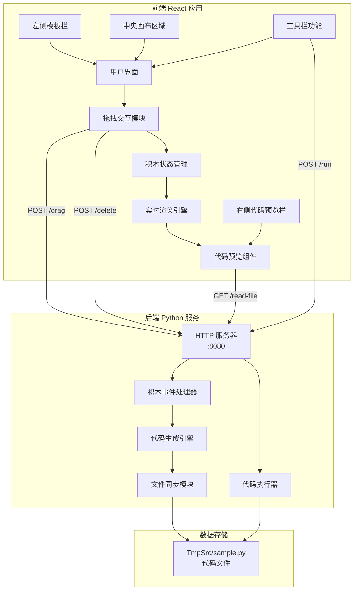

**神经网络工坊（Block Builder）**是一个创新的**可视化代码构建工具**，采用积木式交互设计，让代码编写变得像搭积木一样直观有趣。项目的核心理念是"**每个积木对应一段代码**"——当你在画布上拖拽、组合各种形状的积木时，系统会实时生成对应的 Python 代码，并自动同步到代码文件中，实现从视觉设计到代码实现的零延迟转换。

这个项目特别适合**编程初学者**理解代码逻辑、**教学演示**场景展示编程概念，以及**快速原型设计**时验证算法流程。通过七种不同形状的积木（正方形、长方形、圆形、三角形等）和十种颜色主题，你可以自由组合出各种代码结构，并在右侧预览栏实时查看生成的 Python 代码。系统还支持**一键执行代码**，让你立即看到积木组合的运行结果。

Sources: [metadata.json](metadata.json#L1-L6), [README.md](README.md#L1-L15)

## 系统架构概览

Block Builder 采用**前后端分离**的现代化架构，前端负责可视化交互界面，后端负责代码生成与执行。两者通过 HTTP REST API 进行通信，实现松耦合设计。整体数据流向清晰：用户在前端画布上操作积木 → 前端将操作事件发送到后端 → 后端解析事件并生成对应代码 → 生成的代码写入文件 → 前端定期读取文件内容并显示在代码预览区。



前端基于 **React 19** 构建，使用 **Motion** 库实现流畅的拖拽动画和视觉效果，**Tailwind CSS v4** 提供现代化的样式系统。后端使用 Python 标准库的 `http.server` 模块，无需额外依赖，轻量且易于部署。整个系统设计遵循**单一职责原则**：前端专注用户体验，后端专注业务逻辑，文件系统作为数据持久化层。

Sources: [src/App.tsx](src/App.tsx#L1-L50), [server.py](server.py#L1-L80), [package.json](package.json#L1-L35)

## 核心功能特性

Block Builder 提供了丰富的交互功能和智能辅助特性，让积木式编程体验更加流畅自然。以下是系统的核心功能矩阵：

| 功能模块 | 功能描述 | 技术实现 | 用户价值 |
|---------|---------|---------|---------|
| **七种积木形状** | 正方形、横长方形、纵长方形、圆形、三角形、L型、T型 | SVG + CSS clip-path | 支持多样化的代码结构表达 |
| **十种颜色主题** | 蓝、红、绿、琥珀、紫、粉、青、橙、靛、青绿 | Tailwind CSS 颜色系统 | 视觉区分不同代码块功能 |
| **拖拽交互** | 从模板栏拖拽到画布，画布内自由移动 | Motion dragControls + React state | 直观的可视化编程体验 |
| **智能网格对齐** | 自动吸附到其他积木边缘，24px 阈值检测 | 自定义 snapping 算法 | 快速对齐，保持代码结构整洁 |
| **右键菜单** | 旋转、复制、删除、置顶、连接等操作 | Context Menu API | 快速访问常用操作 |
| **积木连接** | 在积木间创建视觉连接线，表示逻辑关系 | SVG Line + 状态管理 | 可视化代码执行流程 |
| **实时代码生成** | 拖拽时自动生成对应 Python 代码 | Python 文件操作 + 映射表 | 零延迟代码同步 |
| **代码预览** | 右侧栏实时显示生成的代码，支持语法高亮 | CodeHighlighter 组件 | 即时反馈代码内容 |
| **代码执行** | 点击运行按钮执行生成的 Python 代码 | subprocess 调用 | 验证代码逻辑正确性 |
| **层级管理** | 自动处理积木堆叠顺序，支持手动置顶 | zIndex 动态分配 | 精确控制积木显示层级 |

Sources: [src/types.ts](src/types.ts#L1-L47), [src/components/BlockShape.tsx](src/components/BlockShape.tsx#L1-L53), [src/App.tsx](src/App.tsx#L130-L180)

## 技术栈详解

项目采用**前沿技术栈**构建，充分利用最新版本框架的特性，确保开发体验和运行性能的最优化。以下是各技术组件的详细说明：

### 前端技术栈

| 技术 | 版本 | 核心作用 | 关键特性 |
|------|------|---------|---------|
| **React** | 19.0.0 | UI 框架 | 并发渲染、自动批处理、Suspense 增强 |
| **Vite** | 6.2.0 | 构建工具 | 极速冷启动、HMR、ESM 原生支持 |
| **TypeScript** | 5.8.2 | 类型系统 | 静态类型检查、智能代码提示 |
| **Tailwind CSS** | 4.1.14 | 样式系统 | 原子化 CSS、JIT 编译、自定义主题 |
| **Motion** | 12.23.24 | 动画库 | 声明式动画、手势支持、布局动画 |
| **Lucide React** | 0.546.0 | 图标库 | 轻量级、树摇优化、统一风格 |

### 后端技术栈

| 技术 | 版本/类型 | 核心作用 | 关键特性 |
|------|----------|---------|---------|
| **Python HTTP Server** | 标准库 | HTTP 服务 | 零依赖、轻量级、易于部署 |
| **subprocess** | 标准库 | 代码执行 | 安全沙箱、超时控制、输出捕获 |
| **JSON** | 标准库 | 数据交换 | 前后端通信协议 |

前端开发环境通过 **Vite** 的开发服务器启动，默认监听 `http://localhost:3000`，支持热模块替换（HMR）实现代码修改后的即时更新。后端服务独立运行在 `http://localhost:8080`，通过 **CORS** 配置允许跨域请求，前后端可以独立开发、测试和部署。

Sources: [package.json](package.json#L6-L35), [vite.config.ts](vite.config.ts#L1-L26), [server.py](server.py#L35-L65), [tsconfig.json](tsconfig.json#L1-L27)

## 项目目录结构

项目采用**清晰的分层目录结构**，将不同职责的代码文件组织在独立的目录中，便于维护和扩展。以下是完整的目录树及其功能说明：

```
block-builder/
├── src/                      # 前端源代码目录
│   ├── App.tsx              # 主应用组件，包含所有业务逻辑
│   ├── main.tsx             # 应用入口文件，挂载 React 根节点
│   ├── index.css            # 全局样式文件
│   ├── types.ts             # TypeScript 类型定义（积木类型、接口）
│   ├── components/          # 可复用组件目录
│   │   ├── BlockShape.tsx   # 积木形状渲染组件（7种形状的 SVG 实现）
│   │   └── CodeHighlighter.tsx  # 代码高亮显示组件
│   └── config/              # 配置文件目录
│       └── codeTheme.ts     # 代码主题配置
├── TmpSrc/                  # 临时源代码目录
│   └── sample.py            # 动态生成的 Python 代码文件
├── torch/                   # PyTorch 相关代码（可选模块）
│   └── main.py
├── public/                  # 静态资源目录（Vite 自动处理）
├── server.py                # Python 后端服务器（监听 :8080）
├── index.html               # HTML 入口文件
├── package.json             # Node.js 项目配置和依赖声明
├── package-lock.json        # 依赖版本锁定文件
├── tsconfig.json            # TypeScript 编译器配置
├── vite.config.ts           # Vite 构建工具配置
├── environment.yml          # Conda 环境配置文件
├── metadata.json            # 项目元数据（名称、描述）
├── README.md                # 项目说明文档
├── CLAUDE.md                # Claude AI 协作指南
└── .gitignore               # Git 忽略规则
```

**核心文件职责**：`src/App.tsx` 是应用的"大脑"，包含所有状态管理和业务逻辑（约 830 行代码）；`src/types.ts` 定义了系统的数据模型，包括积木实例、模板、连接关系等；`server.py` 是后端的"心脏"，处理所有 HTTP 请求并协调代码生成与执行；`TmpSrc/sample.py` 是"输出产物"，存储最终生成的可执行 Python 代码。

Sources: [目录结构分析](.#L1-L31), [src/App.tsx](src/App.tsx#L1-L831), [src/types.ts](src/types.ts#L1-L47), [server.py](server.py#L1-L230)

## 快速启动指南

想要立即体验 Block Builder，只需执行以下**四个简单步骤**，即可在本地运行完整的可视化编程环境：

**第一步：克隆项目代码**
```bash
git clone https://github.com/Linmoqian/block-builder
cd block-builder
```

**第二步：配置 Python 环境**
```bash
conda env create -f environment.yml
conda activate block-builder  # 激活环境（根据 environment.yml 中的名称）
```

**第三步：安装前端依赖**
```bash
npm install
```

**第四步：启动开发服务器（需要两个终端窗口）**

终端 1（前端）：
```bash
npm run dev
# 访问 http://localhost:3000
```

终端 2（后端）：
```bash
python server.py
# 服务监听 http://localhost:8080
```

启动成功后，打开浏览器访问 `http://localhost:3000`，你将看到左侧的积木模板栏、中央的空白画布和右侧的代码预览区。从左侧拖拽任意积木到画布上，右侧会立即显示对应的 Python 代码，点击工具栏的"运行"按钮即可执行代码并查看输出结果。

Sources: [README.md](README.md#L7-L15), [package.json](package.json#L7-L13), [environment.yml](environment.yml#L1-L1)

## 学习路径建议

为了帮助你系统地掌握 Block Builder 的使用和开发，我们设计了**循序渐进的学习路径**。根据你的角色和目标，可以选择不同的阅读顺序：

### 🎯 初学者路径（快速上手）
如果你是**初次接触可视化编程工具**或**React 初学者**，建议按以下顺序阅读：

1. **[快速开始](2-kuai-su-kai-shi)** - 跟随详细步骤完成环境搭建和首次运行
2. **[开发环境配置](3-kai-fa-huan-jing-pei-zhi)** - 深入了解 Node.js、Conda、IDE 的配置细节
3. **[项目结构说明](4-xiang-mu-jie-gou-shuo-ming)** - 理解每个文件和目录的作用
4. **[七种积木形状](6-qi-chong-ji-mu-xing-zhuang)** - 学习每种积木的特性和使用场景
5. **[拖拽交互实现](11-tuo-zhuai-jiao-hu-shi-xian)** - 了解拖拽功能的技术原理

### 💻 前端开发者路径（深入源码）
如果你是**有经验的 React 开发者**，想要学习项目的技术实现：

1. **[主应用状态管理](10-zhu-ying-yong-zhuang-tai-guan-li)** - 研究 830 行 App.tsx 的状态设计
2. **[积木形状渲染组件](12-ji-mu-xing-zhuang-xuan-ran-zu-jian)** - 分析 SVG 和 CSS 的组合技巧
3. **[Motion 动画库使用](27-motion-dong-hua-ku-shi-yong)** - 学习声明式动画的最佳实践
4. **[实时代码生成原理](29-shi-shi-dai-ma-sheng-cheng-yuan-li)** - 理解前后端协作的数据流
5. **[React 19 特性应用](24-react-19-te-xing-ying-yong)** - 掌握最新 React 版本的特性

### 🔧 后端开发者路径（服务端实现）
如果你关注**Python 后端开发**和**代码执行机制**：

1. **[Python HTTP 服务器](19-python-http-fu-wu-qi)** - 学习零依赖 HTTP 服务器的实现
2. **[积木事件监听](20-ji-mu-shi-jian-jian-ting)** - 理解事件驱动的代码生成逻辑
3. **[代码文件同步机制](21-dai-ma-wen-jian-tong-bu-ji-zhi)** - 研究文件操作的并发控制
4. **[代码执行功能](22-dai-ma-zhi-xing-gong-neng)** - 掌握 subprocess 的安全使用
5. **[前后端通信协议](30-qian-hou-duan-tong-xin-xie-yi)** - 了解 REST API 的设计原则

### 🎨 架构师路径（系统设计）
如果你关注**整体架构设计**和**扩展性考虑**：

1. **[积木系统架构](5-ji-mu-xi-tong-jia-gou)** - 理解分层架构和模块划分
2. **[网格对齐机制](7-wang-ge-dui-qi-ji-zhi)** - 学习智能算法的设计思路
3. **[颜色主题系统](9-yan-se-zhu-ti-xi-tong)** - 了解可配置系统的设计模式
4. **[积木模板扩展](33-ji-mu-mo-ban-kuo-zhan)** - 掌握插件化架构的实现
5. **[Python 语法分析器](31-python-yu-fa-fen-xi-qi)** - 探索代码生成的高级应用

无论选择哪条路径，建议**边读边实践**：打开对应的源代码文件，对照文档理解实现细节，并尝试修改代码观察效果。Block Builder 的代码库经过精心设计，每个模块职责清晰，非常适合作为学习现代 Web 开发的实战项目。