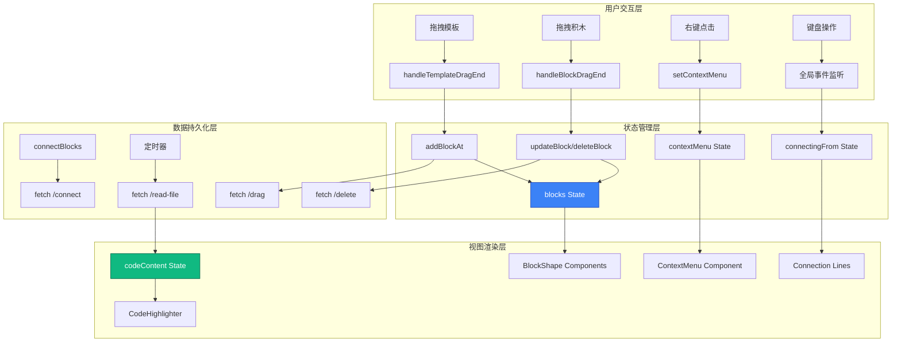

主应用状态管理是神经网络工坊的核心架构基础，采用 React 19 的函数式组件与 Hooks 模式，实现了积木数据、用户交互、UI状态的多维度协调管理。整个状态系统以单一数据源原则为核心，通过细粒度的状态划分和响应式更新机制，支撑起复杂的拖拽交互、积木连接、实时代码同步等功能。

## 状态架构设计

状态管理系统遵循**最小状态原则**和**就近管理原则**，将状态分为四个语义层：核心数据状态、UI交互状态、功能控制状态、DOM引用状态。这种分层设计既保证了状态的可预测性，又优化了组件的渲染性能，避免不必要的状态更新触发全局重渲染。

### 核心数据状态

核心数据状态是整个应用的单一数据源，管理着积木实例的完整生命周期信息，包括位置、外观、层级、连接关系等所有业务数据。

**blocks 状态**是系统中最重要的状态，采用数组结构存储所有积木实例，每个积木实例包含 7 个核心属性：

```typescript
interface BlockInstance {
  id: string;              // 唯一标识符，使用随机9位字符串
  type: ShapeType;         // 形状类型：7种预定义形状
  x: number;               // 画布X坐标（像素）
  y: number;               // 画布Y坐标（像素）
  color: string;           // 颜色值（十六进制）
  rotation: number;        // 旋转角度（0-359度）
  zIndex: number;          // 层叠顺序
  connectedTo?: string[];  // 连接的其他积木ID数组
}
```

**selectedId 状态**追踪当前选中积木的唯一标识，采用 `string | null` 类型，null 表示无选中状态。选中状态决定了右键菜单、工具栏操作的上下文，以及积木的高亮显示逻辑。

**nextZIndex 状态**是一个自增计数器，管理积木的层叠顺序。每次添加或选中积木时，将当前 nextZIndex 赋值给积木的 zIndex 属性，然后 nextZIndex 自增，确保新操作的积木始终显示在最上层。

Sources: [App.tsx](src/App.tsx#L28-L42), [types.ts](src/types.ts#L3-L12)

### UI交互状态

UI交互状态控制用户界面的显示行为和交互反馈，这些状态直接关联到视觉呈现和用户体验。

**拖拽状态组**包含三个布尔状态，精细控制拖拽交互的不同阶段：
- `isDraggingExisting`：标识是否正在拖拽画布上的现有积木
- `isDraggingTemplate`：标识是否正在从侧边栏拖拽模板积木
- `isAnyItemDragging`：综合拖拽状态，用于控制侧边栏的 overflow 行为

**右侧边栏状态组**管理代码预览面板的布局行为：
- `rightSidebarOpen`：控制右侧边栏的展开/折叠
- `rightSidebarWidth`：记录右侧边栏的宽度（像素值，默认 400）
- `isResizing`：标识是否正在进行宽度调整操作

**辅助UI状态**提供额外的界面控制：
- `showGrid`：控制网格显示，影响新积木的自动对齐行为
- `showClearConfirm`：控制清空画布确认对话框的显示

Sources: [App.tsx](src/App.tsx#L30-L37)

### 功能控制状态

功能控制状态管理特定业务功能的状态流转，支持复杂的交互模式。

**右键菜单状态**采用对象结构，存储菜单的位置和关联的积木ID：

```typescript
const [contextMenu, setContextMenu] = useState<{
  x: number;           // 菜单显示的X坐标
  y: number;           // 菜单显示的Y坐标
  blockId: string;     // 右键点击的积木ID
} | null>(null);
```

**连接模式状态**实现积木之间的连接功能：
- `connectingFrom`：存储连接起始积木的ID，null 表示未进入连接模式
- `dragPositions`：记录拖拽过程中积木的实时位置，用于动态绘制连接线

**代码内容状态**：`codeContent` 存储从后端同步的 Python 代码文本，通过定期轮询机制保持与文件系统的同步。

Sources: [App.tsx](src/App.tsx#L45-L55), [App.tsx](src/App.tsx#L38)

### DOM引用状态

DOM引用状态使用 `useRef` Hook 管理，不触发组件重渲染，用于直接操作 DOM 元素或存储跨渲染周期的持久数据。

**三个核心 Ref 引用**：
- `isOverCanvasRef`：布尔标记，追踪拖拽过程中是否位于画布区域上方，使用 Ref 而非 State 以避免拖拽过程中的频繁状态更新
- `canvasRef`：画布容器的 DOM 引用，用于计算拖拽释放时的坐标转换
- `sidebarRef`：侧边栏的 DOM 引用，用于获取侧边栏宽度以判断拖拽区域

Sources: [App.tsx](src/App.tsx#L39-L41)

## 状态管理方法

主应用采用**集中式状态更新模式**，所有状态变更通过定义在 App 组件内的函数方法执行，子组件通过 props 接收回调函数。这种模式确保了状态变更的可追溯性和可调试性。

### 积木生命周期管理

**addBlockAt 方法**是积木创建的统一入口，执行四个关键操作：

1. **位置计算**：调用 `findSnapPosition` 计算吸附后的最终坐标，支持网格对齐和积木间吸附
2. **实例构造**：创建包含随机ID、形状类型、位置、颜色、旋转角度、层级的完整积木对象
3. **状态更新**：使用 `setBlocks(prev => [...prev, newBlock])` 的不可变更新模式
4. **后端同步**：通过 fetch API 向后端发送 `/drag` 事件，通知积木创建

**updateBlock 方法**实现积木属性的部分更新，采用 `map` 函数配合对象展开语法：

```typescript
setBlocks(prev => prev.map(b => 
  b.id === id ? { ...b, ...updates } : b
));
```

**deleteBlock 方法**执行积木删除的完整流程：
1. 查找待删除积木的信息
2. 向后端发送 `/delete` 事件
3. 从 blocks 数组中过滤移除
4. 如果删除的是选中积木，清空 selectedId

Sources: [App.tsx](src/App.tsx#L146-L191)

### 层级与变换管理

**bringToFront 方法**通过更新 zIndex 属性实现置顶功能，同时自增 nextZIndex 计数器，确保每次操作都分配唯一的层级值。

**rotateBlock 方法**实现 45 度增量旋转，使用模运算保持角度在 0-359 范围内：`(block.rotation + 45) % 360`。

**duplicateBlock 方法**复制积木实例，创建新ID，位置偏移 24 像素（一个网格单位），重置连接关系（connectedTo 设为空数组）。

Sources: [App.tsx](src/App.tsx#L193-L220)

### 连接功能状态管理

**connectBlocks 方法**实现双向连接关系的建立，在两个积木的 connectedTo 数组中互相添加对方的 ID：

```typescript
setBlocks(prev => prev.map(block => {
  if (block.id === fromId) {
    const connectedTo = block.connectedTo || [];
    if (!connectedTo.includes(toId)) {
      return { ...block, connectedTo: [...connectedTo, toId] };
    }
  }
  if (block.id === toId) {
    const connectedTo = block.connectedTo || [];
    if (!connectedTo.includes(fromId)) {
      return { ...block, connectedTo: [...connectedTo, fromId] };
    }
  }
  return block;
}));
```

连接建立后，向后端发送 `/connect` 事件，携带两个积木的类型和名称信息。

Sources: [App.tsx](src/App.tsx#L223-L257)

## 状态同步机制

主应用实现了前后端状态的双向同步，采用**事件驱动**和**轮询机制**相结合的策略。

### 后端事件推送

所有积木操作（添加、删除、连接）都会通过 fetch API 向后端发送 HTTP POST 请求：

| 操作类型 | 端点 | 携带数据 | 触发时机 |
|---------|------|---------|---------|
| 添加积木 | `/drag` | `{id, type, name}` | 新积木创建时 |
| 删除积木 | `/delete` | `{id, name}` | 积木删除时 |
| 连接积木 | `/connect` | `{from, to}` | 积木连接建立时 |

所有后端通信使用 `.catch(() => {})` 静默处理错误，确保后端不可用时前端功能不受影响。

### 代码内容轮询

**useEffect 定时器**实现代码文件的定期同步，每 1000ms 从后端 `/read-file` 端点获取最新的 Python 代码内容：

```typescript
useEffect(() => {
  const fetchCode = () => {
    fetch('http://localhost:8080/read-file')
      .then(res => res.json())
      .then(data => {
        if (data.content !== undefined) {
          setCodeContent(data.content);
        }
      })
      .catch(() => {});
  };

  fetchCode();
  const interval = setInterval(fetchCode, 1000);
  return () => clearInterval(interval);
}, []);
```

这种设计实现了代码文件的**准实时同步**，支持外部编辑器修改代码后的即时预览。

Sources: [App.tsx](src/App.tsx#L78-L93)

## 全局事件监听

主应用通过 **useEffect** 注册全局事件监听器，实现跨组件的交互协调。

**三组全局事件监听**：
- `click`：点击页面任意位置关闭右键菜单
- `resize`：窗口大小变化时关闭右键菜单
- `keydown`：Escape 键关闭右键菜单和取消连接模式

清理函数在组件卸载时移除所有事件监听器，避免内存泄漏：

```typescript
useEffect(() => {
  const handleClick = () => setContextMenu(null);
  const handleResize = () => setContextMenu(null);
  const handleEscape = (e: KeyboardEvent) => {
    if (e.key === 'Escape') {
      setContextMenu(null);
      setConnectingFrom(null);
    }
  };
  
  window.addEventListener('click', handleClick);
  window.addEventListener('resize', handleResize);
  window.addEventListener('keydown', handleEscape);
  
  return () => {
    window.removeEventListener('click', handleClick);
    window.removeEventListener('resize', handleResize);
    window.removeEventListener('keydown', handleEscape);
  };
}, []);
```

Sources: [App.tsx](src/App.tsx#L58-L75)

## 状态流动架构



状态流动遵循**单向数据流**原则：用户交互触发状态更新方法 → 方法修改 React State → State 变化触发组件重渲染 → 新的视图呈现给用户。后端同步作为副作用并行执行，不阻塞 UI 更新。

## 性能优化策略

状态管理系统采用了多项性能优化技术：

**Ref 替代 State**：`isOverCanvasRef` 使用 useRef 而非 useState，避免拖拽过程中频繁的状态更新导致的大量重渲染。

**不可变更新**：所有数组更新使用展开运算符或 map/filter 方法，确保 React 的浅比较优化生效。

**条件更新**：后端通信使用 `.catch(() => {})` 静默处理错误，避免错误状态导致的额外渲染周期。

**细粒度状态划分**：将不同职责的状态分离（UI状态、数据状态、功能状态），使得状态更新只影响相关的组件子树。

Sources: [App.tsx](src/App.tsx#L39), [App.tsx](src/App.tsx#L159)

## 类型安全保障

整个状态管理系统建立在 TypeScript 的强类型基础之上，所有状态变量、函数参数、返回值都有明确的类型定义。

**核心类型定义**在 `types.ts` 文件中集中管理：
- `ShapeType`：联合类型，限定 7 种积木形状
- `BlockInstance`：接口类型，定义积木实例的完整结构
- `BlockTemplate`：接口类型，定义积木模板的元数据
- `Connection`：接口类型，定义积木连接关系

类型系统在编译时捕获状态不一致、属性缺失、类型错误等问题，为大规模状态管理提供了可靠的开发时保障。

Sources: [types.ts](src/types.ts#L1-L23)

## 扩展建议

当前状态管理架构为未来扩展预留了多个方向：

**状态持久化**：可扩展 blocks 状态到 localStorage 或后端数据库，实现项目保存和加载功能。

**撤销/重做**：基于当前的状态结构，可以实现命令模式的历史记录栈，支持操作的撤销和重做。

**状态机模式**：对于连接模式、拖拽模式等复杂交互，可以引入 XState 等状态机库，提供更严格的状态转换控制。

**Context 分层**：随着功能增长，可以将不同类型的状态通过 React Context 分层提供，避免 props drilling 问题。