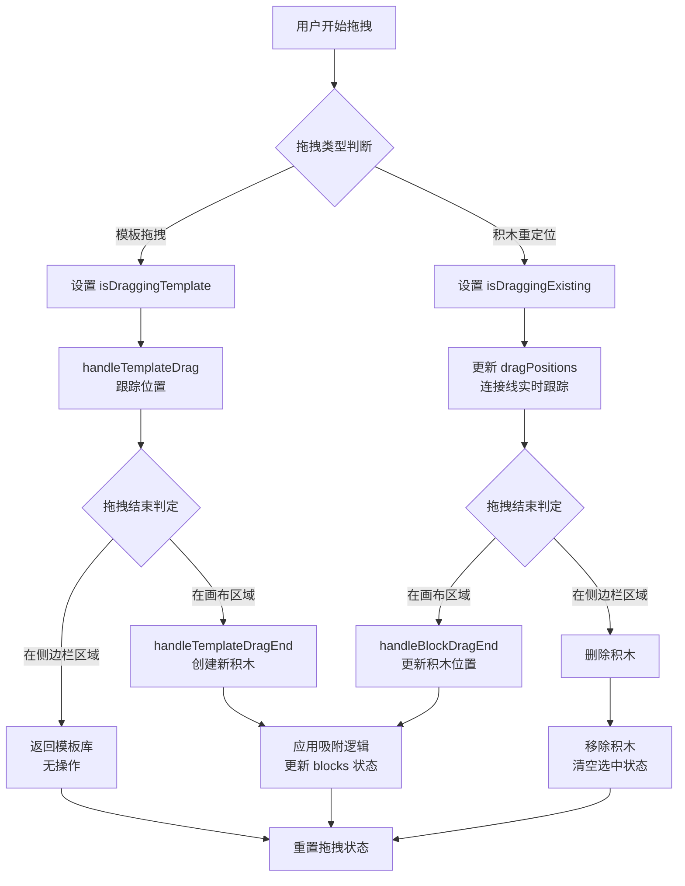

本页面深入剖析 Block Builder Pro 应用中拖拽交互系统的技术实现。该系统基于 **Motion 动画库**（v12.23.24）构建，提供流畅的积木拖拽体验，支持模板拖拽创建、画布重定位、智能对齐吸附以及拖拽删除等核心功能。通过精心设计的状态管理和事件处理机制，实现了直观且响应式的用户交互体验。

## 系统架构概览

拖拽交互系统由三个核心层次构成：**状态管理层**负责追踪拖拽状态和位置信息，**事件处理层**响应各类拖拽事件并执行业务逻辑，**视觉反馈层**通过 Motion 动画库提供实时视觉响应。整个系统围绕两种不同的拖拽场景设计：从侧边栏模板库拖拽创建新积木，以及在画布上拖拽重新定位已有积木。这两种场景共享相同的底层机制，但在事件处理流程和最终行为上存在关键差异。



拖拽系统的核心是 **Motion 库的 `drag` 属性**，它提供了声明式的拖拽能力配置。通过 `dragMomentum={false}` 禁用物理惯性，确保拖拽行为完全受控；通过 `whileDrag` 属性定义拖拽过程中的视觉变换效果；通过 `onDrag`、`onDragStart`、`onDragEnd` 三阶段事件钩子实现细粒度的交互控制。这种设计将复杂的拖拽逻辑封装在声明式 API 之后，使开发者能够专注于业务逻辑而非底层事件处理。

Sources: [App.tsx](src/App.tsx#L1-L50), [package.json](package.json#L26)

## 双模式拖拽机制

系统实现了两种语义不同的拖拽模式，分别对应"创建"和"移动"两种用户意图。**模板拖拽模式**发生在侧边栏模板库中，用户从预定义的积木模板开始拖拽，当拖拽至画布区域释放时创建新实例，若拖回侧边栏则取消操作。**积木重定位模式**发生在画布上已有积木实例上，用户拖拽积木改变其位置，若拖拽至侧边栏区域则触发删除操作。这两种模式通过 `isDraggingTemplate` 和 `isDraggingExisting` 两个独立状态变量区分，确保 UI 能够针对不同场景提供正确的视觉反馈。

模板拖拽的实现使用了 `dragSnapToOrigin` 属性，这使得模板在被拖拽离开原位置后，会在释放时自动返回原位，形成"复制拖拽"的语义。与之相对，画布上的积木没有此属性，拖拽释放后会在新位置保持，体现"移动拖拽"的语义。这种设计巧妙地利用了 Motion 库的内置能力，避免了手动管理模板位置的复杂性。当模板被拖拽到画布区域释放时，`handleTemplateDragEnd` 函数会计算相对于画布的坐标位置，应用吸附逻辑后调用 `addBlockAt` 创建新的积木实例。

Sources: [App.tsx](src/App.tsx#L270-L302), [App.tsx](src/App.tsx#L304-L329)

## 智能吸附系统

吸附系统是拖拽交互的核心增值功能，它通过 **网格吸附** 和 **积木间吸附** 两种机制，帮助用户快速实现精确对齐。网格吸附基于 24 像素的虚拟网格，当启用时（`showGrid` 为 `true`），所有拖拽释放的积木都会自动对齐到最近的网格交叉点。积木间吸附则通过 `findSnapPosition` 函数实现，它计算当前拖拽积木与画布上其他所有积木的相对位置关系，当边缘距离小于 24 像素的阈值时触发吸附，支持边缘对齐、边缘贴合等多种吸附模式。

`findSnapPosition` 函数采用双层循环算法：外层遍历画布上的所有其他积木，内层分别处理 X 轴和 Y 轴的吸附判定。X 轴吸附支持三种模式：拖拽块右边缘吸附到目标块左边缘、拖拽块左边缘吸附到目标块右边缘、以及左右边缘直接对齐。Y 轴吸附逻辑与之对称，但处理的是上下边缘关系。该算法的时间复杂度为 O(n)，其中 n 为画布上积木数量，对于典型的使用场景（几十个积木）性能完全可接受。吸附结果返回调整后的坐标，确保积木在视觉上紧密排列。

```typescript
// 吸附算法核心逻辑片段
const findSnapPosition = (id: string | null, x: number, y: number, currentBlocks: BlockInstance[]) => {
  const SNAP_THRESHOLD = 24;
  const BLOCK_SIZE = 64;
  let snappedX = x, snappedY = y;
  
  for (const other of currentBlocks) {
    if (other.id === id) continue;
    
    // X轴吸附：右边缘贴左边缘
    if (Math.abs((x + BLOCK_SIZE) - other.x) < SNAP_THRESHOLD) {
      snappedX = other.x - BLOCK_SIZE;
    }
    // X轴吸附：左边缘贴右边缘
    else if (Math.abs(x - (other.x + BLOCK_SIZE)) < SNAP_THRESHOLD) {
      snappedX = other.x + BLOCK_SIZE;
    }
    // ... Y轴类似逻辑
  }
  return { x: snappedX, y: snappedY };
};
```

吸附系统的设计体现了"渐进增强"原则：当网格显示启用时，优先使用网格吸附提供规整的布局；当网格关闭时，仍然保留积木间吸附功能，帮助用户实现自由布局下的精确对齐。这种设计确保了系统在不同使用场景下都能提供有意义的辅助，而非强制用户进入单一的工作模式。

Sources: [App.tsx](src/App.tsx#L88-L135)

## 状态管理与事件流

拖拽交互涉及多个相互关联的状态变量，它们协同工作以提供完整的交互体验。**核心状态**包括 `isDraggingExisting` 和 `isDraggingTemplate`，分别标识当前是否正在拖拽已有积木或模板，它们控制侧边栏删除提示遮罩的显示。**辅助状态** `isAnyItemDragging` 是一个通用标志，用于控制 CSS 过渡效果的禁用（拖拽过程中禁用过渡可避免视觉抖动）以及侧边栏滚动容器的 `overflow` 属性切换（拖拽时需要 `overflow: visible` 以允许拖拽元素离开容器）。**位置追踪状态** `dragPositions` 是一个 Record 对象，记录拖拽过程中积木的实时位置，用于连接线的动态更新。

事件流遵循标准的"开始-进行-结束"三阶段模式。`onDragStart` 触发时设置相应的拖拽标志位，对于已有积木还会调用 `setSelectedId` 确保当前积木被选中。`onDrag` 在拖拽过程中持续触发，模板拖拽时调用 `handleTemplateDrag` 判断是否进入画布区域，积木重定位时更新 `dragPositions` 状态以驱动连接线的实时跟踪。`onDragEnd` 是最关键的阶段，它负责清理拖拽状态、计算最终位置、应用吸附逻辑，并根据拖拽结束位置决定创建新积木、更新积木位置或删除积木。

状态更新采用了 React 的函数式更新模式（`setBlocks(prev => ...)`），确保在并发拖拽多个积木时状态更新的正确性。`dragPositions` 的更新使用了展开运算符创建新对象，确保 React 能够检测到状态变化并触发重新渲染。拖拽结束时通过 `delete` 操作清理 `dragPositions` 中对应的条目，避免内存泄漏。所有这些细节共同构成了一个健壮的状态管理系统。

Sources: [App.tsx](src/App.tsx#L14-L18), [App.tsx](src/App.tsx#L458-L503)

## 视觉反馈与用户体验

拖拽交互的视觉反馈通过 **Motion 的 `whileDrag` 属性**和 **AnimatePresence 组件**实现。当积木进入拖拽状态时，`whileDrag` 定义的样式会平滑应用：缩放至 1.1 倍以突出当前操作对象，提升 `zIndex` 至 2000 确保拖拽元素始终在最上层，添加大型阴影（`boxShadow: "0 25px 50px -12px rgb(0 0 0 / 0.4)"`）创造悬浮效果，以及将光标变为抓取状态。这些视觉变化通过 Motion 的硬件加速动画实现，确保 60fps 的流畅体验。

侧边栏的删除提示遮罩是另一个关键的视觉反馈元素。当 `isDraggingExisting` 或 `isDraggingTemplate` 为 `true` 时，一个半透明的深色遮罩会通过 `AnimatePresence` 动画进入视图，中央显示垃圾桶图标和提示文本。对于已有积木的拖拽，提示文本为"拖拽到此处删除"；对于模板拖拽，提示为"取消拖拽"。这种差异化的文案设计帮助用户理解不同拖拽模式下的行为语义。遮罩还包含一个弹跳动画的图标，进一步增强视觉吸引力。

连接线的实时跟踪是高级视觉反馈功能的体现。当用户拖拽已建立连接的积木时，连接线需要实时更新以跟随积木移动。这通过在 `onDrag` 回调中持续更新 `dragPositions` 状态实现，SVG 连接线渲染逻辑会优先使用 `dragPositions` 中的实时位置，若不存在则使用积木的静态位置（`block.x` 和 `block.y`）。连接线还应用了 `transition-all duration-75` CSS 类，确保位置变化时有轻微的过渡效果，避免视觉跳变。

Sources: [App.tsx](src/App.tsx#L478-L484), [App.tsx](src/App.tsx#L458-L466), [App.tsx](src/App.tsx#L505-L533)

## Motion 库集成细节

Motion 库（原 Framer Motion）是拖拽系统的技术基石，它提供了声明式的拖拽能力配置。在 Block Builder Pro 中，拖拽功能通过在 `motion.div` 组件上设置 `drag` 属性启用，这是一个布尔值或方向限制对象（如 `{ x: true, y: false }` 限制只能水平拖拽）。`dragMomentum` 设置为 `false` 以禁用释放后的惯性滑动，确保积木精确停留在释放位置。`dragElastic` 设置为 `0.1` 提供轻微的弹性阻尼，当拖拽超出边界时产生柔和的回弹效果。

模板拖拽使用了 `dragSnapToOrigin` 属性，这是一个特殊的功能，使得拖拽元素在释放后自动返回原始位置。这对于实现"从库中拖拽创建"的交互模式至关重要：模板本身不应该移动，而是应该在画布上创建副本。与之配合的是 `handleTemplateDragEnd` 函数，它在检测到拖拽结束于画布区域时，根据拖拽的最终坐标创建新的积木实例。这种设计模式避免了手动管理模板位置的复杂性，将位置管理完全交给 Motion 库处理。

`useDragControls` Hook 是 Motion 提供的高级 API，虽然在当前代码中未被深度使用（导入了但未在核心逻辑中调用），但它代表了 Motion 库的另一种拖拽控制模式：程序化控制。通过 `dragControls` 对象，开发者可以通过 `start(event)` 方法在自定义事件（如长按）中启动拖拽，或通过 `bind()` 方法将拖拽控制绑定到特定的子元素。这种能力在需要复杂拖拽触发条件的场景下非常有用，例如需要在拖拽前显示确认对话框的场景。

Sources: [App.tsx](src/App.tsx#L1-L2), [App.tsx](src/App.tsx#L359-L377), [App.tsx](src/App.tsx#L461-L463)

## 边界情况与特殊处理

拖拽系统需要处理多种边界情况以确保用户体验的连贯性。**微小移动过滤**是 `handleTemplateDragEnd` 中的关键逻辑：通过计算拖拽距离（`Math.sqrt(info.offset.x ** 2 + info.offset.y ** 2)`）并设置 10 像素的阈值，系统能够区分真实的拖拽操作和误触或点击事件。这避免了用户单击模板时意外创建积木的问题。对于已有积木的拖拽，Motion 库内部已经处理了类似的判定，因此无需额外代码。

**画布边界检测**通过比较拖拽点的 X 坐标与侧边栏宽度实现。`sidebarRef.current?.offsetWidth` 获取侧边栏的实际渲染宽度（默认 320 像素），当 `info.point.x` 大于此值时判定为画布区域。这种基于实际 DOM 尺寸的判定比硬编码常量更健壮，能够适应侧边栏宽度动态变化的场景（如未来可能的可调整侧边栏功能）。对于模板拖拽，进入画布区域时会设置 `isDraggingTemplate` 状态，触发侧边栏遮罩的文案切换。

**Z-Index 层级管理**通过 `nextZIndex` 状态变量实现，这是一个单调递增的计数器。每次创建新积木或点击已有积木时，都会调用 `bringToFront` 函数将积木的 `zIndex` 设置为当前 `nextZIndex` 值，然后递增计数器。这种设计确保了最近交互的积木总是显示在其他积木之上，模拟了物理世界中"拿起再放下"的自然行为。在拖拽过程中，`whileDrag` 会临时将 `zIndex` 提升至 2000，确保拖拽元素不会意外被其他积木遮挡。

Sources: [App.tsx](src/App.tsx#L304-L329), [App.tsx](src/App.tsx#L270-L302), [App.tsx](src/App.tsx#L84-L86)

## 性能优化策略

拖拽交互的性能优化主要集中在三个方面：**CSS 过渡的智能禁用**、**状态更新的最小化**以及**React 渲染的优化**。当 `isAnyItemDragging` 为 `true` 时，积木元素会应用 `transition-none` CSS 类，禁用所有 CSS 过渡效果。这是因为在拖拽过程中，积木的位置会通过 Motion 的 `x` 和 `y` 属性高频更新，如果同时启用了 CSS 过渡，会导致 Motion 的动画和 CSS 过渡冲突，产生视觉抖动和性能下降。

状态更新的最小化体现在 `dragPositions` 的设计上。这个状态只在需要连接线实时跟踪时才更新，对于没有连接的积木，拖拽过程中不会触发任何状态更新。这避免了不必要的 React 重新渲染。更进一步，`onDrag` 回调中的 `setDragPositions` 使用了函数式更新和对象展开，确保只有实际拖拽的积木位置被更新，其他积木的位置引用保持不变，React 的浅比较优化能够生效。

React 渲染优化通过 `useCallback` 和 `useMemo` Hooks 实现（虽然在当前代码片段中未完全展示，但这是 React 应用的最佳实践）。事件处理函数如 `handleTemplateDrag`、`handleBlockDragEnd` 等都应该用 `useCallback` 包裹，避免在每次渲染时创建新的函数实例，导致子组件的不必要重新渲染。对于计算密集的操作如 `findSnapPosition`，可以考虑使用 `useMemo` 缓存结果，但在当前实现中，由于该函数在事件处理器中调用而非渲染路径中，直接调用更为合理。

Sources: [App.tsx](src/App.tsx#L485), [App.tsx](src/App.tsx#L464-L471)

## 与后端服务的集成

拖拽交互不仅仅是前端的视觉体验，还与后端服务深度集成以实现代码生成和同步功能。当新积木通过模板拖拽创建时，`addBlockAt` 函数会向 `http://localhost:8080/drag` 端点发送 POST 请求，携带积木的 ID、类型和名称信息。后端接收到此事件后，会在 Python 代码文件中添加对应的代码片段。这种"拖拽即编程"的体验是 Block Builder Pro 的核心价值主张。

值得注意的是，**积木重定位不会触发后端通知**。在 `onDragStart` 回调中，注释明确指出"移动已有积木时不通知后端添加代码"，这是因为重定位操作不改变代码结构，只是调整视觉布局。这种设计避免了不必要的网络请求和代码文件修改，体现了前后端职责分离的原则。只有真正改变代码语义的操作（创建、删除、连接）才会与后端通信。

删除操作的集成通过 `deleteBlock` 函数实现，它向 `/delete` 端点发送请求，后端会从代码文件中移除对应的代码片段。连接操作的集成通过 `connectBlocks` 函数实现，向 `/connect` 端点发送包含两个积木类型和名称的请求，后端会在代码中建立相应的逻辑连接关系。所有这些后端通信都使用了 `.catch(() => {})` 空错误处理，这是有意为之的设计：拖拽交互不应因为网络问题而中断，即使后端不可用，前端的拖拽功能仍然应该正常工作。

Sources: [App.tsx](src/App.tsx#L137-L156), [App.tsx](src/App.tsx#L158-L173), [App.tsx](src/App.tsx#L196-L215)

## 下一步学习方向

掌握了拖拽交互的实现原理后，建议继续探索以下主题以构建完整的知识体系：[积木形状渲染组件](12-ji-mu-xing-zhuang-xuan-ran-zu-jian)详细讲解了如何使用 CSS 和 clip-path 技术渲染七种不同的积木形状；[网格对齐机制](7-wang-ge-dui-qi-ji-zhi)深入剖析吸附算法的数学原理和优化策略；[积木连接功能](8-ji-mu-lian-jie-gong-neng)展示了如何在拖拽基础上实现积木间的逻辑连接；[动画效果与过渡](14-dong-hua-xiao-guo-yu-guo-du)全面介绍 Motion 库在项目中的应用模式。这些主题共同构成了 Block Builder Pro 交互系统的完整图景。