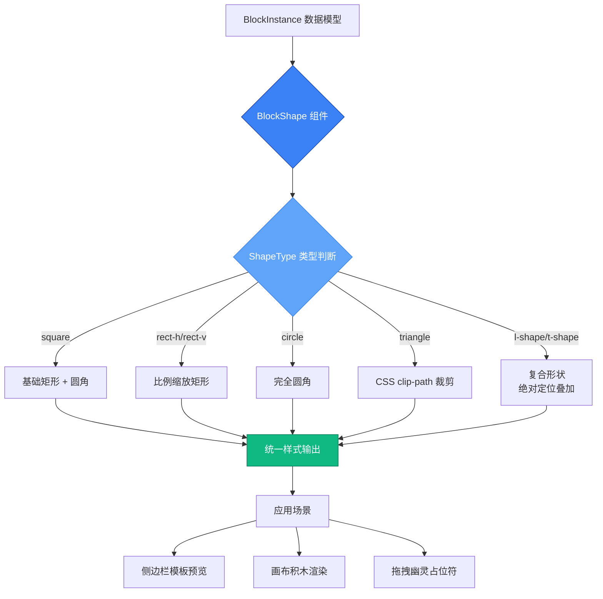

BlockShape 组件是神经网络工坊中负责视觉呈现的核心渲染单元，它将抽象的形状类型定义转换为可交互的可视化元素。作为**纯展示型组件**，它专注于几何形态的精确绘制，通过 CSS 技术组合实现七种积木形状的像素级还原，为整个拖拽交互系统提供视觉基础。

## 组件架构与职责边界

BlockShape 在系统架构中处于**视图层最底端**，它接收类型化数据并输出视觉元素，不处理任何业务逻辑、状态管理或事件响应。这种职责分离使其具备高度的可测试性和可复用性——无论是侧边栏的模板预览、画布中的交互积木，还是拖拽过程中的幽灵占位符，都共享同一套渲染逻辑。

该组件的设计遵循**单一职责原则**：它仅关心"如何绘制指定形状"，而不关心"何时绘制"、"绘制在哪里"或"绘制后如何交互"。父组件通过 props 传入 `type`（形状类型）、`color`（填充色）、`size`（基准尺寸）和可选的 `className`（扩展样式），BlockShape 负责将这些声明式配置转换为具体的 DOM 结构和样式规则。

Sources: [BlockShape.tsx](src/components/BlockShape.tsx#L4-L9)

## Props 接口与类型系统

组件的 Props 接口严格定义了渲染所需的四个维度，通过 TypeScript 类型系统确保调用方的正确性：

| 属性名 | 类型 | 必需性 | 默认值 | 语义说明 |
|--------|------|--------|--------|----------|
| `type` | `ShapeType` | 必需 | - | 形状类型枚举，决定渲染分支 |
| `color` | `string` | 必需 | - | CSS 颜色值，应用于 backgroundColor |
| `size` | `number` | 可选 | 64 | 基准像素尺寸，复杂形状据此计算相对比例 |
| `className` | `string` | 可选 | "" | Tailwind 类名扩展，用于响应式或状态样式 |

`ShapeType` 是核心类型定义，它约束了系统支持的七种形状：`'square' | 'rect-h' | 'rect-v' | 'circle' | 'triangle' | 'l-shape' | 't-shape'`。这种联合类型设计既提供了编译期类型检查，又为 switch-case 渲染逻辑提供了穷尽性保障——如果未来新增形状类型但忘记实现渲染分支，TypeScript 会在编译时报错。

Sources: [BlockShape.tsx](src/components/BlockShape.tsx#L4-L9) [types.ts](src/types.ts#L1)

## 七种形状的渲染策略

BlockShape 组件根据 `type` 属性执行不同的渲染路径，每种形状采用最适合其几何特征的 CSS 技术组合。理解这些技术选型的背后逻辑，有助于在扩展新形状时做出合理决策。

### 基础几何形状：矩形与圆形

**正方形**（square）是最基础的形态，通过一个 div 元素实现，宽高均设为 `size`，并应用 `rounded-sm` 类添加轻微圆角以避免锐利边缘。这种设计体现了**最小复杂度原则**——能用简单元素解决的绝不引入额外结构。

**横向长方形**（rect-h）和**纵向长方形**（rect-v）是正方形的变体，通过比例缩放实现：横向矩形宽度为 `size * 1.5`、高度为 `size * 0.75`，纵向矩形则相反。这种相对尺寸计算确保了不同 size 参数下的视觉一致性，1.5:0.75 的比例（即 2:1）提供了明显的方向性特征而不至于过于细长。

**圆形**（circle）的实现展示了 Tailwind 工具类的语义化优势：只需将 `rounded-sm` 替换为 `rounded-full`，即可将矩形转变为完美圆形，无需手动计算 border-radius 值。这体现了**声明式样式**的核心价值——描述"想要什么"而非"如何实现"。

Sources: [BlockShape.tsx](src/components/BlockShape.tsx#L14-L22)

### CSS 裁剪技术：三角形

**三角形**（triangle）的渲染引入了现代 CSS 特性 `clip-path`，这是组件中技术复杂度最高的形状。通过 `polygon(50% 0%, 0% 100%, 100% 100%)` 定义三个顶点坐标：顶部中心点 (50%, 0%)、左下角 (0%, 100%)、右下角 (100%, 100%)，CSS 引擎会自动裁剪出等腰三角形。

这种技术选型避免了传统方案（如 border 技巧或 SVG 内联）的局限性：**clip-path 直接作用于常规 div 元素**，保留了 backgroundColor、box-shadow 等 CSS 属性的完整支持，同时代码量极少且易于理解。唯一的兼容性考虑是旧版浏览器支持，但在现代前端工程中这已不再是阻碍。

Sources: [BlockShape.tsx](src/components/BlockShape.tsx#L23-L34)

### 复合形状：L 型与 T 型

**L 型**（l-shape）和**T 型**（t-shape）无法通过单一元素或简单裁剪实现，因此采用了**绝对定位叠加**策略。以 L 型为例，它由两个子 div 组成：一个横向矩形（宽 size、高 size/2）和一个纵向矩形（宽 size/2、高 size），通过 `position: absolute` 精确放置在父容器的特定位置。

这种多元素组合虽然增加了 DOM 节点数量，但带来了两个关键优势：**样式继承的一致性**（子元素共享相同的 backgroundColor 样式对象）和**视觉连接的自然性**（两个矩形在交叠处无缝衔接，没有裁剪边缘的锯齿问题）。父容器设置为 `position: relative` 为子元素提供定位上下文，同时其自身尺寸（width: size, height: size）确保了与其他形状的布局对齐。

T 型的实现逻辑类似，区别在于子元素的排列方式：顶部横向矩形（宽 size、高 size/2）与中央纵向矩形（宽 size/2、高 size）在水平中心对齐（left: size/4），形成经典的 T 字形态。

Sources: [BlockShape.tsx](src/components/BlockShape.tsx#L35-L48)

## 样式计算与动态属性

组件内部通过 `const style = { backgroundColor: color }` 创建基础样式对象，然后在各渲染分支中通过对象展开 `{ ...style, ...additionalStyles }` 进行扩展。这种模式避免了在每个 case 中重复 backgroundColor 设置，同时允许针对特定形状添加额外样式属性（如三角形的 clipPath、复合形状的 position）。

**尺寸计算遵循相对单位原则**：所有几何参数都基于 `size` 参数动态计算，而非硬编码像素值。这确保了组件在不同使用场景下的弹性——侧边栏模板预览使用 size=52，画布积木使用 size=64，拖拽占位符可能使用 size=40，但形状的视觉比例始终保持一致。

**className 的透传机制**允许父组件注入额外样式而不破坏组件封装性。例如在画布渲染中，父组件传入 `className="absolute cursor-grab"` 来添加定位和光标样式，而 BlockShape 内部不需要了解这些外部关注点。这种**关注点分离**是 React 组件设计的核心原则之一。

Sources: [BlockShape.tsx](src/components/BlockShape.tsx#L11-L16)

## 实际应用场景分析

BlockShape 组件在系统中有三个主要应用场景，每个场景对 size 和 className 参数有不同的需求模式：

**侧边栏模板预览**场景中，组件被包裹在 motion.div 拖拽容器内，size 设为 52 以适应卡片布局，外层容器处理所有交互逻辑。这里的 BlockShape 纯粹作为视觉标识，帮助用户识别形状类型。当拖拽发生时，同一组件实例会因为 motion 的 whileDrag 动画而放大（scale: 1.2），但 BlockShape 本身不感知这些动画状态。

**画布积木渲染**场景中，size 恢复为默认的 64，组件被包裹在另一个 motion.div 中，该容器通过 `rotate: block.rotation` 应用旋转变换。这里展示了**变换的职责分层**：BlockShape 负责形状的静态渲染，父容器负责动态变换（旋转、缩放、位移），两者通过 React 组件树组合实现完整的视觉效果。

**拖拽幽灵占位符**场景是一个有趣的设计细节：当任何积木被拖拽时，侧边栏模板卡片中会渲染一个半透明黑色版本（opacity: 0.1, color: "#000"）作为视觉占位，提示用户原始位置。这里复用了同一 BlockShape 组件，仅改变 color 和外层透明度，体现了组件抽象的经济性。

Sources: [App.tsx](src/App.tsx#L386-L387) [App.tsx](src/App.tsx#L612) [App.tsx](src/App.tsx#L395-L398)

## 性能特征与优化考量

BlockShape 是一个**纯函数组件**（React.FC），给定相同的 props 总是返回相同的 JSX 结构，这使其天然兼容 React 的记忆化优化策略。虽然当前实现中没有显式使用 React.memo，但在积木数量增多导致渲染压力增大时，这可以作为优化手段——只需在组件导出时包裹 `React.memo(BlockShape)` 即可避免无关状态变化引起的不必要重渲染。

**DOM 结构的复杂度分级**也是性能考量的一部分：正方形、长方形、圆形仅需单个 div 节点，三角形需要单个 div 加 clip-path 属性，而 L 型和 T 型需要三个 div（父容器 + 两个子元素）。在实际应用中，大部分积木是基础形状，复杂形状占比通常较低，这种不均匀分布降低了平均渲染成本。

**CSS-in-JS 的轻量化实践**：组件没有使用 styled-components 或 emotion 等运行时 CSS-in-JS 库，而是直接使用 style 对象和 Tailwind 类名。这种选择避免了运行时样式注入的性能开销，同时 clip-path 等 CSS 特性通过内联样式直接传递给浏览器，确保了渲染路径的最短化。

Sources: [BlockShape.tsx](src/components/BlockShape.tsx#L11-L51)

## 扩展性与维护性设计

当需要新增形状类型时，开发流程清晰可控：首先在 `types.ts` 中的 `ShapeType` 联合类型添加新成员（如 `'hexagon'`），TypeScript 编译器会立即在 BlockShape 的 switch 语句中报错提示缺失 case 分支；然后在组件中实现对应的渲染逻辑，可以复用现有的三种技术模式（基础元素、clip-path 裁剪、绝对定位叠加）或引入新技术（如 SVG 内联）；最后在 `BLOCK_TEMPLATES` 数组中添加模板配置，新形状即可在侧边栏和画布中使用。

**类型安全的穷尽性检查**通过 default 分支返回 null 实现，虽然理论上不应该执行到该分支（因为 TypeScript 会检查 switch 的完整性），但它作为运行时安全网存在，防止未预期的类型值导致组件崩溃。这种防御性编程在动态数据源（如未来可能的后端配置加载）场景下尤为重要。

**样式抽象的可替换性**：当前实现使用 Tailwind CSS 的工具类（rounded-sm、rounded-full、relative），如果项目未来迁移到其他 CSS 框架，只需修改这些类名映射而不需要重写渲染逻辑。backgroundColor 通过内联样式设置而非 Tailwind 类（如 bg-blue-500），是为了支持动态颜色值——这体现了**静态工具类与动态内联样式的互补使用**策略。

Sources: [BlockShape.tsx](src/components/BlockShape.tsx#L49-L51) [types.ts](src/types.ts#L1-L23)

## 技术栈集成细节

BlockShape 组件的实现充分利用了项目技术栈的特性：**React 19** 的函数组件和 TypeScript 接口提供了类型安全的 props 解构；**Tailwind CSS v4** 的工具类系统简化了圆角和定位样式；**Vite 6** 的快速热更新确保了形状调整时的即时反馈。虽然组件本身不直接使用 **Motion 动画库**，但它被设计为与 motion.div 无缝协作——外层容器处理所有动画和交互，BlockShape 专注于静态形态，这种分层是 React 动画系统的最佳实践。

组件的**零依赖特性**值得强调：它不导入任何外部库（除了 React 自身），完全依赖浏览器原生 CSS 能力实现视觉效果。这种自包含性降低了打包体积，提高了代码的可移植性，也使得组件可以在不同项目间轻松复用——只需复制 BlockShape.tsx 和相关类型定义即可。

Sources: [BlockShape.tsx](src/components/BlockShape.tsx#L1-L2)

## 下一步学习路径

理解 BlockShape 的渲染机制后，建议按以下顺序深入相关主题：

- **[七种积木形状](6-qi-chong-ji-mu-xing-zhuang)**：了解每种形状的设计理念和在神经网络构建中的语义含义
- **[颜色主题系统](9-yan-se-zhu-ti-xi-tong)**：探索 color 参数的来源和 COLORS 数组的配色策略
- **[拖拽交互实现](11-tuo-zhuai-jiao-hu-shi-xian)**：学习 BlockShape 如何与 Motion 拖拽系统集成
- **[积木模板扩展](33-ji-mu-mo-ban-kuo-zhan)**：掌握如何添加新形状类型并保持系统一致性