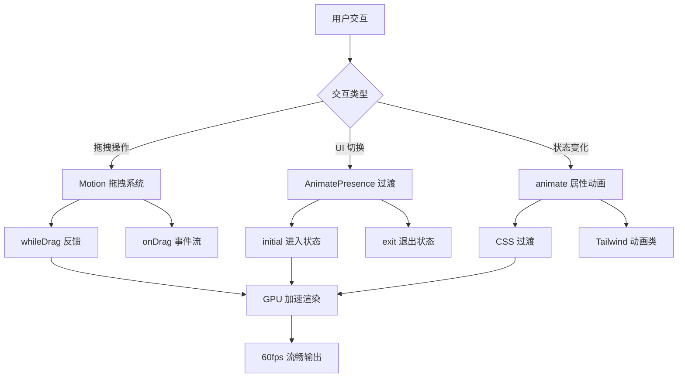

Block Builder Pro 采用 **Motion** 动画库（Framer Motion v12）构建流畅的交互体验，通过声明式动画 API 实现拖拽反馈、组件生命周期过渡和微交互效果。系统的动画设计遵循 **性能优先、用户感知导向** 的原则，在保持 60fps 流畅度的同时提供清晰的视觉反馈。

## 动画系统架构

项目的动画实现分为三个层次：**物理拖拽层**处理用户直接操作的反馈，**声明式过渡层**管理组件的进入与退出，**CSS 辅助层**提供轻量级的持续动画。这种分层架构确保复杂交互与简单动画各司其职，避免性能冲突。



核心依赖配置显示 Motion 库作为独立包管理，版本号为 12.23.24，与 React 19 协同工作。项目通过 Vite 6 的构建优化实现动画库的按需加载，确保首屏性能不受动画代码体积影响。Sources: [package.json](package.json#L6-L24)

## Motion 库核心集成

项目从 `motion/react` 导入核心组件，这种路径区别于传统的 `framer-motion` 包名，反映了库的现代化迁移。`motion` 组件作为 HTML 元素的增强版本，支持所有原生属性的同时提供动画专用 props。`AnimatePresence` 组件通过检测子组件的挂载状态，自动编排进入与退出动画的时间线。

```typescript
import { motion, AnimatePresence } from 'motion/react';
import { useDragControls } from 'motion/react';
```

动画配置遵循 **最小干预原则**，仅在需要物理反馈的场景启用拖拽功能，避免全局拖拽监听带来的性能开销。`useDragControls` Hook 提供程序化控制拖拽的能力，用于实现复杂的拖拽约束和自定义手势。Sources: [App.tsx](src/App.tsx#L1-L13)

## 拖拽动画系统

### 模板拖拽实现

左侧模板栏的积木模板使用 Motion 的 `drag` 属性实现拖拽功能，通过 `dragSnapToOrigin` 配置确保未成功放置时自动回弹到原位。这种设计模式避免了用户误操作导致的模板丢失，同时提供明确的视觉反馈。

```typescript
<motion.div
  drag
  dragSnapToOrigin
  dragMomentum={false}
  dragElastic={0.1}
  whileDrag={{ 
    scale: 1.2, 
    zIndex: 1000,
    filter: "drop-shadow(0 20px 30px rgba(0,0,0,0.3))",
    cursor: "grabbing"
  }}
  onDragStart={() => setIsAnyItemDragging(true)}
  onDrag={handleTemplateDrag}
  onDragEnd={(e, info) => {
    setIsAnyItemDragging(false);
    handleTemplateDragEnd(e, info, template);
  }}
  className="z-30 cursor-grab active:z-50 touch-none"
>
  <BlockShape type={template.type} color={template.defaultColor} size={52} />
</motion.div>
```

关键配置参数包括：`dragMomentum={false}` 禁用惯性滑动，确保拖拽停止时立即响应；`dragElastic={0.1}` 限制弹性系数，防止过度拉伸导致的视觉失真；`whileDrag` 对象定义拖拽期间的瞬时样式，包括 **20% 缩放提升**、**层级置顶** 和 **深度阴影投射**。Sources: [App.tsx](src/App.tsx#L324-L346)

### 画布积木拖拽动画

画布中的积木实例实现更复杂的拖拽逻辑，需要同步更新位置状态、层级管理和连接线跟踪。动画系统通过 `initial`、`animate`、`exit` 三态模型描述组件的完整生命周期，配合 `whileDrag` 提供操作时的视觉增强。

```typescript
<motion.div
  drag
  dragMomentum={false}
  onDragStart={() => {
    setSelectedId(block.id);
    setIsDraggingExisting(true);
    setIsAnyItemDragging(true);
  }}
  onDrag={(e, info) => {
    setDragPositions(prev => ({
      ...prev,
      [block.id]: { x: block.x + info.offset.x, y: block.y + info.offset.y }
    }));
  }}
  initial={{ scale: 0, opacity: 0 }}
  animate={{ 
    scale: 1, 
    opacity: 1,
    x: block.x,
    y: block.y,
    rotate: block.rotation,
    zIndex: block.zIndex
  }}
  whileDrag={{ 
    scale: 1.1, 
    zIndex: 2000,
    boxShadow: "0 25px 50px -12px rgb(0 0 0 / 0.4)"
  }}
  exit={{ scale: 0, opacity: 0 }}
/>
```

`initial` 状态定义积木创建时的 **缩放为 0、透明度为 0**，`animate` 状态驱动过渡到 **正常尺寸、完全可见** 的最终状态。`exit` 状态处理积木删除时的 **反向动画**，确保元素平滑消失而非突兀移除。`onDrag` 回调通过 `info.offset` 计算实时位置偏移，用于更新连接线的渲染坐标，实现拖拽过程中连接线的 **动态跟踪**。Sources: [App.tsx](src/App.tsx#L497-L547)

## 组件过渡动画

### AnimatePresence 生命周期管理

`AnimatePresence` 组件包装需要条件渲染的元素集合，自动检测子组件的移除并延迟卸载直到 `exit` 动画完成。这种机制避免了传统 CSS 动画需要手动管理 `setTimeout` 的复杂性，通过声明式配置实现优雅的退出过渡。

```typescript
<AnimatePresence>
  {(isDraggingExisting || isDraggingTemplate) && (
    <motion.div
      initial={{ opacity: 0, scale: 0.9 }}
      animate={{ opacity: 1, scale: 1 }}
      exit={{ opacity: 0, scale: 0.9 }}
      className="absolute inset-0 z-50 bg-zinc-900/80 backdrop-blur-sm"
    >
      <div className="w-20 h-20 bg-white/10 rounded-full animate-bounce">
        <Trash size={40} className={isDraggingExisting ? "text-red-400" : "text-blue-400"} />
      </div>
    </motion.div>
  )}
</AnimatePresence>
```

删除确认覆盖层的动画配置展示典型的 **淡入放大** 和 **淡出缩小** 模式，`scale` 从 0.9 过渡到 1.0 提供轻微的弹出感，`opacity` 变化控制透明度渐变。`exit` 状态的配置确保覆盖层在用户释放拖拽后 **平滑消失**，而非立即消失导致的视觉断裂。Sources: [App.tsx](src/App.tsx#L438-L456)

### 侧边栏展开动画

右侧代码预览栏使用 `AnimatePresence` 管理展开与收起的过渡，通过 `width` 属性的动画实现平滑的宽度变化。这种方案优于传统的 CSS `max-width` 技巧，能够精确控制目标宽度并支持动态调整。

```typescript
<AnimatePresence>
  {rightSidebarOpen && (
    <motion.aside
      initial={{ width: 0, opacity: 0 }}
      animate={{ width: rightSidebarWidth, opacity: 1 }}
      exit={{ width: 0, opacity: 0 }}
      transition={{ duration: 0.3 }}
      className="bg-white border-l border-zinc-200 overflow-hidden"
      style={{ width: rightSidebarWidth }}
    >
      {/* 侧边栏内容 */}
    </motion.aside>
  )}
</AnimatePresence>
```

`transition={{ duration: 0.3 }}` 配置将动画持续时间固定为 300ms，符合 **Material Design 动画时长指南** 中复杂过渡的建议值。`overflow-hidden` 类确保内容在宽度收缩时被裁剪而非溢出，维持视觉整洁。Sources: [App.tsx](src/App.tsx#L686-L702)

### 右键菜单弹出动画

右键菜单使用 **缩放+透明度** 组合动画实现弹出效果，从 0.9 倍尺寸和完全透明过渡到正常尺寸和完全可见。这种模式在 macOS 和 iOS 系统界面中广泛使用，提供轻盈的视觉感受。

```typescript
<AnimatePresence>
  {contextMenu && (
    <motion.div
      initial={{ opacity: 0, scale: 0.9 }}
      animate={{ opacity: 1, scale: 1 }}
      exit={{ opacity: 0, scale: 0.9 }}
      className="fixed bg-white rounded-xl shadow-2xl border border-zinc-200"
      style={{ left: contextMenu.x, top: contextMenu.y }}
    >
      {/* 菜单项 */}
    </motion.div>
  )}
</AnimatePresence>
```

菜单定位通过内联 `style` 属性动态设置 `left` 和 `top` 值，确保菜单出现在鼠标点击位置。`fixed` 定位模式使菜单脱离文档流，避免受到父容器布局的影响。Sources: [App.tsx](src/App.tsx#L601-L627)

## CSS 辅助动画

### Tailwind 内置动画类

项目利用 Tailwind CSS v4 提供的实用动画类实现轻量级持续动画，避免为简单效果引入 JavaScript 开销。`animate-bounce` 类实现垂直弹跳效果，`animate-pulse` 类实现透明度脉冲效果。

```typescript
// 删除图标弹跳动画
<div className="w-20 h-20 bg-white/10 rounded-full animate-bounce">
  <Trash size={40} />
</div>

// 状态指示器脉冲动画
<div className="w-2 h-2 rounded-full bg-emerald-500 animate-pulse" />
```

这些动画类基于 CSS `@keyframes` 规则定义，通过 `animation` 属性应用到元素。`animate-bounce` 使用 `transform: translateY()` 实现垂直位移，`animate-pulse` 使用 `opacity` 属性实现呼吸效果。Sources: [App.tsx](src/App.tsx#L443-L446), [App.tsx](src/App.tsx#L678-L680)

### 过渡效果配置

颜色过渡和变换过渡通过 Tailwind 的 `transition-*` 类实现，这些类设置 `transition-property`、`transition-duration` 和 `transition-timing-function` 属性。项目主要使用 `transition-colors` 和 `transition-transform` 类。

```typescript
// 颜色过渡
<button className="hover:bg-blue-50 transition-colors">
  复制
</button>

// 变换过渡
<button className="hover:scale-110 transition-transform">
  <RotateCw size={14} />
</button>
```

`transition-colors` 类专门针对 `color`、`background-color`、`border-color` 等颜色属性设置过渡，`transition-transform` 类针对 `transform` 属性设置过渡。这种细粒度控制避免不必要的属性监听，提升动画性能。Sources: [App.tsx](src/App.tsx#L398-L415)

## 动画性能优化

### GPU 加速策略

Motion 库自动将 `transform` 和 `opacity` 属性的动画提升到 GPU 层，通过硬件加速实现流畅的 60fps 渲染。项目中的所有拖拽动画和过渡动画都基于这两个属性，确保动画性能不受 CPU 计算瓶颈限制。

```typescript
// GPU 加速的动画属性
whileDrag={{ 
  scale: 1.1,        // transform: scale()
  opacity: 0.8,      // opacity
  boxShadow: "..."   // 注意：box-shadow 不触发 GPU 加速
}}
```

`boxShadow` 属性的动画虽然不触发 GPU 加速，但仅在 `whileDrag` 状态下应用，持续时间短且频率低，不会造成明显性能问题。对于长时间运行的动画，应避免使用 `box-shadow`、`filter` 等触发重绘的属性。Sources: [App.tsx](src/App.tsx#L509-L514)

### 拖拽状态管理优化

项目通过多个布尔状态标记拖拽的不同阶段，避免在每次 `onDrag` 回调中执行昂贵的计算。`isDraggingExisting`、`isDraggingTemplate`、`isAnyItemDragging` 三个状态分别标记 **画布积木拖拽**、**模板拖拽** 和 **任意拖拽**，用于条件渲染覆盖层和调整样式。

```typescript
const [isDraggingExisting, setIsDraggingExisting] = useState(false);
const [isDraggingTemplate, setIsDraggingTemplate] = useState(false);
const [isAnyItemDragging, setIsAnyItemDragging] = useState(false);

// 拖拽期间禁用过渡
className={`absolute cursor-grab ${isAnyItemDragging ? 'transition-none' : ''}`}
```

`transition-none` 类在拖拽期间禁用 CSS 过渡，防止过渡动画与拖拽动画产生冲突。这种模式确保拖拽操作的响应性，避免过渡动画延迟位置更新的视觉反馈。Sources: [App.tsx](src/App.tsx#L14-L16), [App.tsx](src/App.tsx#L548)

## 动画状态协调

### 实时位置追踪

拖拽过程中需要实时更新连接线的渲染坐标，`onDrag` 回调通过 `info.offset` 计算当前位置偏移并存储到 `dragPositions` 状态。连接线渲染逻辑优先使用拖拽位置，若无则使用静态位置，实现 **拖拽中动态跟踪，静止时静态定位** 的混合模式。

```typescript
const [dragPositions, setDragPositions] = useState<Record<string, { x: number; y: number }>>({});

onDrag={(e, info) => {
  setDragPositions(prev => ({
    ...prev,
    [block.id]: { x: block.x + info.offset.x, y: block.y + info.offset.y }
  }));
}

// 连接线渲染
const x1 = (dragPositions[block.id]?.x ?? block.x) + 32;
const y1 = (dragPositions[block.id]?.y ?? block.y) + 32;
```

`info.offset` 提供相对于拖拽起点的累计偏移量，与 `block.x/y` 相加得到绝对坐标。`??` 运算符提供默认值，确保在 `dragPositions` 中无对应记录时回退到静态位置。`+ 32` 偏移量将坐标定位到 64px 积木的中心点。Sources: [App.tsx](src/App.tsx#L44-L45), [App.tsx](src/App.tsx#L576-L582)

### 层级动态调整

积木的 `zIndex` 属性通过 `animate` 对象动态绑定，确保层级变化时触发平滑过渡。`bringToFront` 函数更新积木的 `zIndex` 值并递增全局 `nextZIndex` 计数器，实现 **后操作者置顶** 的层叠逻辑。

```typescript
const [nextZIndex, setNextZIndex] = useState(1);

const bringToFront = (id: string) => {
  updateBlock(id, { zIndex: nextZIndex });
  setNextZIndex(prev => prev + 1);
};

animate={{ 
  scale: 1, 
  zIndex: block.zIndex  // 动态绑定层级
}}
```

`nextZIndex` 状态作为 **单调递增的序列号**，确保每次置顶操作都获得唯一的层级值，避免多个积木共享同一层级导致的覆盖冲突。`animate` 对象中的 `zIndex` 绑定使层级变化融入动画系统，虽然 `zIndex` 本身不产生视觉过渡，但保证了状态更新的时序一致性。Sources: [App.tsx](src/App.tsx#L28-L29), [App.tsx](src/App.tsx#L503-L508)

## 动画设计模式总结

| 动画场景 | 实现技术 | 触发条件 | 性能特征 |
|---------|---------|---------|---------|
| 模板拖拽 | Motion `drag` + `whileDrag` | 用户拖拽手势 | GPU 加速，60fps |
| 积木生命周期 | Motion `initial/animate/exit` | 组件挂载/卸载 | GPU 加速，300ms 过渡 |
| 侧边栏展开 | Motion `width` 动画 | 状态切换 | 布局重计算，300ms 过渡 |
| 右键菜单 | Motion `scale` + `opacity` | 右键点击 | GPU 加速，150ms 过渡 |
| 删除覆盖层 | AnimatePresence + CSS `animate-bounce` | 拖拽进入删除区 | 混合模式，持续动画 |
| 状态指示器 | CSS `animate-pulse` | 组件挂载 | CSS 动画，无限循环 |
| 按钮悬停 | Tailwind `transition-colors` | 鼠标悬停 | CSS 过渡，150ms |

项目的动画系统展示了 **渐进增强** 的设计理念：基础交互依赖 CSS 过渡和 Tailwind 动画类实现零 JavaScript 开销，复杂交互引入 Motion 库提供物理模拟和状态编排能力。这种分层策略确保核心功能在低端设备上依然可用，同时在支持高级特性的环境中提供增强体验。Sources: [App.tsx](src/App.tsx)

## 进阶学习路径

掌握 Block Builder Pro 的动画系统后，建议按以下顺序深入学习相关主题：

- **[Motion 动画库使用](27-motion-dong-hua-ku-shi-yong)**：了解 Motion 库的完整 API 和高级特性，包括布局动画、手势识别和动画编排
- **[拖拽交互实现](11-tuo-zhuai-jiao-hu-shi-xian)**：深入研究拖拽逻辑的状态管理和事件处理机制
- **[Tailwind CSS v4 样式系统](26-tailwind-css-v4-yang-shi-xi-tong)**：探索 Tailwind 的动画工具类和自定义配置
- **[React 19 特性应用](24-react-19-te-xing-ying-yong)**：理解 React 19 的并发特性如何与动画系统协同工作