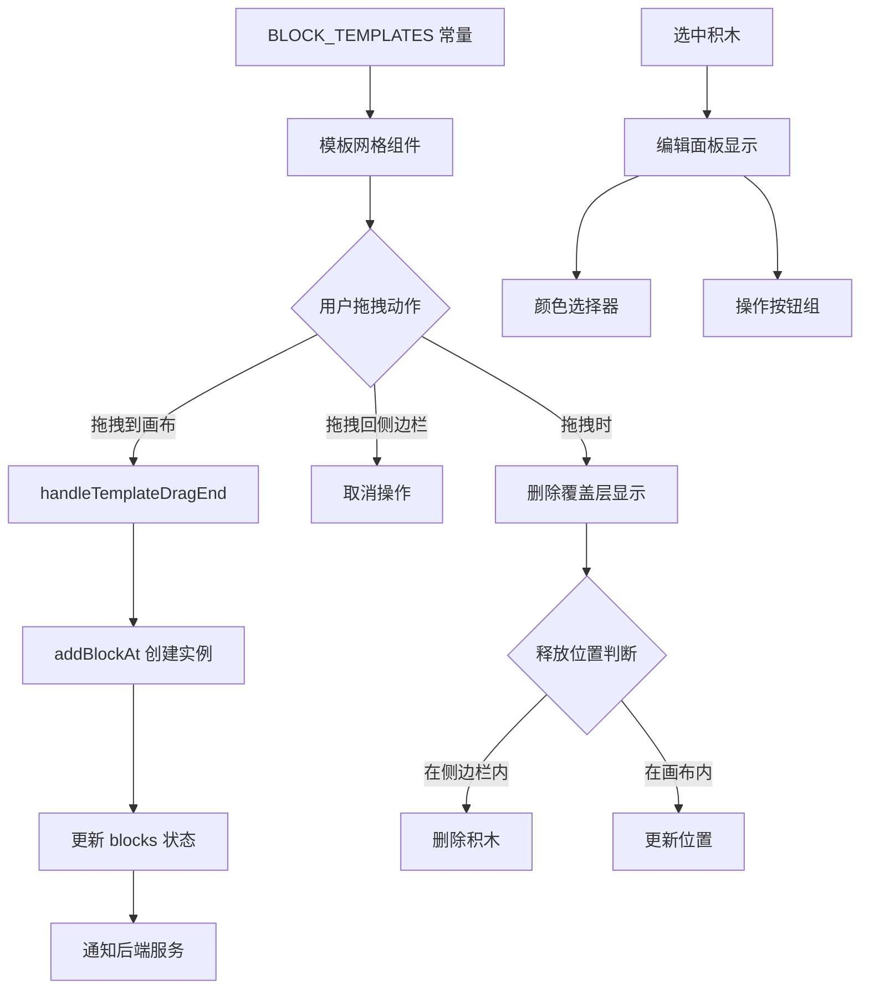

左侧模板栏是 Block Builder Pro 应用的核心交互入口，为用户提供可视化的积木形状库。作为整个应用的起点，它采用直观的拖拽交互模式，让初学者能够快速上手，通过拖拽不同形状的积木到中央画布来构建神经网络模型。模板栏采用响应式布局设计，在提供丰富视觉反馈的同时，保持界面的整洁与专业感。

Sources: [App.tsx](src/App.tsx#L341-L516)

## 架构概览

左侧模板栏采用模块化的组件架构，由四个主要功能区组成：顶部标题区、中间模板网格区、动态编辑面板（仅在选中积木时显示）以及底部重置按钮区。整个侧边栏使用固定宽度（320px），确保在不同屏幕尺寸下保持一致的用户体验。数据流从 `BLOCK_TEMPLATES` 常量流向模板网格，再通过拖拽交互传递到中央画布，形成单向数据流。

Sources: [App.tsx](src/App.tsx#L341-L516), [types.ts](src/types.ts#L25-L33)

## 七种积木模板

模板库提供了七种预定义的积木形状，每种形状对应不同的神经网络组件概念。模板数据存储在 `BLOCK_TEMPLATES` 常量中，包含形状类型、中文标签和默认颜色三个属性。这些模板采用 2x4 网格布局展示，每个模板卡片都具有悬停高亮效果和拖拽手势提示。

| 形状类型 | 中文标签 | 默认颜色 | 形状特征 | 应用场景 |
|---------|---------|---------|---------|---------|
| square | 正方形 | 蓝色 (#3b82f6) | 64×64px 等边正方形 | 基础神经元节点 |
| rect-h | 长方形 (横) | 红色 (#ef4444) | 96×48px 横向矩形 | 横向连接层 |
| rect-v | 长方形 (纵) | 绿色 (#10b981) | 48×96px 纵向矩形 | 纵向数据流 |
| circle | 圆形 | 琥珀色 (#f59e0b) | 64×64px 圆形 | 循环节点 |
| triangle | 三角形 | 紫色 (#8b5cf6) | 64×64px 三角形 | 激活函数 |
| l-shape | L型 | 粉色 (#ec4899) | 64×64px L形状 | 分支结构 |
| t-shape | T型 | 青色 (#06b6d4) | 64×64px T形状 | 多路分发 |

Sources: [types.ts](src/types.ts#L25-L33)

## 拖拽交互机制

拖拽交互是模板栏的核心功能，通过 Motion 动画库的 `drag` 属性实现。每个模板卡片都封装在 `motion.div` 组件中，配置了 `dragSnapToOrigin`（拖拽结束后返回原位）、`dragMomentum`（禁用惯性）和 `dragElastic`（弹性系数 0.1）等参数。拖拽过程分为三个阶段：开始时设置全局拖拽状态标志，拖拽中实时检测是否越过侧边栏边界，结束时根据释放位置决定创建积木实例或取消操作。

拖拽处理器通过 `handleTemplateDrag` 函数实时监控鼠标位置，计算当前坐标是否超过侧边栏宽度（320px），从而判断用户意图是将模板拖到画布还是取消操作。当检测到拖拽状态变化时，会更新 `isDraggingTemplate` 状态，触发删除覆盖层的显示或隐藏。拖拽距离小于 10px 的微小移动会被识别为点击操作并忽略，避免误触发。

Sources: [App.tsx](src/App.tsx#L259-L297), [App.tsx](src/App.tsx#L364-L388)

## 视觉反馈系统

模板栏实现了多层次的视觉反馈机制，确保用户在每个交互阶段都能获得清晰的状态提示。静态状态下，模板卡片采用浅灰色背景（bg-zinc-50）和细边框（border-zinc-100），悬停时边框变为蓝色（border-blue-400）并切换为浅蓝背景（bg-blue-50）。拖拽状态下，积木形状会放大到 1.2 倍，添加深度阴影效果（drop-shadow），并将 z-index 提升到 1000，确保拖拽元素始终显示在最上层。

当用户开始拖拽时，模板栏会显示一个半透明的删除覆盖层（opacity-80），背景采用深色模糊效果（backdrop-blur-sm），中央显示垃圾桶图标和提示文字。如果拖拽的是已有积木（isDraggingExisting 为 true），图标显示为红色并提示"拖拽到此处删除"；如果是拖拽模板（isDraggingTemplate 为 true），图标显示为蓝色并提示"取消拖拽"。这种差异化的视觉提示帮助用户理解当前操作的含义。

Sources: [App.tsx](src/App.tsx#L462-L482), [App.tsx](src/App.tsx#L369-L374)

## 动态编辑面板

当选中画布上的积木时，模板栏底部会动态显示一个编辑面板，采用深色主题（bg-zinc-900）与圆角设计（rounded-2xl）。面板包含颜色选择器和四个操作按钮：旋转（RotateCw）、置顶（Layers）、复制（Copy）和删除（Trash2）。颜色选择器展示 10 种预设颜色，采用 5x2 网格布局，当前选中颜色会显示白色边框并放大 10%。所有按钮都配置了悬停效果和平滑过渡动画。

编辑面板通过 Motion 的 `initial` 和 `animate` 属性实现淡入滑动动画，初始状态透明度为 0 并向下偏移 10px，动画结束后恢复到正常位置。面板的显示条件是 `selectedBlock` 状态不为 null，当用户点击画布空白区域或关闭按钮时，`selectedId` 被设置为 null，面板随之消失。这种条件渲染方式避免了不必要的 DOM 节点，提升了应用性能。

Sources: [App.tsx](src/App.tsx#L405-L459)

## 重置画布功能

模板栏底部提供了一个重置画布按钮，采用浅色设计（text-zinc-500）和 Undo2 图标，悬停时文字颜色加深（hover:text-zinc-800）。为了避免误操作，点击按钮后不会立即清空画布，而是显示一个确认对话框。确认对话框采用绝对定位覆盖整个底部区域，包含"确定清空？"提示文字和两个按钮：红色确定按钮和灰色取消按钮。

确认对话框同样使用 Motion 动画库实现淡入滑动效果，通过 `showClearConfirm` 状态控制显示。点击确定按钮后，调用 `clearCanvas` 函数清空 `blocks` 数组、重置 `selectedId` 为 null，并将确认状态恢复为 false。这种两步确认机制有效防止了用户意外丢失工作成果，符合现代应用的用户体验最佳实践。

Sources: [App.tsx](src/App.tsx#L484-L515), [App.tsx](src/App.tsx#L330-L334)

## 拖拽状态管理

模板栏通过三个关键状态变量协调复杂的拖拽交互：`isDraggingTemplate` 表示是否正在拖拽模板到画布，`isDraggingExisting` 表示是否正在拖拽已有积木，`isAnyItemDragging` 是全局拖拽标志，用于控制滚动容器的 overflow 属性。当 `isAnyItemDragging` 为 true 时，模板网格容器切换为 `overflow-visible`，确保拖拽元素不会被容器裁剪；否则保持 `overflow-y-auto` 允许垂直滚动。

`isOverCanvasRef` 是一个 ref 引用而非状态变量，用于在拖拽过程中实时跟踪鼠标是否在画布区域内。使用 ref 而非 state 的原因是 ref 的更新不会触发组件重新渲染，避免了高频拖拽事件导致的性能问题。每次 `handleTemplateDrag` 被调用时，都会比较当前 `isOverCanvas` 状态与 ref 值，只有当状态发生变化时才更新 `isDraggingTemplate`，这种优化减少了不必要的状态更新。

Sources: [App.tsx](src/App.tsx#L31-L34), [App.tsx](src/App.tsx#L39), [App.tsx](src/App.tsx#L259-L267)

## 模板渲染流程

每个模板卡片都是一个独立的 React 组件实例，包含外层容器、可拖拽层、积木形状组件和标签文字四个部分。外层容器是固定高度（h-32）的 div，采用网格布局的 2 列排列（grid-cols-2），间距为 4 个单位（gap-4）。容器内部使用 flexbox 居中对齐，垂直方向从上到下依次排列积木形状和标签文字。

积木形状通过 `BlockShape` 组件渲染，该组件接收 `type`（形状类型）、`color`（颜色）和 `size`（尺寸）三个 props。在模板栏中，size 固定为 52px，比画布上的积木（64px）略小，营造视觉层次感。标签文字采用 10px 字号、粗体、大写字母、加宽字距（tracking-wider）的排版风格，默认显示灰色（text-zinc-400），悬停时变为蓝色（group-hover:text-blue-500），使用 `select-none` 类禁止文字选择。

Sources: [App.tsx](src/App.tsx#L358-L402), [components/BlockShape.tsx](src/components/BlockShape.tsx#L11-L52)

## 下一步学习

完成左侧模板栏的学习后，建议继续探索以下主题以深入理解整个应用的工作机制：

- **[中央画布区域](16-zhong-yang-hua-bu-qu-yu)**：了解拖拽到画布的积木如何被渲染、移动和管理
- **[积木形状渲染组件](12-ji-mu-xing-zhuang-xuan-ran-zu-jian)**：深入理解 BlockShape 组件如何绘制七种不同形状
- **[拖拽交互实现](11-tuo-zhuai-jiao-hu-shi-xian)**：掌握 Motion 库的高级拖拽配置和事件处理
- **[颜色主题系统](9-yan-se-zhu-ti-xi-tong)**：学习 10 种预设颜色的设计理念和应用场景