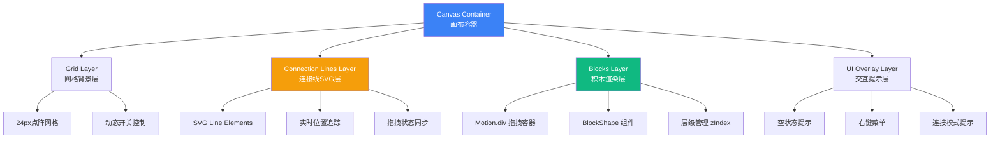
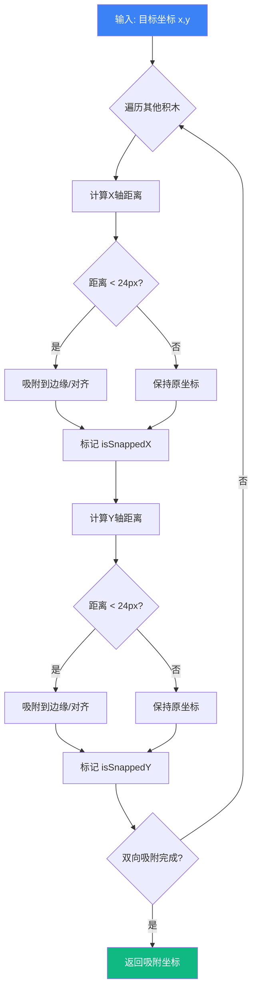
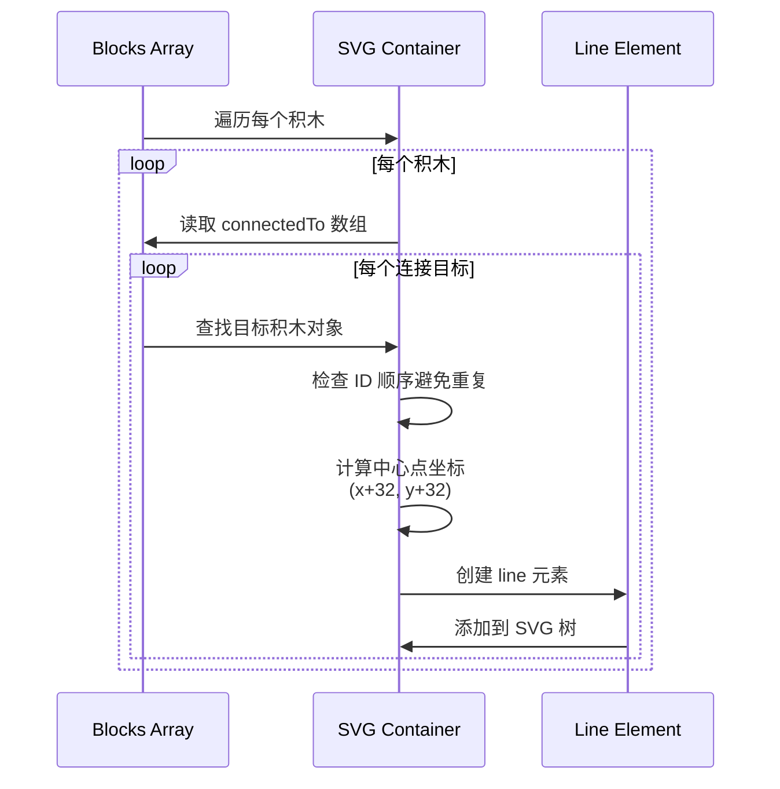
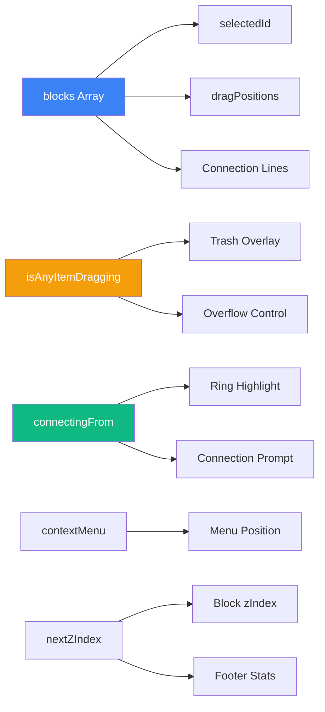

中央画布区域是 Block Builder Pro 应用的核心工作区，为用户提供可视化积木搭建的主要交互空间。该区域负责积木实例的渲染、定位、对齐、连接和层级管理，是连接用户操作与代码生成的关键界面组件。画布采用 **24px 网格对齐系统**，支持智能吸附功能，确保积木排列的整齐性和专业性。通过 Motion 动画库实现的流畅拖拽交互，配合实时视觉反馈（缩放、阴影、连接线），为初学者提供直观友好的操作体验。

Sources: [App.tsx](src/App.tsx#L536-L548)

## 架构概览

中央画布区域采用**多层叠加架构**设计，将不同功能通过独立的视觉层进行管理，确保职责清晰和性能优化：



画布容器作为最外层包装器，管理整体布局和事件委托；网格层提供视觉参考和对齐基准；连接线层使用 SVG 技术绘制积木间的关联关系；积木层通过 Motion 组件实现拖拽和动画效果；交互提示层负责空状态引导、右键菜单和操作反馈。这种分层设计使每个功能模块独立演进，便于维护和扩展。

Sources: [App.tsx](src/App.tsx#L536-L725)

## 核心功能模块

### 积木渲染系统

积木渲染采用 **声明式动画架构**，通过 Motion 库的 `motion.div` 组件将积木实例转换为可交互的视觉元素。每个积木实例包含 6 个核心属性：`id`（唯一标识）、`type`（形状类型）、`x/y`（画布坐标）、`color`（颜色值）、`rotation`（旋转角度）和 `zIndex`（层级顺序）。渲染流程通过 `blocks.map()` 遍历状态数组，为每个积木创建独立的拖拽容器：

**渲染属性配置表**

| 属性名 | 类型 | 功能说明 | 示例值 |
|--------|------|----------|--------|
| `drag` | boolean | 启用拖拽功能 | `true` |
| `dragMomentum` | boolean | 拖拽惯性效果 | `false` |
| `initial` | object | 初始动画状态 | `{ scale: 0, opacity: 0 }` |
| `animate` | object | 目标动画状态 | `{ scale: 1, x: block.x, y: block.y }` |
| `whileDrag` | object | 拖拽中样式 | `{ scale: 1.1, zIndex: 2000 }` |
| `exit` | object | 退出动画 | `{ scale: 0, opacity: 0 }` |

积木的实际形状通过 `BlockShape` 组件渲染，该组件根据 `type` 属性返回对应的几何形状（正方形、圆形、三角形等）。拖拽容器负责处理交互逻辑（选择、移动、右键菜单），而形状组件专注于视觉呈现，实现了**关注点分离**的设计原则。

Sources: [App.tsx](src/App.tsx#L549-L615), [BlockShape.tsx](src/components/BlockShape.tsx#L11-L52), [types.ts](src/types.ts#L3-L12)

### 网格对齐机制

画布采用 **24px 基准网格系统**，通过 CSS `radial-gradient` 生成点阵背景，为用户提供精确的视觉参考。对齐机制包含两种模式：**网格吸附**（Grid Snapping）和**积木间吸附**（Block-to-Block Snapping）。当网格显示开启时，积木位置强制对齐到 24px 整数倍坐标；当网格关闭时，系统自动检测相邻积木并在 24px 阈值内进行边缘对齐。

**findSnapPosition 吸附算法流程**



X 轴吸附逻辑包含三种情况：拖拽块右边缘吸附到目标块左边缘（`x + 64 → other.x`）、左边缘吸附到目标块右边缘（`x → other.x + 64`）、左边缘对齐（`x → other.x`）。Y 轴采用相同的三模式逻辑。这种多维度吸附策略确保积木既能紧密排列，又能保持视觉整齐，极大降低了初学者的操作门槛。

Sources: [App.tsx](src/App.tsx#L95-L144)

### 拖拽交互实现

拖拽交互分为**模板拖拽**（从侧边栏创建新积木）和**现有积木拖拽**（移动画布中的积木）两种场景。模板拖拽使用 `handleTemplateDragEnd` 函数处理，首先通过 `dragDistance` 计算排除误触点击（距离 < 10px），然后检测鼠标是否进入画布区域（`info.point.x > sidebarWidth`），最后根据网格状态应用坐标转换和吸附逻辑。新积木通过 `addBlockAt` 函数创建，自动分配唯一 ID 和递增 zIndex。

**拖拽生命周期事件映射**

| 事件阶段 | 模板拖拽 | 现有积木拖拽 | 触发函数 |
|----------|----------|--------------|----------|
| 开始 | `onDragStart` | `onDragStart` | `setIsAnyItemDragging(true)` |
| 进行中 | `onDrag` | `onDrag` | `handleTemplateDrag` / 位置更新 |
| 结束 | `onDragEnd` | `onDragEnd` | `handleTemplateDragEnd` / `handleBlockDragEnd` |

现有积木拖拽通过 `handleBlockDragEnd` 处理，包含**删除检测逻辑**：如果拖拽结束时鼠标位于侧边栏区域（`info.point.x < sidebarWidth`），则调用 `deleteBlock` 移除积木，实现直观的"拖到垃圾桶删除"交互。拖拽过程中通过 `dragPositions` 状态实时记录积木位置，用于连接线的动态跟踪，确保视觉反馈的连续性。

Sources: [App.tsx](src/App.tsx#L259-L328)

### 积木连接系统

连接系统允许用户在积木之间建立**可视化关联关系**，通过右键菜单的"连接"选项激活连接模式。系统维护 `connectingFrom` 状态记录源积木 ID，当用户点击另一个积木时，`connectBlocks` 函数在双方积木的 `connectedTo` 数组中互相关联。连接关系通过 SVG `<line>` 元素渲染，使用虚线样式（`strokeDasharray="5,5"`）和蓝色主题（`#3b82f6`），在视觉上区分于积木本身的实色填充。

**连接线渲染算法**



连接线的坐标计算采用**优先级策略**：拖拽过程中使用 `dragPositions` 中的实时位置（`dragPositions[block.id]?.x ?? block.x`），静止状态使用积木的静态坐标。中心点通过 `+32` 偏移计算（积木尺寸 64px 的一半）。SVG 容器设置为 `pointer-events-none`，确保连接线不干扰下层积木的鼠标事件，保持交互的流畅性。

Sources: [App.tsx](src/App.tsx#L222-L257), [App.tsx](src/App.tsx#L617-L646)

## 视觉元素与反馈

### 网格背景系统

网格背景通过 CSS `radial-gradient` 生成 24px 间距的点阵图案，背景颜色为 `#f8fafc`（浅灰蓝），点颜色为 `#e5e7eb`（中灰）。网格开关由工具栏的 `Grid3X3` 按钮控制，状态保存在 `showGrid` 变量中。当网格关闭时，背景恢复为纯色 `bg-zinc-50`，但积木间吸附功能仍然生效，保证操作体验的连续性。

**网格样式配置**

```css
/* 激活状态 */
background-image: radial-gradient(#e5e7eb 1px, transparent 1px);
background-size: 24px 24px;
background-color: #f8fafc;

/* 关闭状态 */
background-image: none;
background-color: #f8fafc;
```

网格不仅是视觉装饰，更是**对齐系统的物理基准**。所有积木的坐标计算、吸附逻辑和位置更新都以 24px 为单位进行量化，确保积木在不同位置间移动时保持视觉一致性。这种量化设计也简化了碰撞检测和布局算法的实现复杂度。

Sources: [App.tsx](src/App.tsx#L538-L547), [App.tsx](src/App.tsx#L823-L827)

### 空状态引导

当画布中无积木时（`blocks.length === 0`），系统显示空状态提示界面，包含一个虚线边框的圆角矩形图标（`border-dashed border-zinc-200`）和引导文字"从左侧拖拽形状开始搭建"。该提示采用 `pointer-events-none` 样式，确保不阻挡画布的点击事件，用户可以直接在提示区域释放拖拽的模板积木。

空状态设计遵循**渐进式引导原则**：视觉上通过低饱和度色彩（zinc-300）和虚线样式表达"待填充"状态，文案使用动词短语（"拖拽"、"搭建"）明确下一步操作，降低新用户的认知负荷。当第一个积木添加后，提示立即消失（通过 `AnimatePresence` 实现淡出动画），为工作内容让出视觉空间。

Sources: [App.tsx](src/App.tsx#L648-L655)

### 右键菜单与交互反馈

右键菜单通过 `contextMenu` 状态管理，包含"复制"和"连接"两个操作选项。菜单使用 Motion 的 `initial/animate/exit` 实现缩放淡入淡出效果，定位采用 `fixed` 布局配合鼠标坐标（`contextMenu.x/y`）。点击菜单项后，系统执行对应操作（`duplicateBlock` 或 `setConnectingFrom`）并自动关闭菜单。

**交互反馈层级**

| 反馈类型 | 触发条件 | 视觉表现 | 持续时间 |
|----------|----------|----------|----------|
| 选中状态 | 点击积木 | 无特殊样式（依赖层级提升） | 持续 |
| 拖拽中 | 拖拽任何积木 | scale: 1.1, 阴影增强 | 拖拽期间 |
| 连接模式 | 右键选择"连接" | 蓝色环形高亮（ring-2） | 至连接完成 |
| 悬停菜单 | 鼠标悬停菜单项 | 背景色变化（hover:bg-*） | 悬停期间 |

连接模式激活时，源积木显示蓝色环形高亮（`ring-2 ring-blue-500 ring-offset-2`），画布底部弹出提示条"点击另一个积木建立连接"，引导用户完成连接操作。用户可通过点击目标积木完成连接，或按 `Escape` 键、点击空白区域取消操作。这种多通道反馈机制（视觉高亮 + 文字提示 + 键盘支持）确保不同习惯的用户都能顺利完成任务。

Sources: [App.tsx](src/App.tsx#L657-L711)

## 状态管理与数据流

### 核心状态变量

画布区域依赖多个 React 状态变量协同工作，通过 `useState` Hook 进行管理。`blocks` 数组是核心数据源，存储所有积木实例的完整信息；`selectedId` 记录当前选中积木的 ID，用于编辑面板的显示；`nextZIndex` 维护层级计数器，确保新积木或置顶操作总是获得最高层级。拖拽相关状态（`isDraggingExisting`、`isDraggingTemplate`、`isAnyItemDragging`）控制侧边栏垃圾桶覆盖层的显示。

**状态依赖关系图**



`dragPositions` 状态采用**字典结构**（`Record<string, { x, y }>`），在拖拽过程中实时更新积木位置，拖拽结束后清除对应条目。这种设计避免了频繁修改 `blocks` 数组导致的重渲染性能问题，同时为连接线提供平滑的跟踪数据。`showGrid` 状态控制网格显示，影响背景样式和坐标吸附逻辑的选择。

Sources: [App.tsx](src/App.tsx#L28-L55)

### 事件处理流程

画布区域的事件处理采用**委托模式**，容器级事件（如点击空白区域）在父元素处理，积木级事件（如点击积木）在子元素拦截并阻止冒泡（`e.stopPropagation()`）。这种设计减少了事件监听器的数量，同时保证了事件响应的精确性。例如，点击画布空白区域会清除选中状态、关闭右键菜单、取消连接模式；而点击积木则设置选中状态并阻止上述清除操作。

**事件传播控制策略**

| 事件类型 | 绑定元素 | 传播行为 | 处理函数 |
|----------|----------|----------|----------|
| 点击画布 | canvas div | 正常传播 | `setSelectedId(null)` |
| 点击积木 | motion.div | 阻止传播 | `e.stopPropagation()` |
| 右键积木 | motion.div | 阻止默认+传播 | `e.preventDefault()` |
| 拖拽结束 | motion.div | 正常传播 | `handleBlockDragEnd` |

全局事件通过 `useEffect` Hook 注册到 `window` 对象，包括点击关闭菜单、窗口缩放关闭菜单、Escape 键取消连接等。这种全局-局部结合的事件处理架构，确保用户无论在画布哪个位置操作，都能获得预期的系统响应，提升了交互的可预测性和容错性。

Sources: [App.tsx](src/App.tsx#L58-L75), [App.tsx](src/App.tsx#L539-L543)

## 与其他组件的协作

### 与左侧模板栏的集成

画布区域与左侧模板栏通过**拖拽事件链**紧密集成。模板栏中的积木模板使用 Motion 的 `drag` 属性启用拖拽，`dragSnapToOrigin` 确保未释放到画布的模板自动返回原位。`handleTemplateDrag` 函数在拖拽过程中检测鼠标是否越过侧边栏边界（`info.point.x > sidebarWidth`），动态设置 `isDraggingTemplate` 状态，触发侧边栏垃圾桶覆盖层的显示。

模板拖拽结束时，`handleTemplateDragEnd` 函数执行坐标转换：从屏幕绝对坐标（`info.point.x/y`）减去画布容器的边界矩形（`canvasRect.left/top`），再减去积木中心偏移（30px），得到画布相对坐标。如果网格开启，坐标通过 `Math.round(x / 24) * 24` 量化到网格点；否则调用 `findSnapPosition` 应用积木间吸附。最终通过 `addBlockAt` 创建新积木实例并通知后端。

Sources: [App.tsx](src/App.tsx#L259-L297)

### 与右侧代码预览栏的联动

画布区域的积木操作会触发后端代码生成，生成的代码通过右侧代码预览栏实时显示。`addBlockAt` 函数在创建新积木时，通过 `fetch('http://localhost:8080/drag')` 通知后端添加对应的 Python 代码片段。`deleteBlock` 函数通过 `fetch('http://localhost:8080/delete')` 通知后端移除代码。`connectBlocks` 函数通过 `fetch('http://localhost:8080/connect')` 建立代码块之间的关联。

右侧边栏的展开/收起通过画布右侧中央的浮动按钮控制（`setRightSidebarOpen`）。按钮位置固定在画布右边缘的中点（`right-4 top-1/2 -translate-y-1/2`），使用 `ChevronLeft/Right` 图标指示操作方向。这种设计确保用户在任何画布缩放或滚动状态下都能快速访问代码预览功能，保持工作流的连贯性。

Sources: [App.tsx](src/App.tsx#L163-L170), [App.tsx](src/App.tsx#L176-L191), [App.tsx](src/App.tsx#L713-L724)

### 与底部状态栏的通信

画布底部的状态栏显示实时统计信息，包括积木总数（`blocks.length`）和当前层级（`nextZIndex - 1`）。这些数据直接从画布状态读取，无需额外的事件通信，体现了 React 单向数据流的优势。状态栏还显示"实时保存中"指示器，通过绿色脉动圆点（`bg-emerald-500 animate-pulse`）提供视觉反馈，增强用户对系统稳定性的信心。

状态栏的统计信息为用户提供**工作进度感知**：积木总数反映当前设计的复杂度，当前层级指示积木的堆叠深度。这些信息虽不直接参与交互逻辑，但对于调试布局问题（如积木被遮挡）和评估设计规模具有重要参考价值。状态栏采用 10px 字号和全大写字母（`uppercase tracking-widest`），以低调但清晰的方式呈现辅助信息。

Sources: [App.tsx](src/App.tsx#L728-L737)

## 技术实现细节

### 坐标系统与转换

画布采用**相对坐标系统**，原点（0, 0）位于画布容器的左上角。积木的 `x/y` 属性存储相对于此原点的像素坐标。坐标转换涉及三个参考系：**屏幕坐标系**（鼠标事件的 `clientX/clientY`）、**画布坐标系**（积木存储位置）、**网格坐标系**（24px 量化后的位置）。转换通过 `getBoundingClientRect()` 获取画布在屏幕中的位置，然后进行减法运算。

**坐标转换公式**

```
画布坐标 = 屏幕坐标 - 画布边界左上角 - 积木中心偏移
x_canvas = info.point.x - canvasRect.left - 30
y_canvas = info.point.y - canvasRect.top - 30

网格坐标 = round(画布坐标 / 24) * 24
x_grid = Math.round(x_canvas / 24) * 24
y_grid = Math.round(y_canvas / 24) * 24
```

积木中心偏移（30px）用于将鼠标位置（通常在积木中心附近）对齐到积木的左上角定位点。这种设计使得用户拖拽时的视觉体验更加自然：积木不会在释放瞬间突然跳动。对于特殊形状（如横向长方形），BlockShape 组件内部处理尺寸差异，外部拖拽逻辑统一使用 64px 基准进行计算。

Sources: [App.tsx](src/App.tsx#L279-L293), [App.tsx](src/App.tsx#L310-L327)

### 动画性能优化

画布区域大量使用 Motion 库的动画功能，但通过多项优化策略确保性能流畅。**硬件加速**通过 `transform` 属性（scale, rotate, x, y）而非 `left/top` 实现位置变化，利用 GPU 渲染避免重排。**动画隔离**通过 `AnimatePresence` 包裹动态列表，确保添加/删除积木时的动画不影响其他积木。**状态节流**通过 `dragPositions` 字典管理拖拽中的位置更新，避免频繁修改 `blocks` 数组。

**性能优化技术栈**

| 技术 | 应用场景 | 性能收益 |
|------|----------|----------|
| `transform` | 位置、缩放、旋转 | GPU 加速，避免重排 |
| `will-change` | Motion 内部使用 | 提前创建合成层 |
| `AnimatePresence` | 积木添加/删除 | 动画隔离，减少重渲染 |
| `pointer-events-none` | 连接线 SVG 层 | 避免事件捕获开销 |
| `React.memo` | BlockShape 组件 | 避免无关重渲染 |

连接线的实时跟踪通过 SVG 的声明式更新实现，无需手动操作 DOM。Motion 库内部使用 `requestAnimationFrame` 进行动画帧调度，确保 60fps 的流畅体验。对于初学者而言，这些优化是透明的，但它们构成了流畅交互体验的技术基础，使得即使在画布中放置大量积木时，系统仍能保持响应迅速。

Sources: [App.tsx](src/App.tsx#L549-L615), [App.tsx](src/App.tsx#L617-L646)

## 扩展阅读建议

掌握中央画布区域的核心概念后，建议按以下顺序深入学习相关主题：

1. **[积木连接功能](8-ji-mu-lian-jie-gong-neng)**：深入了解连接系统的数据结构和后端同步机制
2. **[网格对齐机制](7-wang-ge-dui-qi-ji-zhi)**：探索吸附算法的数学原理和自定义配置
3. **[拖拽交互实现](11-tuo-zhuai-jiao-hu-shi-xian)**：学习 Motion 库的高级拖拽特性和手势识别
4. **[积木形状渲染组件](12-ji-mu-xing-zhuang-xuan-ran-zu-jian)**：了解七种积木形状的 SVG/CSS 实现细节
5. **[实时代码生成原理](29-shi-shi-dai-ma-sheng-cheng-yuan-li)**：研究积木操作如何转换为 Python 代码

通过系统学习这些主题，您将全面掌握 Block Builder Pro 的前端架构设计，具备开发自定义积木类型、扩展画布功能或优化交互体验的能力。每个主题都提供了理论讲解、代码示例和最佳实践，适合初学者循序渐进地提升技能水平。