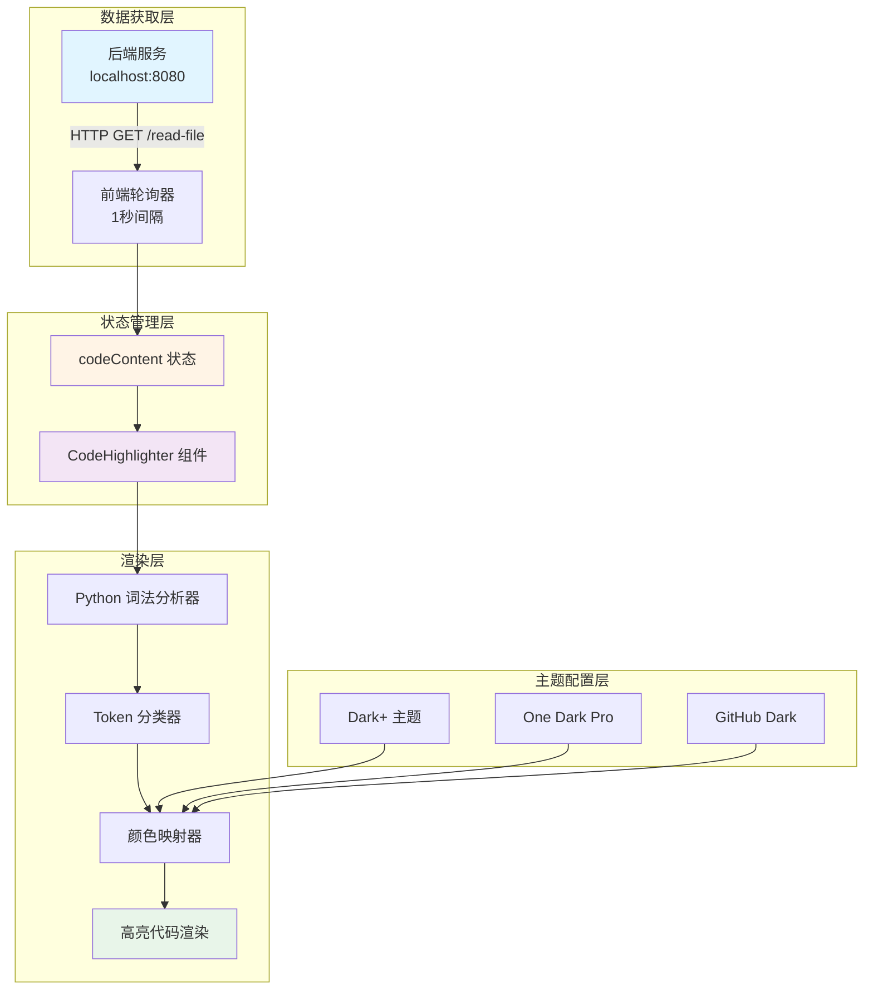
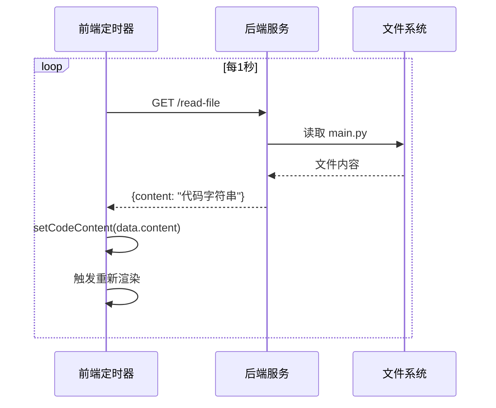
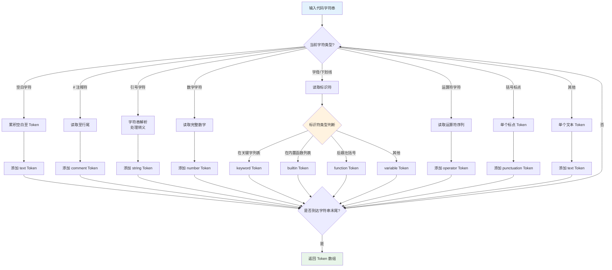

右侧代码预览栏是 Block Builder 应用中的**实时代码可视化界面**，通过自定义语法分析器将 Python 代码渲染为带语法高亮的可读格式。该面板采用**拉取式同步架构**，每秒从后端服务获取最新代码内容，为用户提供积木操作与代码生成之间的即时视觉反馈。

## 架构概览

右侧代码预览栏的架构设计遵循**关注点分离原则**，将界面渲染、语法分析和主题配置解耦为三个独立模块，通过状态管理实现数据流转。

**核心组件职责划分**：主应用（App.tsx）负责面板的展开/收起状态、宽度调整和代码内容获取；CodeHighlighter 组件专注于语法分析和渲染；codeTheme 配置文件提供可插拔的颜色主题系统。这种三层架构确保了代码的可维护性和扩展性。

Sources: [App.tsx](src/App.tsx#L35-L93) | [CodeHighlighter.tsx](src/components/CodeHighlighter.tsx#L18-L56) | [codeTheme.ts](src/config/codeTheme.ts#L6-L45)

## 界面布局与交互功能

右侧代码预览栏采用**可折叠侧边栏设计**，通过 Motion 动画库实现平滑的展开/收起过渡效果。面板整体分为三个功能区域：顶部工具栏、文件标签栏和代码显示区。

### 面板状态控制

面板的可见性由 `rightSidebarOpen` 状态控制，用户可通过画布右侧中央的圆形按钮触发切换。面板宽度支持拖拽调整，范围限定在 280px 至 600px 之间，通过监听 `mousedown`、`mousemove` 和 `mouseup` 事件实现实时宽度计算。

**宽度调整实现机制**：当用户按下左侧边缘的拖拽手柄时，系统记录初始鼠标位置和面板宽度，随后在鼠标移动过程中计算宽度差值并更新状态。这种**增量式计算方法**避免了绝对定位的复杂性，同时保证了拖拽的流畅性。

Sources: [App.tsx](src/App.tsx#L713-L776)

### 工具栏功能按钮

顶部工具栏提供两个核心操作按钮，均采用图标化设计以节省空间：

| 按钮 | 图标 | 功能 | 后端交互 |
|------|------|------|----------|
| **运行代码** | Play（绿色） | 执行当前显示的 Python 代码 | POST /run |
| **复制代码** | Copy（灰色） | 将代码复制到系统剪贴板 | 无 |

运行按钮通过 POST 请求向后端 `/run` 端点发送执行指令，后端接收后调用 Python 解释器运行代码文件。复制功能直接使用浏览器原生 `navigator.clipboard.writeText` API，无需后端参与。

Sources: [App.tsx](src/App.tsx#L777-L807)

### 文件标签栏设计

文件标签栏采用**标签页隐喻**，显示当前查看的文件名和编程语言类型。设计中使用蓝色背景的标签徽章突出文件名，配合浅灰色语言标识，形成清晰的视觉层次。当前固定显示 `main.py` 和 `Python` 标识，为未来多文件支持预留扩展空间。

Sources: [App.tsx](src/App.tsx#L809-L813)

## 实时代码同步机制

代码预览栏通过**轮询拉取模式**实现与后端的实时同步，这是一种简单但有效的数据同步策略，特别适合单用户低频更新的场景。

### 轮询架构实现

系统使用 `useEffect` Hook 建立定时器，在组件挂载时立即执行一次代码获取，随后以 1000 毫秒为间隔持续轮询。每次请求向后端 `/read-file` 端点发送 GET 请求，接收 JSON 格式的响应数据并提取 `content` 字段更新到 `codeContent` 状态。

**错误处理策略**：网络请求使用空 catch 块捕获异常，确保单次请求失败不会中断整个轮询周期。这种**静默失败模式**在开发环境中避免控制台错误噪音，在生产环境中提供更强的容错能力。

Sources: [App.tsx](src/App.tsx#L77-L93)

### 数据流转时序

该时序图展示了从前端定时器触发到界面更新的完整数据路径。**关键设计点**在于后端作为文件系统的代理层，前端无需关心文件存储位置和读取细节，只需消费后端提供的统一 HTTP 接口。

Sources: [App.tsx](src/App.tsx#L78-L88)

## Python 语法分析器

CodeHighlighter 组件内置了**自定义词法分析器**，通过逐字符扫描和模式匹配将 Python 代码分解为语义化的 Token 序列。该分析器不依赖第三方库，实现了零依赖的轻量级语法高亮方案。

### Token 类型分类系统

词法分析器将 Python 代码划分为 10 种 Token 类型，每种类型对应特定的语法元素和颜色主题：

| Token 类型 | 匹配规则 | 示例 | 默认颜色 (Dark+) |
|------------|----------|------|------------------|
| **keyword** | Python 关键字列表 | `def`, `class`, `if` | 紫红色 #c586c0 |
| **builtin** | 内置函数列表 | `print`, `len`, `range` | 黄色 #dcdcaa |
| **string** | 引号包裹内容 | `"hello"`, `'world'` | 橙色 #ce9178 |
| **number** | 数字字面量 | `123`, `3.14`, `0xFF` | 浅绿色 #b5cea8 |
| **comment** | # 开头至行尾 | `# 这是注释` | 绿色 #6a9955 |
| **function** | 标识符后接 ( | `my_func(` | 黄色 #dcdcaa |
| **operator** | 运算符字符 | `+`, `-`, `==`, `+=` | 白色 #d4d4d4 |
| **punctuation** | 括号和标点 | `(`, `)`, `[`, `]`, `:` | 白色 #d4d4d4 |
| **variable** | 普通标识符 | `x`, `my_var` | 浅蓝色 #9cdcfe |
| **text** | 空白和其他 | 空格, 换行 | 前景色 #d4d4d4 |

**函数识别算法**：分析器在识别标识符后，向前查看代码字符串判断是否存在左括号，从而区分函数调用（如 `print()`）和变量引用（如 `count`）。这种**前瞻式识别**提高了语法分析的准确性。

Sources: [CodeHighlighter.tsx](src/components/CodeHighlighter.tsx#L62-L188)

### 词法分析流程

该流程图展示了词法分析器的**状态机工作模式**，通过不断判断当前字符类型并转移到对应的处理分支，最终生成完整的 Token 序列。**转义字符处理**是字符串解析的关键环节，分析器识别反斜杠后跳过下一个字符，避免错误地提前结束字符串。

Sources: [CodeHighlighter.tsx](src/components/CodeHighlighter.tsx#L82-L188)

### 渲染优化策略

CodeHighlighter 组件采用**行级渲染粒度**，将代码按换行符分割后逐行处理。每行渲染包括两部分：行号显示区和代码高亮区。行号使用等宽字体右对齐，宽度固定为 2rem，确保代码内容的对齐一致性。

**空白行处理**：当某行代码为空字符串时，渲染器插入不间断空格（`\u00A0`）代替空内容，保证空行在视觉上仍然占据垂直空间，维持代码的原始行号对应关系。

Sources: [CodeHighlighter.tsx](src/components/CodeHighlighter.tsx#L35-L56)

## 代码主题系统

项目内置三套专业级代码主题，均参考主流代码编辑器的配色方案，为用户提供熟悉的视觉体验。主题系统采用**配置驱动设计**，所有颜色值集中在 `CodeTheme` 接口中定义，便于未来扩展新主题。

### 主题对比分析

| 特性 | Dark+ (默认) | One Dark Pro | GitHub Dark |
|------|--------------|--------------|-------------|
| **背景色** | 深灰 #1e1e1e | 中灰 #282c34 | 纯黑 #0d1117 |
| **关键字** | 紫红 #c586c0 | 紫色 #c678dd | 红色 #ff7b72 |
| **字符串** | 橙色 #ce9178 | 绿色 #98c379 | 青色 #a5d6ff |
| **函数名** | 黄色 #dcdcaa | 蓝色 #61afef | 紫色 #d2a8ff |
| **注释** | 深绿 #6a9955 | 灰色 #5c6370 | 中灰 #8b949e |
| **适用场景** | VS Code 用户 | Atom 用户 | GitHub 用户 |
| **对比度** | 中等 | 较高 | 最高 |

**主题选择建议**：Dark+ 主题色调平衡适合长时间编码；One Dark Pro 对比度较高适合演示场景；GitHub Dark 适合习惯 GitHub 界面的开发者。当前系统默认使用 Dark+ 主题，未来可通过用户设置界面提供主题切换功能。

Sources: [codeTheme.ts](src/config/codeTheme.ts#L50-L159)

### 主题接口定义

`CodeTheme` 接口定义了 15 个颜色属性，覆盖 Python 语法的所有视觉元素。接口设计遵循**语义化命名原则**，属性名直接反映其作用的语法元素，如 `keyword`、`string`、`comment` 等，而非使用抽象的颜色用途命名。

**扩展性设计**：接口预留了可选属性如 `lineHighlight`（行高亮背景色）和 `stringEscape`（转义字符颜色），为未来添加更细粒度的语法高亮功能留出空间。开发者只需实现该接口即可创建自定义主题，无需修改核心渲染逻辑。

Sources: [codeTheme.ts](src/config/codeTheme.ts#L6-L45)

## 组件集成与状态管理

右侧代码预览栏与主应用的集成通过 React 状态管理实现，涉及四个核心状态变量的协同工作：

### 状态变量职责

| 状态变量 | 类型 | 初始值 | 用途 |
|----------|------|--------|------|
| `rightSidebarOpen` | boolean | false | 控制面板显示/隐藏 |
| `rightSidebarWidth` | number | 400 | 面板宽度（像素） |
| `isResizing` | boolean | false | 拖拽调整宽度时的锁定状态 |
| `codeContent` | string | "print('Hello, World!')" | 待显示的代码内容 |

**状态更新流程**：轮询定时器获取新代码 → 更新 `codeContent` → 触发 CodeHighlighter 重新渲染 → 语法分析生成 Token → 应用主题颜色 → 输出高亮代码。整个流程由 React 的声明式渲染机制自动驱动，开发者无需手动操作 DOM。

Sources: [App.tsx](src/App.tsx#L35-L38)

### 动画过渡实现

面板展开和收起使用 Motion 库的 `AnimatePresence` 组件包裹，配合 `initial`、`animate`、`exit` 三个属性定义动画关键帧。展开时宽度和透明度从 0 过渡到目标值，收起时反向过渡，动画持续 0.3 秒，提供流畅的视觉反馈。

**性能优化**：面板使用 `overflow-hidden` 样式属性，确保在宽度动画过程中内容不会溢出容器边界，避免布局抖动。同时，拖拽手柄使用 `position: absolute` 定位，脱离文档流，不影响面板内容的布局计算。

Sources: [App.tsx](src/App.tsx#L741-L821)

## 后续学习路径

掌握右侧代码预览栏的实现后，建议按以下顺序深入学习相关主题：

1. **[代码高亮显示组件](13-dai-ma-gao-liang-xian-shi-zu-jian)** - 深入了解 CodeHighlighter 组件的完整实现细节和优化技巧
2. **[实时代码生成原理](29-shi-shi-dai-ma-sheng-cheng-yuan-li)** - 理解积木操作如何转换为 Python 代码的底层机制
3. **[代码主题定制](32-dai-ma-zhu-ti-ding-zhi)** - 学习如何创建自定义代码主题和颜色配置
4. **[Python HTTP 服务器](19-python-http-fu-wu-qi)** - 探究后端 `/read-file` 和 `/run` 端点的实现细节
5. **[代码文件同步机制](21-dai-ma-wen-jian-tong-bu-ji-zhi)** - 了解前后端代码同步的完整架构和容错处理