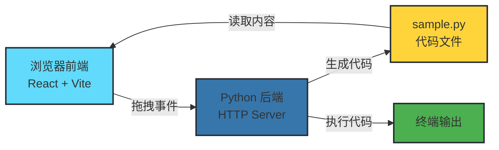
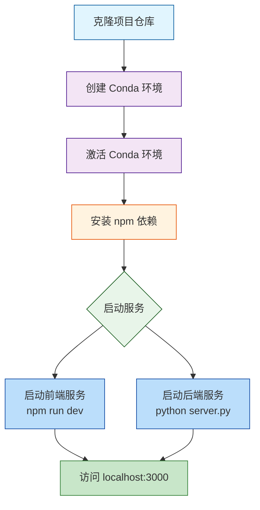

欢迎使用积木代码构建器！这是一个将可视化积木拖拽转换为可执行代码的创新工具。通过直观的拖拽交互，您可以像搭积木一样构建程序逻辑，系统会自动将您的积木组合转换为 Python 代码并实时同步到源文件中。

## 系统架构概览

本项目采用前后端分离架构，前端负责可视化交互与积木渲染，后端处理代码生成与执行。两个服务需要同时运行才能实现完整的拖拽-代码转换功能。



前端运行在 `localhost:3000`，后端运行在 `localhost:8080`，两者通过 HTTP 协议通信。当您拖拽积木到画布时，前端会将事件发送给后端，后端根据积木类型生成对应的 Python 语句并写入文件。

Sources: [server.py](server.py#L1-L230), [src/App.tsx](src/App.tsx#L1-L100)

## 环境要求

在开始之前，请确保您的系统已安装以下工具：

| 工具名称 | 最低版本 | 用途 | 验证命令 |
|---------|---------|------|---------|
| **Node.js** | 18.0+ | 前端运行环境 | `node --version` |
| **npm** | 9.0+ | 包管理器 | `npm --version` |
| **Conda** | 4.0+ | Python 环境管理 | `conda --version` |
| **Git** | 2.0+ | 代码克隆 | `git --version` |
| **Python** | 3.11+ | 后端运行环境（由 Conda 管理） | `python --version` |

**Windows 用户注意**：建议使用 PowerShell 或 Git Bash 执行命令。如果遇到权限问题，请以管理员身份运行终端。

Sources: [package.json](package.json#L1-L35), [environment.yml](environment.yml#L1-L122)

## 安装流程

以下流程图展示了从克隆项目到启动服务的完整步骤：



### 步骤 1：克隆项目

```bash
git clone https://github.com/Linmoqian/block-builder
cd block-builder
```

克隆完成后，您将进入项目根目录，后续所有命令都应在此目录下执行。

Sources: [README.md](README.md#L7-L10)

### 步骤 2：创建 Python 环境

项目使用 Conda 管理 Python 依赖，确保后端环境一致性。执行以下命令创建并激活环境：

```bash
# 创建环境（首次运行）
conda env create -f environment.yml

# 激活环境
conda activate x
```

环境名称为 `x`，包含 PyTorch、NumPy 等科学计算库。创建过程可能需要 5-10 分钟，取决于网络速度。

Sources: [environment.yml](environment.yml#L1-L122), [README.md](README.md#L8)

### 步骤 3：安装前端依赖

前端使用 npm 管理依赖包，包括 React 19、Vite 6、Tailwind CSS v4 和 Motion 动画库：

```bash
npm install
```

此命令会根据 `package.json` 下载所有必需的前端依赖包。

Sources: [package.json](package.json#L1-L35), [README.md](README.md#L9)

### 步骤 4：启动服务

**重要**：需要同时启动前端和后端两个服务。请打开两个终端窗口：

**终端 1（前端服务）**：
```bash
npm run dev
```
此命令启动 Vite 开发服务器，监听端口 3000。

**终端 2（后端服务）**：
```bash
# 确保已激活 Conda 环境
conda activate x

# 启动 Python HTTP 服务器
python server.py
```
此命令启动 Python 后端服务，监听端口 8080，处理积木事件和代码生成。

Sources: [README.md](README.md#L10-L11), [server.py](server.py#L1-L40), [package.json](package.json#L8)

### 步骤 5：访问应用

打开浏览器访问 `http://localhost:3000`，您将看到包含左侧模板栏、中央画布和右侧代码预览的应用界面。如果看到积木形状和代码显示，说明环境配置成功！

## 基本使用演示

现在您已经成功启动应用，让我们通过一个简单示例体验核心功能：

### 1. 浏览积木模板

左侧边栏展示了七种预设积木形状，每种形状对应不同的代码片段：

| 积木形状 | 图标标识 | 生成的代码 |
|---------|---------|-----------|
| 正方形 | `square` | `print("我是正方形")` |
| 长方形（横） | `rect-h` | `print("我是长方形(横)")` |
| 长方形（纵） | `rect-v` | `print("我是长方形(纵)")` |
| 圆形 | `circle` | `print("我是圆形")` |
| 三角形 | `triangle` | `print("我是三角形")` |
| L 型 | `l-shape` | `print("我是L型")` |
| T 型 | `t-shape` | `print("我是T型")` |

Sources: [server.py](server.py#L19-L27)

### 2. 拖拽积木到画布

将鼠标悬停在左侧模板栏的任意积木上，按住鼠标左键拖拽到中央画布区域。松开鼠标后，积木会被固定在画布上，同时后端会生成对应的代码。

**操作提示**：
- 拖拽时积木会显示半透明预览效果
- 释放到画布后积木自动获得焦点（显示蓝色边框）
- 画布支持网格对齐，帮助您整齐排列积木

Sources: [src/App.tsx](src/App.tsx#L1-L100)

### 3. 查看生成的代码

右侧边栏会实时显示生成的 Python 代码。每次添加、移动或删除积木时，代码会自动更新：

```python
print("我是圆形")
print("我是长方形(横)")
print("我是长方形(纵)")
print("我是三角形")
```

这些代码同步保存在 `TmpSrc/sample.py` 文件中。您可以直接编辑此文件，或使用应用内的运行按钮执行代码。

Sources: [TmpSrc/sample.py](TmpSrc/sample.py#L1-L5), [server.py](server.py#L87-L115)

### 4. 执行代码

点击工具栏中的运行按钮（播放图标），后端会执行 `sample.py` 文件并在终端输出结果：

```
[运行] 执行 TmpSrc/sample.py
─────────
  我是圆形
  我是长方形(横)
  我是长方形(纵)
  我是三角形
─────────
[完成] 返回码: 0
```

这验证了从积木拖拽到代码执行的完整流程。

Sources: [server.py](server.py#L149-L185)

## 项目结构说明

了解项目目录结构有助于您快速定位代码和配置文件：

```
block-builder/
├── src/                    # 前端源代码
│   ├── App.tsx            # 主应用组件（状态管理、拖拽逻辑）
│   ├── main.tsx           # React 入口文件
│   ├── components/        # React 组件
│   │   ├── BlockShape.tsx # 积木形状渲染组件
│   │   └── CodeHighlighter.tsx # 代码高亮显示组件
│   ├── types.ts           # TypeScript 类型定义
│   └── config/            # 配置文件
│       └── codeTheme.ts   # 代码主题配置
├── TmpSrc/                # 生成的代码存放目录
│   └── sample.py          # 实时同步的 Python 代码
├── server.py              # Python HTTP 服务器（后端）
├── package.json           # npm 依赖配置
├── environment.yml        # Conda 环境配置
├── vite.config.ts         # Vite 构建配置
└── index.html             # HTML 入口文件
```

**关键目录说明**：
- `src/`：所有前端代码，使用 React + TypeScript 开发
- `TmpSrc/`：自动生成的代码文件，可通过后端读取和执行
- `server.py`：后端服务核心，处理积木事件监听和代码生成

Sources: [package.json](package.json#L1-L35), [vite.config.ts](vite.config.ts#L1-L26)

## 常见问题排查

| 问题现象 | 可能原因 | 解决方案 |
|---------|---------|---------|
| 前端无法访问 localhost:3000 | npm 服务未启动 | 执行 `npm run dev` |
| 拖拽积木无代码生成 | 后端服务未启动 | 执行 `python server.py` |
| 代码预览空白 | 后端连接失败 | 检查端口 8080 是否被占用 |
| Conda 环境创建失败 | 网络问题或依赖冲突 | 使用国内镜像源或手动安装依赖 |
| 积木无法拖拽 | JavaScript 错误 | 打开浏览器控制台查看错误信息 |

## 下一步学习

恭喜您完成了快速开始教程！现在您已经掌握了积木构建器的基本使用方法。建议按以下顺序深入学习：

**核心概念理解**：
- [积木系统架构](5-ji-mu-xi-tong-jia-gou)：了解积木系统的整体设计思路
- [七种积木形状](6-qi-chong-ji-mu-xing-zhuang)：深入理解每种积木的特性和用途
- [积木连接功能](8-ji-mu-lian-jie-gong-neng)：学习如何连接积木构建复杂逻辑

**前端开发深入**：
- [主应用状态管理](10-zhu-ying-yong-zhuang-tai-guan-li)：掌握 React 状态管理模式
- [拖拽交互实现](11-tuo-zhuai-jiao-hu-shi-xian)：了解 Motion 库的拖拽实现原理

**后端服务扩展**：
- [Python HTTP 服务器](19-python-http-fu-wu-qi)：深入后端架构设计
- [代码文件同步机制](21-dai-ma-wen-jian-tong-bu-ji-zhi)：理解实时同步原理

**环境配置优化**：
- [开发环境配置](3-kai-fa-huan-jing-pei-zhi)：配置 IDE 和开发工具
- [项目结构说明](4-xiang-mu-jie-gou-shuo-ming)：全面了解代码组织方式

开始您的积木编程之旅吧！🚀