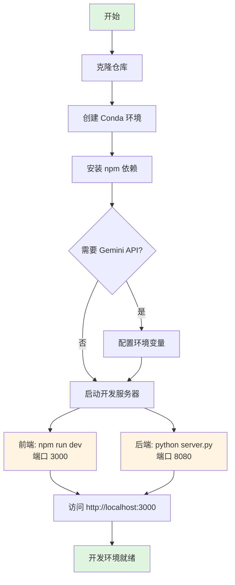

本文档详细说明 Block Builder 积木库项目的开发环境配置流程，涵盖从前端 React 应用到后端 Python 服务的完整环境搭建。项目采用 **前后端分离架构**：前端基于 React 19 + Vite 6 + Tailwind CSS v4 构建可视化积木编辑器，后端使用 Python HTTP 服务器处理积木事件监听与代码同步。通过本指南，您将掌握项目依赖安装、配置文件解析、开发服务器启动以及常见问题排查的核心技能。

## 系统要求

在开始配置之前，请确保您的开发环境满足以下最低要求。项目在 Windows 系统上开发和测试，但理论上支持 macOS 和 Linux 系统。

| 组件 | 最低版本 | 推荐版本 | 验证命令 | 说明 |
|------|---------|---------|---------|------|
| Node.js | 18.0.0 | 24.14.0+ | `node --version` | 支持 ES2022 特性和 ESM 模块 |
| Python | 3.11.0 | 3.11.15 | `python --version` | 需要 Conda/Miniforge 环境管理器 |
| npm | 9.0.0 | 10.0.0+ | `npm --version` | 随 Node.js 自动安装 |
| Conda | 22.9.0 | 最新版 | `conda --version` | 推荐 Miniforge3 或 Anaconda |
| Git | 2.0.0 | 最新版 | `git --version` | 用于克隆仓库 |

**关键依赖版本锁定**：项目使用 React 19.0.0（最新稳定版）、Vite 6.2.0（构建工具）、Tailwind CSS 4.1.14（样式系统）、TypeScript 5.8.2（类型检查）以及 PyTorch 2.10.0（机器学习框架）。这些版本经过兼容性测试，建议严格按照 [package.json](package.json#L13-L24) 和 [environment.yml](environment.yml#L1-L121) 中锁定的版本安装。

Sources: [package.json](package.json#L1-L35), [environment.yml](environment.yml#L1-L121)

## 安装步骤

环境配置遵循 **依赖隔离原则**：Node.js 依赖通过 npm 管理，Python 依赖通过 Conda 环境隔离。以下流程图展示了完整的安装路径：



### 1. 克隆仓库

```bash
git clone https://github.com/Linmoqian/block-builder
cd block-builder
```

### 2. 创建 Python 虚拟环境

使用 Conda 创建隔离的 Python 环境，避免与系统 Python 冲突。环境名称为 `x`，包含 PyTorch、OpenCV、ONNX 等机器学习依赖：

```bash
conda env create -f environment.yml
conda activate x
```

**环境创建时间**：首次创建需要下载约 2GB 的依赖包（主要是 PyTorch 和 MKL 库），请确保网络畅通。创建完成后，可通过 `conda env list` 验证环境是否存在。

Sources: [README.md](README.md#L8-L14), [environment.yml](environment.yml#L1-L121)

### 3. 安装 Node.js 依赖

项目使用 npm 管理前端依赖，包括 React、Vite、Tailwind CSS、Motion 动画库等：

```bash
npm install
```

**核心依赖说明**：
- **react/react-dom 19.0.0**：最新 React 版本，支持并发特性和自动批处理
- **vite 6.2.0**：下一代前端构建工具，提供极速 HMR（热模块替换）
- **tailwindcss 4.1.14**：原子化 CSS 框架，通过 Vite 插件集成
- **motion 12.23.24**：高性能动画库（Framer Motion 的继任者）
- **lucide-react 0.546.0**：轻量级图标库
- **@google/genai 1.29.0**：Google Gemini API 客户端（可选）

Sources: [package.json](package.json#L13-L24)

### 4. 配置环境变量（可选）

如果项目需要使用 Google Gemini API（用于 AI 辅助功能），需在项目根目录创建 `.env` 文件：

```bash
# .env
GEMINI_API_KEY=your_api_key_here
```

**安全提示**：`.env` 文件已添加到 [.gitignore](.gitignore)，不会被提交到版本控制。Vite 会通过 [vite.config.ts](vite.config.ts#L10-L12) 中的 `define` 配置将环境变量注入前端代码。

Sources: [vite.config.ts](vite.config.ts#L10-L12)

## 配置文件详解

项目采用 **分层配置架构**：TypeScript 负责类型检查，Vite 负责构建优化，Conda 负责 Python 环境隔离。以下是各配置文件的核心作用和关键参数：

### TypeScript 配置

[tsconfig.json](tsconfig.json#L1-L26) 定义了 TypeScript 编译选项，针对 Vite 打包工具优化：

| 配置项 | 值 | 作用 |
|--------|---|------|
| `target` | ES2022 | 编译目标为 ES2022，支持顶层 await 等特性 |
| `module` | ESNext | 使用最新 ES 模块系统，配合 Vite 打包 |
| `moduleResolution` | bundler | 使用打包工具解析策略，支持裸模块导入 |
| `jsx` | react-jsx | 使用 React 17+ 的新 JSX 转换 |
| `lib` | ES2022, DOM, DOM.Iterable | 包含浏览器 DOM 类型和 ES2022 API |
| `paths` | `@/*` → `./*` | 路径别名，简化导入语句 |
| `allowImportingTsExtensions` | true | 允许导入 `.ts` 扩展名（Vite 要求） |
| `noEmit` | true | 不生成 `.js` 文件，由 Vite 负责编译 |

**关键设计**：`useDefineForClassFields: false` 禁用了类字段的 `define` 语义，这是为了兼容 React 19 的类组件行为。`experimentalDecorators: true` 启用了装饰器实验性特性，为未来扩展预留支持。

Sources: [tsconfig.json](tsconfig.json#L1-L26)

### Vite 构建配置

[vite.config.ts](vite.config.ts#L1-L25) 是前端构建的核心配置，集成了 React 插件和 Tailwind CSS v4 插件：

```typescript
// 关键配置解析
{
  plugins: [react(), tailwindcss()],  // React + Tailwind 双插件
  define: {
    'process.env.GEMINI_API_KEY': JSON.stringify(env.GEMINI_API_KEY),
  },  // 环境变量注入
  resolve: {
    alias: { '@': path.resolve(__dirname, '.') },
  },  // 路径别名映射
  server: {
    hmr: process.env.DISABLE_HMR !== 'true',  // HMR 开关
    watch: { ignored: ['**/TmpSrc/**'] },  // 忽略临时文件监听
  }
}
```

**HMR 优化**：开发服务器默认启用热模块替换，修改代码后浏览器自动刷新。如果遇到 HMR 导致的性能问题，可通过设置环境变量 `DISABLE_HMR=true` 禁用。`watch.ignored` 配置排除了 [TmpSrc/](TmpSrc) 目录，避免监听临时生成的 Python 代码文件。

Sources: [vite.config.ts](vite.config.ts#L1-L25)

### Python 环境配置

[environment.yml](environment.yml#L1-L121) 定义了 Conda 虚拟环境的完整依赖树，包含 121 个包。以下是核心依赖分类：

| 类别 | 包名 | 版本 | 用途 |
|------|------|------|------|
| **核心运行时** | python | 3.11.15 | Python 解释器 |
| | pytorch | 2.10.0 | 深度学习框架（CPU 版本） |
| | libtorch | 2.10.0 | PyTorch C++ 后端 |
| **数据处理** | numpy | 2.4.3 | 数值计算库 |
| | scipy | 1.17.1 | 科学计算库 |
| | opencv-python | 4.13.0.92 | 图像处理库 |
| **机器学习** | onnx | 1.20.1 | 模型交换格式 |
| | onnxruntime | 1.24.4 | ONNX 推理引擎 |
| | huggingface-hub | 1.7.2 | Hugging Face 模型仓库 |
| **GUI 工具** | pyqt6 | 6.10.2 | Qt6 图形界面框架 |
| | pyqt6-webengine | 6.10.0 | Qt6 WebEngine 组件 |
| **开发工具** | pip | 26.0.1 | Python 包管理器 |
| | setuptools | 82.0.1 | 构建工具 |

**环境命名约定**：环境名为 `x`，路径为 `C:\Users\<username>\miniforge3\envs\x`。如果需要重命名环境，需修改 [environment.yml](environment.yml#L1) 的 `name` 字段并重新创建环境。

Sources: [environment.yml](environment.yml#L1-L121)

## 启动开发服务器

项目需要 **同时启动前端和后端服务**：前端提供可视化界面，后端处理积木事件和代码同步。以下是启动流程：

### 前端开发服务器

```bash
npm run dev
```

**启动参数**：
- 端口：`3000`（可通过修改 [package.json](package.json#L7) 调整）
- 主机：`0.0.0.0`（允许局域网访问）
- 访问地址：http://localhost:3000

**可用脚本**：

| 命令 | 作用 | 说明 |
|------|------|------|
| `npm run dev` | 启动开发服务器 | 带 HMR，适合开发调试 |
| `npm run build` | 构建生产版本 | 输出到 `dist/` 目录 |
| `npm run preview` | 预览生产构建 | 需先执行 `npm run build` |
| `npm run lint` | TypeScript 类型检查 | 无编译输出，仅检查类型 |
| `npm run clean` | 清理构建产物 | 删除 `dist/` 目录 |

Sources: [package.json](package.json#L6-L12)

### 后端 Python 服务器

在新的终端窗口中执行：

```bash
conda activate x
python server.py
```

**服务器配置**：
- 主机：`localhost`
- 端口：`8080`
- 功能：监听积木拖拽/删除/运行事件，同步代码到 [TmpSrc/sample.py](TmpSrc/sample.py)

**服务器输出示例**：
```
服务器启动成功
地址: http://localhost:8080
等待积木拖拽/删除/运行事件...
```

**后端 API 端点**：

| 端点 | 方法 | 功能 | 请求体 |
|------|------|------|--------|
| `/drag` | POST | 记录积木拖拽事件 | `{id, name, type}` |
| `/delete` | POST | 删除积木对应代码 | `{id, name}` |
| `/run` | POST | 执行 sample.py | 无 |
| `/read-file` | GET | 读取 sample.py 内容 | 无 |

后端服务器通过 CORS 头 `Access-Control-Allow-Origin: *` 允许前端跨域访问，详见 [server.py](server.py#L42-L67) 中的 CORS 处理逻辑。

Sources: [server.py](server.py#L216-L229)

## IDE 推荐配置

推荐使用 **Visual Studio Code** 作为主要开发工具，配合以下扩展提升开发体验：

### 必装扩展

| 扩展名 | 用途 | 配置建议 |
|--------|------|---------|
| **ES7+ React/Redux/React-Native snippets** | React 代码片段 | - |
| **Tailwind CSS IntelliSense** | Tailwind 类名提示 | 启用 `classAttributes` 配置 |
| **TypeScript Importer** | 自动导入 TypeScript 类型 | - |
| **Python** | Python 语言支持 | 选择 Conda 环境 `x` |
| **Pylance** | Python 类型检查 | 启用严格模式 |
| **Thunder Client** | API 测试工具 | 测试后端 `/drag`、`/run` 端点 |

### 工作区配置

在项目根目录创建 `.vscode/settings.json`（需手动创建）：

```json
{
  "typescript.tsdk": "node_modules/typescript/lib",
  "typescript.enablePromptUseWorkspaceTsdk": true,
  "tailwindCSS.experimental.classRegex": [
    ["className\\s*=\\s*[\"']([^\"']*)[\"']", "([^\"'\\s]*)"]
  ],
  "python.defaultInterpreterPath": "C:\\Users\\<username>\\miniforge3\\envs\\x\\python.exe",
  "files.watcherExclude": {
    "**/TmpSrc/**": true,
    "**/node_modules/**": true
  }
}
```

**配置说明**：`typescript.tsdk` 强制使用项目安装的 TypeScript 版本，避免与全局版本冲突。`files.watcherExclude` 排除了 TmpSrc 目录，避免 VSCode 监听临时文件变化导致性能下降。

Sources: [tsconfig.json](tsconfig.json#L1-L26), [vite.config.ts](vite.config.ts#L18-L23)

## 常见问题排查

以下表格总结了开发环境配置中的常见问题及解决方案：

| 问题 | 症状 | 原因 | 解决方案 |
|------|------|------|---------|
| **端口冲突** | `Error: Port 3000 is already in use` | 其他程序占用端口 | 修改 [package.json](package.json#L7) 中的 `--port` 参数，或关闭占用端口的程序 |
| **Conda 环境激活失败** | `CondaError: Run 'conda init' before 'conda activate'` | Shell 未初始化 Conda | 执行 `conda init powershell`（Windows）或 `conda init bash`（Linux/macOS），重启终端 |
| **npm install 失败** | `ERESOLVE unable to resolve dependency tree` | 依赖版本冲突 | 执行 `npm install --legacy-peer-deps` 或删除 `node_modules/` 和 `package-lock.json` 后重试 |
| **Python 模块未找到** | `ModuleNotFoundError: No module named 'cv2'` | 未激活 Conda 环境 | 确保在运行 `python server.py` 前执行 `conda activate x` |
| **HMR 不工作** | 修改代码后浏览器不刷新 | `DISABLE_HMR=true` 环境变量被设置 | 检查环境变量，或在 [vite.config.ts](vite.config.ts#L19) 中移除 HMR 条件判断 |
| **CORS 错误** | 前端无法调用后端 API | 跨域请求被阻止 | 确认后端服务器已启动，检查 [server.py](server.py#L42-L67) 中的 CORS 头配置 |
| **类型检查错误** | `Cannot find module '@/xxx'` | 路径别名未生效 | 检查 [tsconfig.json](tsconfig.json#L18-L22) 中的 `paths` 配置，确保 VSCode 使用工作区 TypeScript 版本 |
| **Tailwind 类名不生效** | 样式未应用到组件 | Tailwind 未扫描到类名 | 确认 [vite.config.ts](vite.config.ts#L9) 中已添加 `tailwindcss()` 插件，检查类名拼写 |

**调试技巧**：
1. **查看完整错误日志**：前端错误打开浏览器开发者工具（F12）的 Console 面板，后端错误查看终端输出
2. **验证环境变量**：在前端代码中添加 `console.log(process.env.GEMINI_API_KEY)` 检查环境变量是否注入
3. **测试后端 API**：使用 Thunder Client 或 curl 测试 `http://localhost:8080/read-file` 端点，确认服务器正常运行

Sources: [package.json](package.json#L6-L12), [vite.config.ts](vite.config.ts#L18-L23), [server.py](server.py#L34-L60), [tsconfig.json](tsconfig.json#L18-L22)

## 下一步

完成开发环境配置后，建议按以下顺序深入学习项目架构：

1. **[项目结构说明](4-xiang-mu-jie-gou-shuo-ming)**：了解目录组织方式和模块职责划分
2. **[积木系统架构](5-ji-mu-xi-tong-jia-gou)**：掌握核心设计理念和组件交互模式
3. **[主应用状态管理](10-zhu-ying-yong-zhuang-tai-guan-li)**：理解前端状态流转和数据流设计
4. **[Python HTTP 服务器](19-python-http-fu-wu-qi)**：深入学习后端事件处理机制

如需快速体验项目功能，可直接跳转至 **[快速开始](2-kuai-su-kai-shi)** 指南。