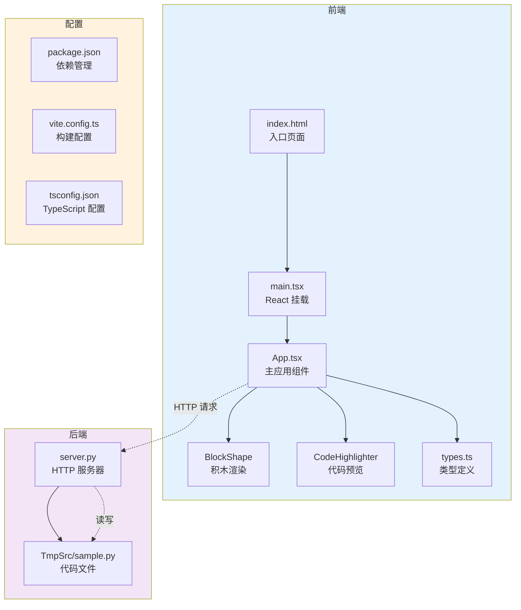

欢迎使用神经网络工坊（Block Builder）！本文档将为您详细解析项目的整体架构与文件组织方式，帮助初学者快速理解这个积木式代码生成工具的内部结构。项目采用现代化的全栈架构，通过可视化拖拽积木的方式实时生成 Python 代码，将编程概念转化为直观的视觉交互体验。

## 整体架构概览

项目采用前后端分离的架构设计，前端负责用户界面和交互逻辑，后端负责代码文件同步与执行。整体架构遵循单一职责原则，前端通过 HTTP 请求与后端通信，实现了视图层与业务逻辑的解耦，这种设计使系统具有良好的可维护性和扩展性。核心数据流从用户拖拽积木开始，经过前端状态管理，最终触发后端代码生成，形成完整的闭环系统。

Sources: [index.html](index.html#L1-L14), [src/main.tsx](src/main.tsx#L1-L11), [src/App.tsx](src/App.tsx#L1-L200), [server.py](server.py#L1-L200), [package.json](package.json#L1-L35)

## 目录结构详解

项目根目录包含前端源码、后端服务、配置文件和临时文件四大类内容。`src/` 目录是前端应用的核心，采用组件化设计模式，将不同功能模块分离到独立文件中；`src/components/` 存放可复用的 UI 组件，`src/config/` 集中管理配置信息。`TmpSrc/` 目录用于存储运行时生成的 Python 代码文件，`torch/` 目录包含额外的 Python 模块，这种目录布局清晰地区分了不同类型的代码资源。

**核心目录说明表**：

| 目录/文件 | 用途 | 重要程度 | 初学者关注点 |
|---------|------|---------|------------|
| `src/` | 前端源码主目录 | ⭐⭐⭐⭐⭐ | 所有 React 组件和业务逻辑 |
| `src/components/` | UI 组件库 | ⭐⭐⭐⭐ | 可复用的积木形状、代码高亮组件 |
| `src/config/` | 配置文件 | ⭐⭐⭐ | 代码主题等样式配置 |
| `server.py` | Python 后端服务 | ⭐⭐⭐⭐ | HTTP 服务器、代码同步逻辑 |
| `TmpSrc/` | 临时代码存储 | ⭐⭐⭐ | 实时生成的 Python 代码 |
| `index.html` | HTML 入口 | ⭐⭐ | 单页应用挂载点 |
| `package.json` | 项目依赖 | ⭐⭐⭐⭐ | 了解技术栈和启动命令 |
| `vite.config.ts` | 构建配置 | ⭐⭐⭐ | Vite 构建工具设置 |

Sources: [src/App.tsx](src/App.tsx#L1-L200), [src/components/BlockShape.tsx](src/components/BlockShape.tsx#L1-L50), [server.py](server.py#L1-L200), [package.json](package.json#L1-L35), [vite.config.ts](vite.config.ts#L1-L26)

## 前端核心文件解析

前端应用以 `src/main.tsx` 为入口点，使用 React 19 的 `createRoot` API 将主组件挂载到 DOM 节点，这是现代 React 应用的标准启动模式。`src/App.tsx` 是应用的核心组件，管理着积木实例数组、选中状态、拖拽模式、画布网格、侧边栏状态等丰富的交互状态，通过 `useState` Hooks 实现响应式状态管理，组件内部包含超过 800 行代码，涵盖了拖拽交互、网格对齐、连接模式、右键菜单等完整功能。

`src/types.ts` 定义了整个应用的 TypeScript 类型系统，包括 `ShapeType`（七种积木形状）、`BlockInstance`（积木实例接口）、`BlockTemplate`（积木模板）等核心类型，以及预定义的积木模板数组和颜色数组，这些类型定义为前端提供了完整的类型安全保障。`src/components/BlockShape.tsx` 是纯展示组件，根据传入的形状类型和颜色渲染对应的视觉元素，支持正方形、长方形、圆形、三角形、L型、T型共七种形状，使用 CSS 的 `clipPath` 属性实现复杂形状。

Sources: [src/main.tsx](src/main.tsx#L1-L11), [src/App.tsx](src/App.tsx#L1-L200), [src/types.ts](src/types.ts#L1-L47), [src/components/BlockShape.tsx](src/components/BlockShape.tsx#L1-L50)

## 后端服务架构

后端采用 Python 标准库的 `HTTPServer` 和 `BaseHTTPRequestHandler` 构建轻量级 HTTP 服务，监听 8080 端口，无需额外的 Web 框架依赖。服务器实现了三个核心 API 端点：`GET /read-file` 用于读取代码文件内容并返回给前端显示；`POST /drag` 处理积木拖拽事件，根据积木类型生成对应的 Python print 语句并追加到 `TmpSrc/sample.py`；`POST /delete` 处理积木删除事件，从代码文件中移除对应的代码行，这三个端点构成了完整的代码同步机制。

服务器还实现了 `POST /run` 端点用于执行生成的 Python 代码，使用 `subprocess.run` 调用 Python 解释器执行 `TmpSrc/sample.py`，并捕获标准输出和错误输出返回给前端。所有 API 响应都包含 `Access-Control-Allow-Origin: *` 头部以支持跨域请求，这是前后端分离架构中必不可少的 CORS 配置。服务器使用全局字典 `block_print_map` 维护积木 ID 与代码行号的映射关系，确保每次拖拽和删除操作都能精确定位到对应的代码行。

Sources: [server.py](server.py#L1-L200)

## 技术栈全景图

项目采用了 2024-2025 年最新的前端技术栈，充分利用现代化工具链提升开发体验和性能表现。React 19 提供了最新的并发特性和自动批处理优化，Vite 6 带来了极速的开发服务器启动和热模块替换，Tailwind CSS v4 引入了全新的引擎和更快的构建速度，Motion 动画库（原 Framer Motion）提供了流畅的拖拽和过渡动画效果。TypeScript 5.8 确保了类型安全，lucide-react 提供了丰富的图标库，这些技术的组合构建了一个高性能、易维护的现代化 Web 应用。

**核心技术栈对比表**：

| 技术类别 | 选用技术 | 版本 | 核心作用 | 学习价值 |
|---------|---------|------|---------|---------|
| 前端框架 | React | 19.0.0 | UI 组件化开发 | ⭐⭐⭐⭐⭐ |
| 构建工具 | Vite | 6.2.0 | 快速开发与构建 | ⭐⭐⭐⭐⭐ |
| CSS 框架 | Tailwind CSS | 4.1.14 | 原子化样式系统 | ⭐⭐⭐⭐ |
| 动画库 | Motion | 12.23.24 | 拖拽与过渡动画 | ⭐⭐⭐⭐ |
| 类型系统 | TypeScript | 5.8.2 | 静态类型检查 | ⭐⭐⭐⭐⭐ |
| 图标库 | lucide-react | 0.546.0 | 矢量图标组件 | ⭐⭐⭐ |
| 后端语言 | Python | 3.x | HTTP 服务器 | ⭐⭐⭐⭐ |

Sources: [package.json](package.json#L1-L35), [vite.config.ts](vite.config.ts#L1-L26)

## 数据流与交互机制

项目的核心数据流遵循单向数据流原则，用户在前端界面拖拽积木模板时，`App.tsx` 中的 `addBlockAt` 函数创建新的积木实例并添加到 `blocks` 状态数组，同时通过 `fetch` API 向后端发送 POST 请求到 `/drag` 端点，后端接收请求后根据积木类型查找对应的 Python 代码模板，将其追加到 `TmpSrc/sample.py` 文件中，前端通过定时器每秒调用 `/read-file` 端点获取最新的代码内容并在右侧代码预览栏显示，形成了从用户交互到代码生成的完整闭环。

拖拽交互使用了 Motion 库的 `useDragControls` Hook，支持从左侧模板栏拖拽新积木到画布以及在画布上移动现有积木两种模式。网格对齐功能通过 `findSnapPosition` 函数实现，当积木边缘接近其他积木边缘或特定位置时自动吸附，阈值设置为 24 像素，这种磁吸效果提升了用户的对齐体验。每个积木实例包含 `id`、`type`、`x`、`y`、`color`、`rotation`、`zIndex` 等属性，完整描述了积木在画布上的视觉状态。

Sources: [src/App.tsx](src/App.tsx#L1-L200), [server.py](server.py#L1-L200), [src/types.ts](src/types.ts#L1-L47)

## 配置文件体系

项目使用多个配置文件协同管理不同的构建和开发需求。`package.json` 定义了项目依赖和 npm 脚本命令，`npm run dev` 启动开发服务器并监听 3000 端口，`npm run build` 执行生产环境构建，`npm run preview` 预览构建结果，`npm run lint` 运行 TypeScript 类型检查。`vite.config.ts` 配置了 React 插件和 Tailwind CSS 插件，设置了路径别名 `@` 指向项目根目录，并配置了开发服务器忽略 `TmpSrc/` 目录的文件监听以避免不必要的重新加载。

`tsconfig.json`（虽然未在结构中详细展示）配置 TypeScript 编译选项，确保类型检查的严格性。`environment.yml` 用于创建 Conda 虚拟环境，管理 Python 依赖，这对于后端 Python 服务的运行至关重要。`metadata.json` 存储项目的元数据信息，包括项目名称"神经网络工坊"和项目描述，这些信息可能用于部署或文档生成。`.gitignore` 文件排除了 `node_modules/`、`dist/` 等构建产物和依赖目录，保持版本控制的整洁性。

Sources: [package.json](package.json#L1-L35), [vite.config.ts](vite.config.ts#L1-L26), [metadata.json](metadata.json#L1-L6)

## 扩展与定制建议

对于初学者而言，理解项目结构后可以从多个方向进行扩展学习。如果希望深入了解前端实现细节，建议阅读 [主应用状态管理](10-zhu-ying-yong-zhuang-tai-guan-li) 了解 React Hooks 的实际应用，或查看 [积木形状渲染组件](12-ji-mu-xing-zhuang-xuan-ran-zu-jian) 学习组件化开发模式。对拖拽交互感兴趣的读者可以参考 [拖拽交互实现](11-tuo-zhuai-jiao-hu-shi-xian) 掌握 Motion 库的使用技巧。后端方面，[Python HTTP 服务器](19-python-http-fu-wu-qi) 详细解析了 server.py 的实现原理，[代码文件同步机制](21-dai-ma-wen-jian-tong-bu-ji-zhi) 解释了前后端如何协作实现实时代码生成。

想要扩展积木类型的开发者可以在 `src/types.ts` 的 `BLOCK_TEMPLATES` 数组中添加新的积木模板，在 `server.py` 的 `PRINT_MAP` 字典中添加对应的代码映射，然后在 `src/components/BlockShape.tsx` 中实现新形状的渲染逻辑。这种模块化的设计使得功能扩展变得简单直观，是学习软件架构设计的优秀案例。

Sources: [src/types.ts](src/types.ts#L1-L47), [server.py](server.py#L1-L200), [src/components/BlockShape.tsx](src/components/BlockShape.tsx#L1-L50)

## 学习路径建议

作为初学者，建议按照以下顺序深入学习项目：

1. **基础理解阶段**：先阅读 [项目概述](1-xiang-mu-gai-shu) 和 [快速开始](2-kuai-su-kai-shi)，运行项目观察实际效果
2. **核心概念阶段**：学习 [积木系统架构](5-ji-mu-xi-tong-jia-gou) 和 [七种积木形状](6-qi-chong-ji-mu-xing-zhuang)，理解系统的核心抽象
3. **前端实现阶段**：从 [主应用状态管理](10-zhu-ying-yong-zhuang-tai-guan-li) 开始，逐步掌握 React 开发模式
4. **后端理解阶段**：阅读 [Python HTTP 服务器](19-python-http-fu-wu-qi) 和 [实时代码生成原理](29-shi-shi-dai-ma-sheng-cheng-yuan-li)，理解全栈协作机制
5. **进阶实践阶段**：尝试 [积木模板扩展](33-ji-mu-mo-ban-kuo-zhan)，动手添加自定义功能

这个学习路径从整体到局部、从理论到实践，能够帮助您系统性地掌握现代 Web 全栈开发的精髓。