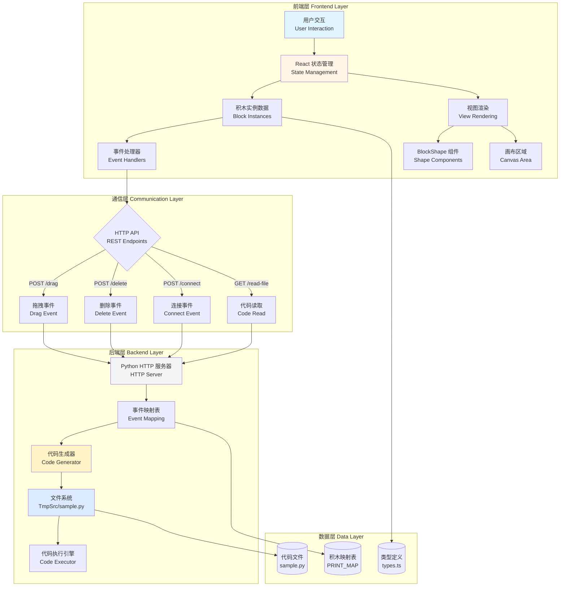
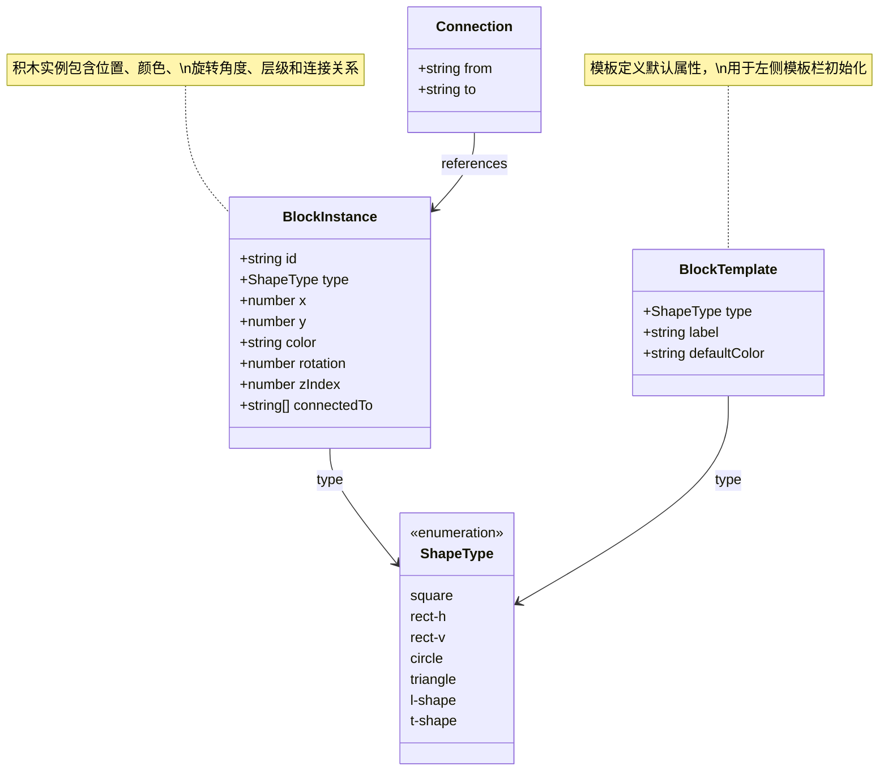
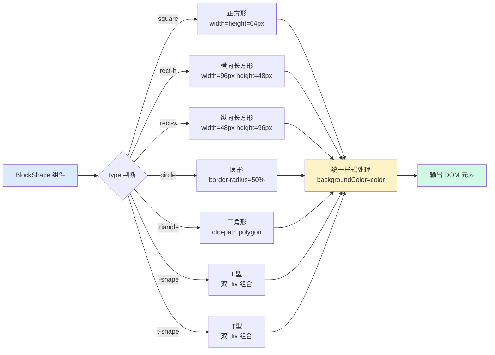
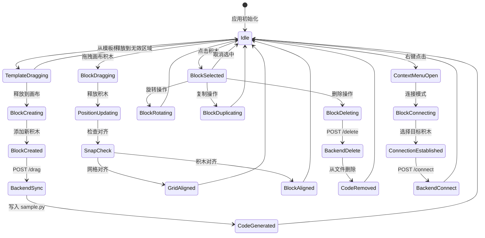
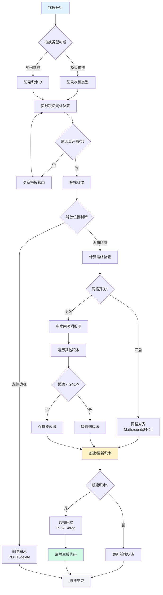
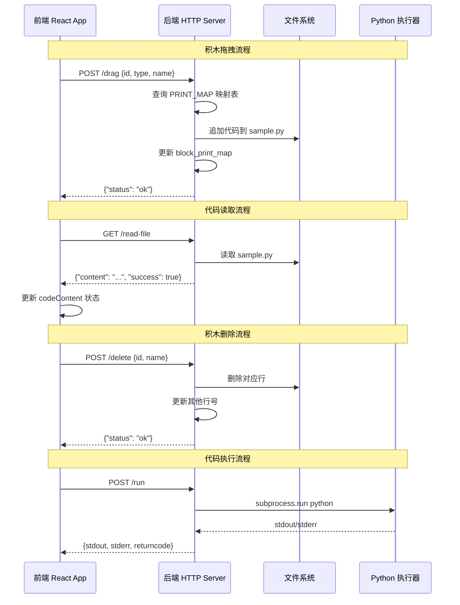
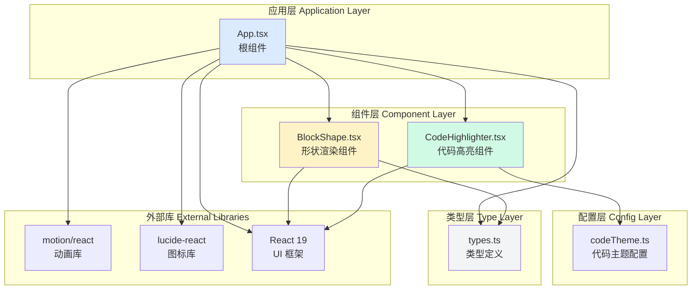
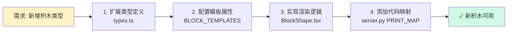

积木系统是本项目的核心功能模块，它实现了一个可视化拖拽式的代码生成环境。该系统基于 **数据驱动架构** 设计，前端通过 React 组件树管理积木状态，后端通过 Python HTTP 服务器监听事件并生成对应代码。系统架构分为四个核心层次：**数据模型层** 定义积木的数据结构，**视图渲染层** 负责七种形状的可视化呈现，**状态管理层** 处理拖拽、对齐、连接等交互逻辑，**通信协议层** 实现前后端事件同步与代码生成。这种分层设计确保了各模块的职责清晰，便于扩展新的积木类型或自定义生成逻辑。

## 整体架构概览

积木系统采用经典的前后端分离架构，前端基于 React 19 构建响应式界面，后端使用 Python http.server 提供轻量级事件监听服务。系统的核心设计理念是 **事件驱动** —— 每个用户交互（拖拽、删除、连接）都会触发前后端状态同步，最终映射为可执行的 Python 代码。

Sources: [types.ts](src/types.ts#L1-L47), [App.tsx](src/App.tsx#L1-L93), [server.py](server.py#L1-L230)

## 核心数据模型

积木系统的数据模型通过 TypeScript 接口定义，包含三个核心实体：**ShapeType** 定义七种积木形状枚举，**BlockInstance** 描述画布上的积木实例完整状态，**BlockTemplate** 提供预设模板配置。这种强类型设计确保了数据一致性，同时为 IDE 提供完整的类型提示支持。

### 数据模型关系图

### 数据模型详解

| 数据结构 | 用途 | 关键属性 | 使用场景 |
|---------|------|---------|---------|
| **ShapeType** | 形状枚举 | 7种预定义形状 | 类型约束、组件渲染分发 |
| **BlockInstance** | 积木实例 | id, type, x, y, color, rotation, zIndex, connectedTo | 画布状态管理、事件处理 |
| **BlockTemplate** | 模板配置 | type, label, defaultColor | 左侧模板栏初始化、新积木创建 |
| **Connection** | 连接关系 | from, to | 积木间依赖关系（预留功能） |

Sources: [types.ts](src/types.ts#L1-L47)

## 七种积木形状系统

系统定义了七种基础积木形状，每种形状对应特定的渲染逻辑和默认颜色配置。形状系统采用 **组合模式** —— BlockShape 组件根据 type 属性动态分发到对应的渲染分支，使用 CSS 技术实现形状绘制（clip-path、position absolute 组合等），避免使用 SVG 或 Canvas 以保持轻量级。

### 形状定义与渲染策略

### 形状属性对照表

| 形状类型 | 中文名称 | 尺寸规格 (px) | 默认颜色 | 渲染技术 | 代码生成模板 |
|---------|---------|--------------|---------|---------|-------------|
| square | 正方形 | 64×64 | #3b82f6 (蓝) | 简单 div | print("我是正方形") |
| rect-h | 长方形(横) | 96×48 | #ef4444 (红) | 简单 div | print("我是长方形(横)") |
| rect-v | 长方形(纵) | 48×96 | #10b981 (绿) | 简单 div | print("我是长方形(纵)") |
| circle | 圆形 | 64×64 | #f59e0b (琥珀) | border-radius: 50% | print("我是圆形") |
| triangle | 三角形 | 64×64 | #8b5cf6 (紫) | clip-path: polygon | print("我是三角形") |
| l-shape | L型 | 64×64 | #ec4899 (粉) | 双 div absolute 定位 | print("我是L型") |
| t-shape | T型 | 64×64 | #06b6d4 (青) | 双 div absolute 定位 | print("我是T型") |

Sources: [types.ts](src/types.ts#L25-L33), [BlockShape.tsx](src/components/BlockShape.tsx#L11-L52), [server.py](server.py#L23-L31)

## 状态管理架构

应用状态采用 React Hooks 进行集中管理，核心状态包括 **积木实例数组**、**选中积木ID**、**网格显示状态**、**拖拽状态标志** 等十多个状态变量。状态更新遵循 **单向数据流** 原则 —— 用户交互触发事件处理器，处理器调用 setState 更新状态，状态变化触发组件重新渲染。这种架构确保了状态变化的可预测性和可调试性。

### 状态流转机制

### 核心状态变量

| 状态变量 | 类型 | 初始值 | 用途说明 |
|---------|------|-------|---------|
| blocks | BlockInstance[] | [] | 画布上所有积木实例 |
| selectedId | string \| null | null | 当前选中积木的ID |
| showGrid | boolean | true | 网格显示开关 |
| nextZIndex | number | 1 | 下一个积木的层级值 |
| connectingFrom | string \| null | null | 连接模式下的源积木ID |
| contextMenu | object \| null | null | 右键菜单位置与目标ID |
| dragPositions | Record<string, {x,y}> | {} | 拖拽时的实时位置缓存 |
| codeContent | string | "print('Hello...')" | 右侧代码预览内容 |

Sources: [App.tsx](src/App.tsx#L28-L55)

## 拖拽交互与对齐机制

拖拽系统基于 Motion 动画库的 drag 控制器实现，支持两种拖拽场景：**模板拖拽** 从左侧模板栏创建新积木，**实例拖拽** 移动画布上的已有积木。对齐机制包含 **网格对齐**（24px 网格单元）和 **积木间吸附**（24px 阈值），确保积木在视觉上整齐排列，便于构建结构化布局。

### 拖拽对齐算法流程

### 对齐规则详解

| 对齐类型 | 触发条件 | 计算方式 | 优先级 |
|---------|---------|---------|--------|
| **网格对齐** | showGrid = true | Math.round(x/24)*24 | 高（网格开启时） |
| **左边缘吸附** | abs(x - other.x) < 24 | snappedX = other.x | 中 |
| **右边缘吸附** | abs((x+64) - other.x) < 24 | snappedX = other.x - 64 | 中 |
| **上边缘吸附** | abs(y - other.y) < 24 | snappedY = other.y | 中 |
| **下边缘吸附** | abs((y+64) - other.y) < 24 | snappedY = other.y - 64 | 中 |

Sources: [App.tsx](src/App.tsx#L95-L144), [App.tsx](src/App.tsx#L259-L328)

## 前后端通信协议

前后端通过 HTTP REST API 进行通信，采用 **事件溯源模式** —— 前端发送积木操作事件，后端根据事件类型映射为对应的 Python 代码片段。所有 API 请求均为异步，使用 fetch API 发送，失败时静默处理（catch 空函数）以保证用户体验流畅性。通信协议支持 CORS 跨域，允许前后端部署在不同端口。

### API 端点规范

### API 接口定义

| 端点路径 | HTTP 方法 | 请求参数 | 响应格式 | 功能说明 |
|---------|----------|---------|---------|---------|
| /drag | POST | {id, type, name} | {"status": "ok"} | 添加积木，生成对应代码 |
| /delete | POST | {id, name} | {"status": "ok"} | 删除积木，移除对应代码行 |
| /connect | POST | {from: {type, name}, to: {type, name}} | {"status": "ok"} | 建立积木连接关系（预留） |
| /read-file | GET | - | {"content": "...", "success": bool} | 读取当前生成的代码文件 |
| /run | POST | - | {stdout, stderr, returncode} | 执行生成的 Python 代码 |

Sources: [App.tsx](src/App.tsx#L78-L93), [App.tsx](src/App.tsx#L164-L169), [App.tsx](src/App.tsx#L179-L187), [server.py](server.py#L70-L206)

## 组件渲染架构

前端组件采用 **单一职责原则** 设计，App.tsx 作为根组件管理全局状态和业务逻辑，BlockShape 作为纯展示组件负责形状渲染，CodeHighlighter 作为独立组件处理代码高亮显示。组件间通过 Props 传递数据和回调函数，避免紧耦合，提升可测试性和复用性。

### 组件依赖关系

Sources: [App.tsx](src/App.tsx#L1-L26), [BlockShape.tsx](src/components/BlockShape.tsx#L1-L52)

## 扩展性设计

积木系统架构采用 **开放-封闭原则**，系统对扩展开放，对修改封闭。扩展新积木类型只需三步：在 types.ts 的 ShapeType 枚举中添加新类型，在 BLOCK_TEMPLATES 数组中配置模板属性，在 BlockShape 组件的 switch 分支中添加渲染逻辑。后端代码生成映射表 PRINT_MAP 同样支持扩展，只需添加新的类型-代码映射条目。

### 扩展流程示意图

Sources: [types.ts](src/types.ts#L1-L47), [BlockShape.tsx](src/components/BlockShape.tsx#L14-L51), [server.py](server.py#L23-L31)

## 后续学习路径

掌握了积木系统架构后，建议按以下顺序深入学习具体实现细节：

- **[七种积木形状](6-qi-chong-ji-mu-xing-zhuang)** - 详解每种形状的 CSS 渲染技术和设计考量
- **[网格对齐机制](7-wang-ge-dui-qi-ji-zhi)** - 深入对齐算法的数学原理和边界情况处理
- **[积木连接功能](8-ji-mu-lian-jie-gong-neng)** - 探索积木间依赖关系的建立与可视化
- **[主应用状态管理](10-zhu-ying-yong-zhuang-tai-guan-li)** - 学习 React Hooks 管理复杂状态的实践技巧
- **[拖拽交互实现](11-tuo-zhuai-jiao-hu-shi-xian)** - 掌握 Motion 动画库的拖拽控制高级用法