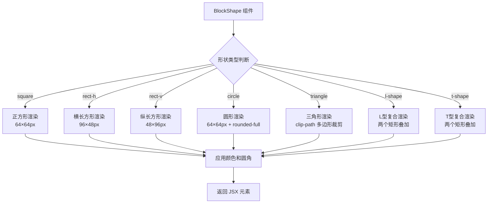

Block Builder Pro 项目的核心视觉元素是**七种可拖拽的积木形状**，每种形状都具备独特的几何特征、默认颜色配置和渲染逻辑。这些积木形状不仅是用户界面中的视觉构建块，更是整个拖拽交互系统的基础单元。从类型定义到组件渲染，七种形状的设计遵循统一的接口规范，同时保留了足够的灵活性以支持旋转、颜色定制和连接功能。

## 形状类型系统

项目的积木形状通过 TypeScript 类型系统进行严格约束。`ShapeType` 联合类型定义了七种合法的形状标识符，确保在编译时就能捕获类型错误。每种形状对应一个字符串字面量类型，包括基础几何形状（正方形、长方形、圆形、三角形）和复合形状（L型、T型）。

类型系统的核心定义位于 `types.ts` 文件中，通过 `ShapeType` 和 `BlockTemplate` 两个关键类型构建了完整的形状元数据体系。`BLOCK_TEMPLATES` 数组作为单一数据源，集中管理所有形状的默认配置，包括类型标识、中文标签和默认颜色。这种设计使得形状的扩展和维护变得极为简洁——只需在数组中添加新条目，整个应用的形状库就会自动更新。

Sources: [types.ts](src/types.ts#L1-L33)

## 形状渲染机制

所有七种积木形状通过统一的 `BlockShape` 组件进行渲染，该组件接收 `type`（形状类型）、`color`（颜色）、`size`（尺寸）和 `className`（样式类名）四个属性。组件内部使用 `switch` 语句根据形状类型返回对应的 JSX 元素，这种设计模式确保了类型安全性和渲染性能。每种形状的渲染逻辑都封装在独立的 `case` 分支中，通过 Tailwind CSS 类名和内联样式实现精确的视觉控制。

渲染流程遵循 React 函数组件的标准模式：首先构造共享的样式对象（背景色），然后根据形状类型应用特定的尺寸和样式属性。基础形状（正方形、长方形、圆形）使用单一的 `
` 元素配合 CSS 属性实现，而复杂形状（三角形、L型、T型）则采用多元素组合或 CSS 裁剪路径技术。所有形状都支持通过 `size` 属性进行等比缩放，默认尺寸为 64 像素。

Sources: [BlockShape.tsx](src/components/BlockShape.tsx#L11-L52)

## 基础几何形状详解

### 正方形

正方形是最简单的积木形状，渲染为等宽高的 `
` 元素。默认尺寸为 64×64 像素，通过 `rounded-sm` 类名添加微小的圆角，使视觉边缘更加柔和。正方形的简洁性使其成为理解整个积木系统的最佳起点——所有其他形状的渲染逻辑都建立在对正方形基础样式的扩展之上。在 `BLOCK_TEMPLATES` 配置中，正方形的默认颜色为蓝色（#3b82f6），这是 Tailwind CSS 的 blue-500 色值。

Sources: [BlockShape.tsx](src/components/BlockShape.tsx#L15-L16), [types.ts](src/types.ts#L26)

### 长方形

长方形分为横向和纵向两种变体，通过不同的宽高比适应不同的布局需求。横向长方形的尺寸为 `size * 1.5 × size * 0.75`（默认 96×48 像素），纵向长方形则为 `size * 0.75 × size * 1.5`（默认 48×96 像素）。这种非对称设计使得积木可以更灵活地填充画布空间，模拟真实世界中不同尺寸的构建块。横向长方形的默认颜色为红色（#ef4444），纵向为绿色（#10b981），通过视觉差异帮助用户快速区分两种变体。

Sources: [BlockShape.tsx](src/components/BlockShape.tsx#L17-L20), [types.ts](src/types.ts#L27-L28)

### 圆形

圆形通过 Tailwind CSS 的 `rounded-full` 工具类实现，该类将 `border-radius` 设置为 50%，使正方形容器变为圆形。圆形的宽高与正方形相同（默认 64×64 像素），但通过圆角变换呈现出完全不同的视觉质感。在交互场景中，圆形常用于表示特殊的节点或连接点，其无边界的特性使其在视觉层次中具有独特的地位。默认颜色为琥珀色（#f59e0b），温暖的色调增强了形状的亲和力。

Sources: [BlockShape.tsx](src/components/BlockShape.tsx#L21-L22), [types.ts](src/types.ts#L29)

### 三角形

三角形采用 CSS `clip-path` 属性实现，通过 `polygon(50% 0%, 0% 100%, 100% 100%)` 定义一个等腰三角形的裁剪区域。这种技术比使用 SVG 或边框技巧更加高效，同时保持了完美的锐利边缘。三角形的底边与容器宽度对齐，顶点位于容器顶边的中心点，形成稳定的视觉重心。默认颜色为紫色（#8b5cf6），神秘的色彩暗示着这种形状在系统中的特殊用途。

Sources: [BlockShape.tsx](src/components/BlockShape.tsx#L23-L34), [types.ts](src/types.ts#L30)

## 复合形状详解

### L型

L型形状由两个矩形元素组合而成：一个水平矩形位于底部（占据容器下半部分），另一个垂直矩形位于左侧（占据容器左半部分）。两个矩形通过 `position: absolute` 定位在同一个相对定位的父容器中，它们的重叠区域自然形成了 L 型的拐角。这种组合方式的优势在于保持了矩形的简洁渲染逻辑，同时通过视觉叠加创造出复杂的几何形态。L 型的默认颜色为粉色（#ec4899），在画布上具有极高的辨识度。

Sources: [BlockShape.tsx](src/components/BlockShape.tsx#L35-L41), [types.ts](src/types.ts#L31)

### T型

T型形状同样采用双矩形组合策略，但其布局逻辑与 L 型相反：水平矩形位于顶部（占据容器上半部分），垂直矩形居中放置（从顶边延伸到底边）。这种对称设计使得 T 型在视觉上更加平衡，适合用作连接节点或分支结构的视觉表示。默认颜色为青色（#06b6d4），冷色调传达出结构和逻辑的意味。T 型的实现展示了复合形状设计模式的通用性——通过调整子元素的位置和尺寸，可以构建出任意复杂的几何形状。

Sources: [BlockShape.tsx](src/components/BlockShape.tsx#L42-L48), [types.ts](src/types.ts#L32)

## 形状对比总览

| 形状名称 | 类型标识 | 默认尺寸 (px) | 渲染技术 | 默认颜色 | 复杂度 |
|---------|---------|--------------|---------|---------|--------|
| 正方形 | `square` | 64 × 64 | 单元素 + 圆角 | 蓝色 #3b82f6 | 基础 |
| 长方形（横） | `rect-h` | 96 × 48 | 单元素 + 圆角 | 红色 #ef4444 | 基础 |
| 长方形（纵） | `rect-v` | 48 × 96 | 单元素 + 圆角 | 绿色 #10b981 | 基础 |
| 圆形 | `circle` | 64 × 64 | 单元素 + rounded-full | 琥珀 #f59e0b | 基础 |
| 三角形 | `triangle` | 64 × 64 | 单元素 + clip-path | 紫色 #8b5cf6 | 中等 |
| L型 | `l-shape` | 64 × 64 | 双元素绝对定位 | 粉色 #ec4899 | 复合 |
| T型 | `t-shape` | 64 × 64 | 双元素绝对定位 | 青色 #06b6d4 | 复合 |

上表总结了七种形状的核心技术特征，从渲染复杂度的角度可以分为三个层次：**基础形状**使用单个 DOM 元素和简单 CSS 属性，**中等形状**引入了高级 CSS 技术（clip-path），**复合形状**则需要多个元素的组合。这种分层设计使得性能优化和扩展开发都具备了清晰的策略路径。

Sources: [types.ts](src/types.ts#L25-L33), [BlockShape.tsx](src/components/BlockShape.tsx#L14-L52)

## 形状在应用中的集成

在实际应用中，七种形状通过 `BLOCK_TEMPLATES` 数组集成到左侧形状库侧边栏。每个模板条目被渲染为一个可拖拽的卡片，包含形状预览和中文标签。用户从侧边栏拖拽形状到中央画布时，系统会创建一个新的 `BlockInstance` 对象，该对象继承模板的 `type` 和 `defaultColor` 属性，同时赋予唯一 ID、初始位置和旋转角度。这种实例化机制确保了画布上的每个积木都是独立的可操作单元，而模板库则保持了静态和可复用的特性。

Sources: [App.tsx](src/App.tsx#L359-L392), [App.tsx](src/App.tsx#L146-L170)

## 形状的可操作属性

每种积木形状在实例化后都支持四个核心操作：**颜色修改**（通过 10 种预设颜色或自定义色值）、**旋转变换**（通过 `rotation` 属性记录角度）、**层级调整**（通过 `zIndex` 控制前后遮挡关系）和**连接建立**（通过 `connectedTo` 数组记录与其他积木的关联）。这些属性定义在 `BlockInstance` 接口中，构成了积木形状的完整状态模型。当用户在右侧编辑面板中调整这些属性时，React 的状态管理系统会触发重新渲染，BlockShape 组件根据新的属性值即时更新视觉效果。

Sources: [types.ts](src/types.ts#L3-L12), [App.tsx](src/App.tsx#L418-L458)

## 扩展形状系统

添加新的积木形状需要三个步骤：首先在 `ShapeType` 联合类型中添加新的字符串字面量类型，然后在 `BLOCK_TEMPLATES` 数组中配置新形状的元数据，最后在 `BlockShape` 组件的 `switch` 语句中实现渲染逻辑。这种扩展模式的优势在于类型系统会在编译时检查所有引用点，确保新形状在整个应用中得到一致的支持。对于复杂的自定义形状，可以参考 L 型和 T 型的实现模式，通过多个子元素的组合构建任意几何形态。

Sources: [types.ts](src/types.ts#L1), [types.ts](src/types.ts#L25-L33), [BlockShape.tsx](src/components/BlockShape.tsx#L14-L52)

## 下一步学习

理解七种积木形状的工作原理后，建议继续探索以下主题以深入掌握整个积木系统：

- **[网格对齐机制](7-wang-ge-dui-qi-ji-zhi)**：学习积木如何自动吸附到网格和其他积木的边缘，实现精确的布局对齐
- **[积木连接功能](8-ji-mu-lian-jie-gong-neng)**：了解如何通过右键菜单建立积木之间的可视化连接关系
- **[颜色主题系统](9-yan-se-zhu-ti-xi-tong)**：探索 10 种预设颜色的设计理念和自定义颜色的实现方式
- **[积木形状渲染组件](12-ji-mu-xing-zhuang-xuan-ran-zu-jian)**：深入 BlockShape 组件的 React 实现细节和性能优化策略