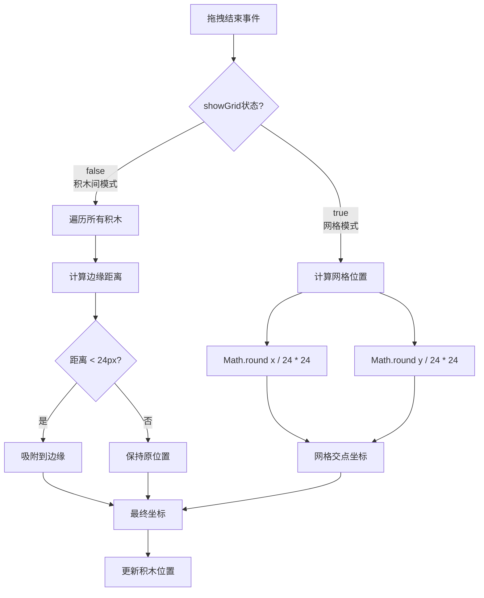

网格对齐机制是积木工坊的核心交互特性之一，它通过智能化的位置吸附算法确保积木在画布上精确排列，无论是遵循统一的网格系统还是与其他积木边缘对齐，都能提供流畅自然的拖拽体验。该机制基于 **双模式对齐策略**：当启用网格显示时，所有积木自动吸附到 24 像素间距的虚拟网格交点；当关闭网格时，系统转而启用 **积木间边缘吸附**，检测并吸附到邻近积木的边缘位置，实现积木之间的紧密排列。

Sources: [App.tsx](src/App.tsx#L269-L311), [App.tsx](src/App.tsx#L511-L516)

## 对齐模式架构

系统采用 **条件分支式对齐策略**，通过 `showGrid` 状态变量控制两种截然不同的对齐行为。这种设计允许用户在 **规则网格布局** 与 **自由积木排列** 之间灵活切换，满足不同场景的设计需求。核心逻辑在拖拽结束时触发，根据当前模式选择对应的吸附算法：网格模式使用简单的数学取整运算，而积木间模式则需要遍历所有现有积木进行边缘距离计算。

Sources: [App.tsx](src/App.tsx#L269-L311), [App.tsx](src/App.tsx#L107-L147)

## 网格对齐模式

网格对齐模式通过 **24 像素网格系统** 实现规则化布局，该数值同时作为网格间距和吸附阈值，确保视觉一致性与计算效率的平衡。当用户从模板栏拖拽新积木或移动现有积木时，系统在拖拽结束时将原始坐标值除以 24 后四舍五入再乘回 24，实现坐标到最近网格交点的映射。这种 **取整吸附算法** 计算复杂度为 O(1)，能够实时响应而不产生性能负担。

网格的视觉呈现采用 CSS **径向渐变背景** 技术，通过 `radial-gradient(#e5e7eb 1px, transparent 1px)` 创建 1 像素直径的圆点阵列，配合 `backgroundSize: '24px 24px'` 设置点阵间距，形成轻量级的视觉参考系统。这种实现方式避免了额外的 DOM 元素开销，且背景图案随画布滚动自然移动，始终保持与吸附逻辑的坐标系同步。

Sources: [App.tsx](src/App.tsx#L269-L275), [App.tsx](src/App.tsx#L541-L545)

## 积木间吸附模式

当网格显示关闭时，系统自动切换至 **边缘感知吸附算法**，该算法通过遍历画布上所有现有积木，计算拖拽积木与每个目标积木在 X 轴和 Y 轴方向的边缘距离，当距离小于 **24 像素吸附阈值** 时触发位置修正。算法定义了六种吸附场景：X 轴包括 **右边缘吸附到左边缘**、**左边缘吸附到右边缘**、**左边缘对齐**；Y 轴包括 **下边缘吸附到上边缘**、**上边缘吸附到下边缘**、**上边缘对齐**。

核心函数 `findSnapPosition()` 接收拖拽积木 ID、原始坐标和当前积木数组作为参数，返回吸附后的修正坐标。函数内部维护 `snappedX` 和 `snappedY` 变量记录累积的吸附偏移，通过 `isSnappedX` 和 `isSnappedY` 标志位避免重复计算。算法使用 **64 像素标准积木尺寸** 进行边缘位置计算，确保不同形状的积木在边缘对齐时保持一致的视觉间距。

Sources: [App.tsx](src/App.tsx#L107-L147), [App.tsx](src/App.tsx#L305-L311)

## 核心参数配置

对齐机制依赖三个关键常量协同工作，这些硬编码值经过交互测试优化，平衡了吸附灵敏度与误触发风险。

| 参数名称 | 数值 | 作用域 | 设计考量 |
|---------|------|--------|----------|
| **GRID_SIZE** | 24px | 网格模式 | 网格间距、视觉密度、吸附精度 |
| **SNAP_THRESHOLD** | 24px | 积木间模式 | 吸附触发距离、容错范围 |
| **BLOCK_SIZE** | 64px | 积木间模式 | 边缘计算基准、形状统一性 |

24 像素的网格间距既能在视觉上提供足够的参考密度，又不会因网格过密导致布局显得局促；作为吸附阈值时，该数值能在拖拽停止时提供明确的吸附反馈，同时避免在快速拖拽时产生意外的位置跳跃。64 像素的积木基准尺寸确保七种不同形状的积木在边缘对齐时保持协调的视觉节奏。

Sources: [App.tsx](src/App.tsx#L108-L110)

## 吸附算法实现细节

积木间吸附算法采用 **分离轴检测策略**，X 轴和 Y 轴独立计算互不干扰，允许积木在单轴方向吸附而另一轴保持自由定位。算法遍历当前画布上的所有积木实例，对每个非自身积木执行三组边缘距离检测：首先检查拖拽积木右边缘（x + 64）与目标积木左边缘的距离，若小于 24 像素则将拖拽积木向左移动至边缘贴合；随后检查左边缘到右边缘、左边缘到左边缘的两种对齐情况，按优先级顺序执行。

Y 轴逻辑与 X 轴完全对称，分别检测下边缘到上边缘、上边缘到下边缘、上边缘到上边缘的距离关系。当两轴同时满足吸附条件时（`isSnappedX && isSnappedY`），算法提前终止遍历以优化性能。这种 **短路优化** 在积木数量较多时能显著减少计算量，时间复杂度从 O(n) 降至 O(k)，其中 k 为首个满足双轴吸附的积木索引。

Sources: [App.tsx](src/App.tsx#L107-L147)

## 用户交互流程

用户通过工具栏的网格切换按钮控制对齐模式，该按钮位于画布顶部中央的浮动工具条中，使用 `Grid3X3` 图标直观表达功能含义。点击按钮触发 `setShowGrid(!showGrid)` 状态切换，React 状态更新立即触发组件重新渲染：背景图案在 `bg-grid-pattern` 与 `bg-zinc-50` 之间切换，同时所有后续的拖拽操作将采用新的对齐逻辑。

对于新积木添加场景，从左侧模板栏拖拽积木到画布时，`handleTemplateDragEnd` 函数在计算相对于画布的本地坐标后，根据 `showGrid` 状态选择网格取整或积木间吸附；对于现有积木移动场景，`handleBlockDragEnd` 函数执行相同的对齐逻辑，但额外处理拖拽回模板栏的删除操作。两种场景共享相同的坐标修正算法，确保一致的交互体验。

Sources: [App.tsx](src/App.tsx#L511-L516), [App.tsx](src/App.tsx#L236-L279), [App.tsx](src/App.tsx#L281-L318)

## 视觉反馈系统

网格模式下的视觉反馈通过 **点阵背景** 实现，浅灰色圆点（#e5e7eb）在白色画布上形成低对比度的参考系，既提供足够的定位辅助又不干扰积木本身的视觉呈现。当积木吸附到网格交点时，由于背景图案与吸附逻辑共享相同的 24 像素间距，积木边缘自然地与最近的网格点对齐，用户能直观感知到吸附效果。

积木间模式缺少明确的视觉参考，用户需要通过 **拖拽时的动态缩放** 和 **释放后的位置修正** 感知吸附行为。Motion 动画库的 `whileDrag` 属性在拖拽过程中将积木放大至 1.1 倍并添加阴影，释放后缩回原始尺寸时位置已被吸附算法修正，这种 **动效-吸附耦合** 设计强化了操作的确认感。未来版本可考虑添加吸附预览线或高亮目标积木边缘，提升积木间模式的可用性。

Sources: [App.tsx](src/App.tsx#L541-L545), [App.tsx](src/App.tsx#L617-L629)

## 性能优化策略

网格对齐算法的性能优势体现在 **计算复杂度控制**：网格模式仅涉及两次除法和乘法运算，任何情况下都是 O(1) 常数时间；积木间模式虽然需要遍历所有积木，但通过 **提前终止条件** 和 **单次遍历双轴计算** 将实际开销降至最低。在包含 100 个积木的典型场景中，最坏情况下的遍历次数为 99 次（排除自身），但平均情况下首个满足条件的积木索引通常在前 10 个以内。

状态管理层面，`showGrid` 作为布尔值状态更新时仅触发画布背景和拖拽逻辑的条件分支变化，不影响积木数组本身，因此不会引发大规模的组件重渲染。Motion 库的 `dragMomentum={false}` 配置禁用了拖拽惯性动画，确保释放后位置立即固定，避免动画过程中的位置抖动与吸附冲突。这些优化共同保障了即使在中低端设备上也能保持 60fps 的流畅拖拽体验。

Sources: [App.tsx](src/App.tsx#L609-L611), [App.tsx](src/App.tsx#L107-L147)

## 扩展性与定制方向

当前实现对齐参数采用硬编码方式，未来可通过提取为配置对象支持 **用户自定义网格密度**，例如允许在设置面板中调整网格间距（12px/24px/48px）和吸附阈值。积木间吸附算法可扩展至支持 **中心点对齐** 和 **角度吸附**，为构建对称布局或辐射状结构提供辅助；引入 **吸附预览线** 功能，在拖拽过程中实时显示即将吸附的边缘位置，通过半透明辅助线增强操作可预测性。

多积木组合场景下，可引入 **组吸附** 机制，当多个积木通过连接功能形成组件后，整体移动时自动保持内部相对位置不变，仅对外部边缘执行吸附计算。这需要扩展 `findSnapPosition()` 函数，使其能够识别连接组并计算组的边界框，将算法复杂度从单个积木的 O(n) 提升至组的 O(m)，其中 m 为组数量，通常远小于积木总数 n。