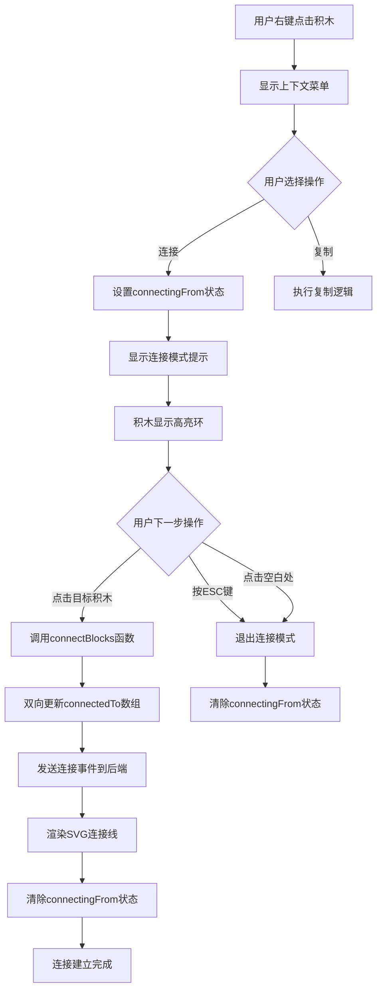

积木连接功能是Block Builder可视化编程环境中的**核心交互机制**，允许用户通过图形化操作建立积木之间的逻辑关联。与单纯的物理位置对齐不同，连接功能在视觉上和逻辑上明确表达积木之间的依赖关系，为后续的代码生成、依赖分析和执行流程可视化提供基础数据结构。该功能采用**双向连接模型**和**实时视觉反馈**设计，确保用户在复杂积木组合中能直观理解组件间的关联拓扑。

## 连接概念与数据模型

积木连接的本质是在独立的积木实例之间建立**双向引用关系**。每个积木实例通过 `connectedTo` 数组字段维护其连接的目标积木ID列表，形成无向图的邻接表表示。这种设计避免了中心化的连接管理器，使得连接信息可以随积木实例独立序列化和传输，同时支持一个积木与多个其他积木建立连接的复杂场景。数据模型定义中，`connectedTo` 字段为可选数组类型，未连接状态下该字段不存在或为空数组，连接建立后则填充目标积木的ID字符串。

```typescript
export interface BlockInstance {
  id: string;
  type: ShapeType;
  x: number;
  y: number;
  color: string;
  rotation: number;
  zIndex: number;
  connectedTo?: string[]; // 连接的其他积木ID
}
```

连接建立时采用**双向更新策略**：当积木A连接到积木B时，系统同时将B的ID添加到A的 `connectedTo` 数组，以及将A的ID添加到B的 `connectedTo` 数组。这种对称存储确保从任意一端都能快速查询到连接关系，但需要在渲染时通过ID去重避免重复绘制连接线。连接关系的持久化依赖于React状态管理，当前实现中连接数据保存在前端内存中，通过后端API预留的 `/connect` 端点可扩展为服务端持久化存储。

Sources: [types.ts](src/types.ts#L3-L12)

## 连接建立交互流程

连接功能的交互设计遵循**模式切换范式**，用户通过右键菜单进入连接模式，随后通过点击目标积木完成连接建立。这种两步交互模式避免了误操作，同时通过明确的UI状态提示确保用户理解当前所处模式。连接流程涉及状态管理、事件处理和视觉反馈三个层面的协作，下图展示了完整的交互时序和状态转换：



连接模式的进入通过右键菜单触发，系统设置 `connectingFrom` 状态为当前积木ID，同时关闭右键菜单。此时积木组件检测到自身ID与 `connectingFrom` 匹配，应用蓝色高亮环样式 (`ring-2 ring-blue-500 ring-offset-2`)，底部同时出现蓝色提示条引导用户"点击另一个积木建立连接"。用户可通过三种方式退出连接模式：点击目标积木完成连接、按ESC键取消、或点击画布空白区域取消，后两种操作会清除 `connectingFrom` 状态并移除所有视觉提示。

Sources: [App.tsx](src/App.tsx#L220-L254), [App.tsx](src/App.tsx#L602-L632)

## 核心连接逻辑实现

`connectBlocks` 函数是连接功能的核心实现，接收源积木ID和目标积木ID两个参数，执行**双向数组更新**和**去重检查**。函数首先验证两个ID不相等（防止自连接），然后通过 `setBlocks` 的函数式更新遍历积木数组。对于源积木，检查其 `connectedTo` 数组是否已包含目标ID，若不存在则追加；对目标积木执行相同逻辑，确保连接关系的对称性。这种设计支持积木间建立多重连接，例如一个积木可同时连接到多个其他积木形成星形或网状拓扑。

```typescript
const connectBlocks = (fromId: string, toId: string) => {
  if (fromId === toId) return;

  setBlocks(prev => prev.map(block => {
    if (block.id === fromId) {
      const connectedTo = block.connectedTo || [];
      if (!connectedTo.includes(toId)) {
        return { ...block, connectedTo: [...connectedTo, toId] };
      }
    }
    if (block.id === toId) {
      const connectedTo = block.connectedTo || [];
      if (!connectedTo.includes(fromId)) {
        return { ...block, connectedTo: [...connectedTo, fromId] };
      }
    }
    return block;
  }));

  // 通知后端
  const fromBlock = blocks.find(b => b.id === fromId);
  const toBlock = blocks.find(b => b.id === toId);
  if (fromBlock && toBlock) {
    const fromTemplate = BLOCK_TEMPLATES.find(t => t.type === fromBlock.type);
    const toTemplate = BLOCK_TEMPLATES.find(t => t.type === toBlock.type);
    fetch('http://localhost:8080/connect', {
      method: 'POST',
      headers: { 'Content-Type': 'application/json' },
      body: JSON.stringify({
        from: { type: fromBlock.type, name: fromTemplate?.label },
        to: { type: toBlock.type, name: toTemplate?.label }
      })
    }).catch(() => {});
  }
};
```

连接建立后，函数通过 `fetch` API 向后端的 `/connect` 端点发送连接事件，payload包含源积木和目标积木的类型及名称信息。当前实现中使用 `.catch(() => {})` 静默处理网络错误，确保即使后端未启动或端点未实现，前端连接功能仍能正常工作。这种**容错设计**使得前后端可以独立开发和测试，后端可通过监听连接事件实现代码依赖分析、执行流程优化或可视化导出等高级功能。

Sources: [App.tsx](src/App.tsx#L220-L254)

## 连接线可视化渲染

连接关系的视觉表达通过**SVG图层叠加**实现，在积木层之上渲染一个全尺寸的SVG画布，使用 `<line>` 元素绘制积木间的虚线连接。渲染逻辑遍历所有积木的 `connectedTo` 数组，对于每个连接对，通过积木ID查找目标积木实例并计算两个积木的中心点坐标（积木位置 + 尺寸偏移32像素）。为避免双向连接导致重复绘制（A→B和B→A本质是同一条线），渲染时通过字符串比较 `block.id > targetId` 进行过滤，只绘制ID字典序较小的连接方向。

```typescript
<svg className="absolute inset-0 pointer-events-none" style={{ width: '100%', height: '100%' }}>
  {blocks.map(block => {
    const connectedTo = block.connectedTo || [];
    return connectedTo.map(targetId => {
      const targetBlock = blocks.find(b => b.id === targetId);
      if (!targetBlock || block.id > targetId) return null;

      const x1 = (dragPositions[block.id]?.x ?? block.x) + 32;
      const y1 = (dragPositions[block.id]?.y ?? block.y) + 32;
      const x2 = (dragPositions[targetId]?.x ?? targetBlock.x) + 32;
      const y2 = (dragPositions[targetId]?.y ?? targetBlock.y) + 32;

      return (
        <line
          key={`${block.id}-${targetId}`}
          x1={x1} y1={y1} x2={x2} y2={y2}
          stroke="#3b82f6"
          strokeWidth="2"
          strokeDasharray="5,5"
          className="transition-all duration-75"
        />
      );
    });
  })}
</svg>
```

连接线支持**拖拽实时跟踪**，当用户拖动已连接的积木时，连接线端点跟随积木位置实时更新。实现中维护了 `dragPositions` 状态对象，记录拖拽过程中积木的实时位置（初始位置 + 拖拽偏移量），SVG渲染优先使用 `dragPositions` 中的实时坐标，若不存在则回退到积木的静态 `x/y` 属性。这种双数据源设计通过空值合并运算符 (`??`) 优雅实现，确保连接线在拖拽时平滑跟随，松手后自动吸附到新位置。连接线样式采用蓝色虚线 (`stroke="#3b82f6" strokeDasharray="5,5"`)，与积木的填充颜色形成视觉区分，虚线样式暗示连接的"逻辑"属性而非物理接触。

Sources: [App.tsx](src/App.tsx#L635-L666)

## 连接与其他功能的交互

连接功能与积木的其他操作存在特定的交互约束，确保连接关系不会破坏用户体验或导致数据不一致。**复制操作**会显式清空连接关系，复制的积木实例中 `connectedTo` 被初始化为空数组，避免新积木继承原积木的连接导致逻辑混乱。**删除操作**当前实现中不会自动清理其他积木中指向被删除积木的连接引用，这可能导致连接线指向不存在的积木，属于需要改进的边界情况。**层级管理**独立于连接关系，积木的 `zIndex` 属性控制渲染顺序，连接线始终渲染在所有积木之下（SVG在React组件树中位于积木map之前），确保积木视觉不被遮挡。

拖拽操作与连接功能的协同通过**状态隔离**实现，`isDraggingExisting` 状态标记当前是否在拖拽已有积木，该状态独立于 `connectingFrom` 连接模式状态。拖拽积木时不会触发连接模式，连接模式下也不影响积木的拖拽能力，两种交互模式通过不同的事件处理器独立响应。积木组件的 `onClick` 处理器优先检查 `connectingFrom` 状态，若处于连接模式且点击的不是自身，则调用 `connectBlocks` 并阻止后续的选择逻辑；否则执行正常的选中操作。这种**优先级调度**确保连接操作在点击事件中优先处理，避免连接意图被误识别为选择操作。

Sources: [App.tsx](src/App.tsx#L200-L218), [App.tsx](src/App.tsx#L602-L632)

## 扩展方向与技术考量

当前连接功能实现了基础的可视化连接建立和维护，但仍有多个方向可进一步扩展。**连接类型系统**可引入不同类型的连接（数据流、控制流、依赖关系），通过不同的线型、颜色或箭头方向区分。**连接验证**可在建立连接前检查积木类型的兼容性，例如只允许特定形状的积木相互连接，提供即时反馈避免无效连接。**连接管理UI**可增加断开连接的交互方式，当前只能通过删除积木间接移除连接，可考虑右键菜单增加"断开连接"选项或点击连接线显示删除按钮。**后端集成**需实现 `/connect` 端点的处理逻辑，将连接关系映射到代码生成的依赖关系，例如在Python代码中通过注释或特定语法表达积木间的逻辑关联。

性能方面，当前实现在积木数量较少时表现良好，但连接线的渲染复杂度为 O(n×m)（n为积木数，m为平均连接数），大规模场景下可考虑使用Canvas替代SVG或引入虚拟化渲染。连接数据的持久化当前依赖前端状态，页面刷新后连接关系丢失，可通过LocalStorage自动保存或集成后端数据库实现跨会话持久化。交互体验上，连接模式的两步操作对新手可能不够直观，可探索拖拽时按住特定修饰键（如Shift）直接建立连接的一步式交互，或通过积木边缘的吸附区域自动触发连接建议。