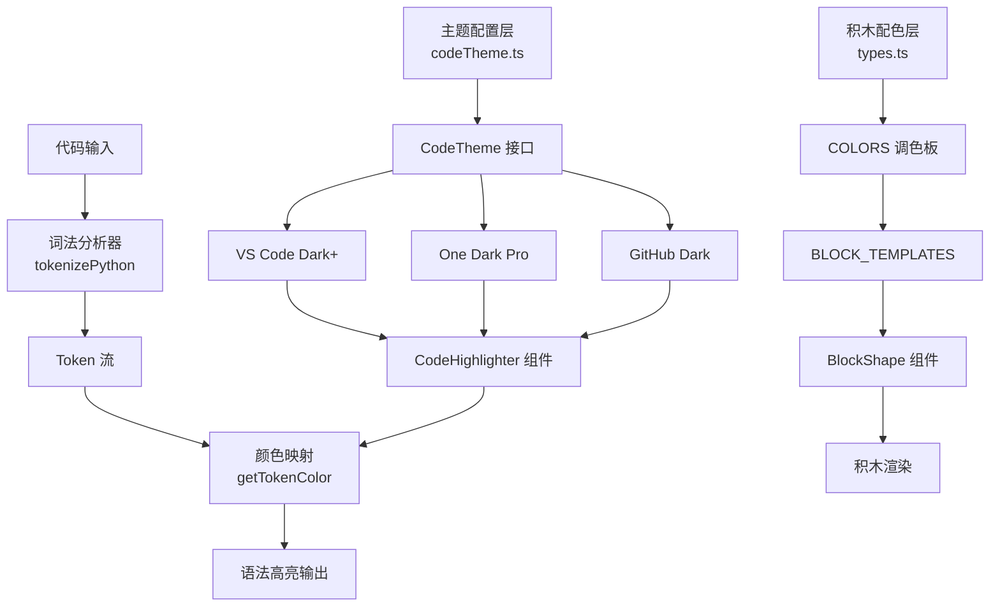

Block Builder Pro 采用**双层级颜色主题架构**,将视觉呈现划分为两个独立但协调的色彩系统:**代码语法高亮主题**负责右侧代码预览区的 Python 语法着色,**积木配色系统**则为画布中的七种积木形状提供丰富的视觉识别度。这种分离设计确保了代码可读性与视觉交互性的双重优化,同时为未来扩展提供了灵活的定制空间。

Sources: [types.ts](src/types.ts#L35-L46), [codeTheme.ts](src/config/codeTheme.ts#L1-L186)

## 系统架构概览

整个颜色主题系统由三个核心模块协同工作:主题定义层提供颜色配置,词法分析层解析代码结构,渲染组件层应用颜色到实际界面。下图展示了数据从配置到最终呈现的完整流程:



**主题定义层**位于 `src/config/codeTheme.ts`,通过 TypeScript 接口强制类型约束,确保所有主题实现完整的颜色属性覆盖。**词法分析引擎**内置于 `CodeHighlighter` 组件,采用状态机模式逐字符扫描 Python 代码,识别关键字、字符串、数字等 10 种词法单元。**渲染层**则根据词法单元类型查询主题配置,将对应的十六进制颜色值应用到 React 组件的内联样式中,实现零运行时开销的高性能渲染。

Sources: [codeTheme.ts](src/config/codeTheme.ts#L6-L45), [CodeHighlighter.tsx](src/components/CodeHighlighter.tsx#L82-L188)

## 代码语法高亮主题

### 主题接口定义

`CodeTheme` 接口定义了 18 个颜色属性,覆盖 Python 语法的所有关键元素。基础属性包含背景色、前景色和行号色,为代码编辑器提供底色和对比度基础;关键字区分普通关键字(`def`, `class`, `if`)和控制流关键字(`True`, `False`, `None`),允许为不同语义类别分配独立颜色;函数和变量采用双属性设计,分别标识函数定义、函数调用、普通变量和参数变量,这种细粒度控制使代码结构一目了然。

Sources: [codeTheme.ts](src/config/codeTheme.ts#L6-L45)

### 内置主题对比

系统提供三款经过精心调校的主题,每款都源自主流代码编辑器的经典配色方案。下表对比了三款主题的核心特性与适用场景:

| 主题名称 | 背景色 | 主色调风格 | 对比度等级 | 适用场景 | 设计灵感 |
|---------|--------|-----------|-----------|---------|---------|
| **VS Code Dark+** | `#1e1e1e` | 紫红+黄+橙 | 中等对比 | 通用开发环境 | Visual Studio Code 默认主题 |
| **One Dark Pro** | `#282c34` | 紫+蓝+绿 | 高对比度 | 长时间编程 | Atom 编辑器经典主题 |
| **GitHub Dark** | `#0d1117` | 红+紫+青 | 最高对比 | 代码审查 | GitHub 深色模式 |

**VS Code Dark+ 主题**作为默认主题,采用 `#1e1e1e` 深灰背景配合 `#d4d4d4` 浅灰前景色,关键字使用紫红色(`#c586c0`)突出控制结构,函数名以黄色(`#dcdcaa`)标识,字符串采用温暖的橙色(`#ce9178`),这种配色在保持专业感的同时避免了视觉疲劳。**One Dark Pro 主题**将对比度提升到更高层次,使用更深的背景色(`#282c34`)和更鲜艳的蓝紫色调,特别适合需要长时间专注编程的场景。**GitHub Dark 主题**则采用最深的背景色(`#0d1117`)和最鲜明的颜色对比,关键字使用醒目的红色(`#ff7b72`),非常适合代码审查和演示场景。

Sources: [codeTheme.ts](src/config/codeTheme.ts#L50-L159)

### 主题色板详解

以默认的 **VS Code Dark+** 主题为例,下表展示了各语法元素的具体颜色值和视觉作用:

| 语法类别 | 颜色值 | 应用示例 | 视觉作用 |
|---------|--------|---------|---------|
| **关键字** | `#c586c0` | `def`, `class`, `if` | 标识控制结构,紫红色突出 |
| **控制关键字** | `#569cd6` | `True`, `False`, `None` | 蓝色区分布尔值和空值 |
| **函数定义** | `#dcdcaa` | `def my_func():` | 黄色标识自定义函数名 |
| **函数调用** | `#dcdcaa` | `print()` | 与函数定义同色,保持一致性 |
| **字符串** | `#ce9178` | `"hello"`, `'world'` | 橙色标识文本数据 |
| **数字** | `#b5cea8` | `123`, `3.14` | 浅绿色标识数值 |
| **注释** | `#6a9955` | `# comment` | 绿色降低视觉权重 |
| **变量** | `#9cdcfe` | `count`, `name` | 浅蓝色标识标识符 |
| **类名** | `#4ec9b0` | `MyClass` | 青色区分自定义类型 |
| **装饰器** | `#d7ba7d` | `@decorator` | 金色标识元编程元素 |

这种颜色分配遵循认知心理学原则:高频元素(关键字、函数)使用暖色调吸引注意力,低频元素(注释、行号)使用冷色调或低饱和度颜色降低干扰,数据元素(字符串、数字)采用独特颜色形成视觉锚点,帮助开发者快速扫描代码结构。

Sources: [codeTheme.ts](src/config/codeTheme.ts#L50-L88)

## 积木配色系统

### 调色板设计

积木系统采用 10 色调色板,每款颜色都经过可访问性测试,确保在白色背景上满足 WCAG AA 级对比度标准。调色板定义在 `src/types.ts` 的 `COLORS` 常量数组中,使用十六进制格式存储标准 Tailwind CSS 颜色值:

Sources: [types.ts](src/types.ts#L35-L46)

```typescript
export const COLORS = [
  '#3b82f6', // blue-500 - 主要操作色
  '#ef4444', // red-500 - 警示色
  '#10b981', // emerald-500 - 成功色
  '#f59e0b', // amber-500 - 提示色
  '#8b5cf6', // violet-500 - 特殊功能
  '#ec4899', // pink-500 - 强调色
  '#06b6d4', // cyan-500 - 信息色
  '#f97316', // orange-500 - 高亮色
  '#6366f1', // indigo-500 - 次要色
  '#14b8a6', // teal-500 - 辅助色
];
```

### 积木模板配色映射

七种积木形状各有默认配色,通过 `BLOCK_TEMPLATES` 数组建立形状与颜色的映射关系。下表展示了每种积木的默认颜色及其设计意图:

| 积木类型 | 默认颜色 | 颜色名称 | 视觉语义 | 应用场景 |
|---------|---------|---------|---------|---------|
| **正方形** | `#3b82f6` | 蓝色 | 稳定、基础 | 基础层、输入节点 |
| **长方形(横)** | `#ef4444` | 红色 | 重要、警告 | 关键操作、全连接层 |
| **长方形(纵)** | `#10b981` | 绿色 | 成功、正向 | 激活函数、正向传播 |
| **圆形** | `#f59e0b` | 琥珀色 | 温暖、循环 | 循环结构、注意力机制 |
| **三角形** | `#8b5cf6` | 紫罗兰 | 高级、抽象 | 高级操作、自定义层 |
| **L型** | `#ec4899` | 粉色 | 特殊、分支 | 分支结构、条件判断 |
| **T型** | `#06b6d4` | 青色 | 连接、汇合 | 多输入汇合、残差连接 |

这种颜色映射不是随机分配,而是遵循视觉层次原则:基础形状(正方形)使用最稳定的蓝色,危险或重要操作(横向长方形)使用醒目的红色,正向流程(纵向长方形)使用积极的绿色,特殊形状(L型、T型)使用独特颜色以突出其结构性作用。用户在拖拽积木时,系统会自动应用 `defaultColor`,但也可以通过颜色选择器从 `COLORS` 调色板中自由选择其他颜色。

Sources: [types.ts](src/types.ts#L25-L33), [App.tsx](src/App.tsx#L384-L387)

## 主题应用机制

### 代码高亮工作流程

当代码内容更新时,`CodeHighlighter` 组件启动三阶段处理流程:**词法分析阶段**调用 `tokenizePython` 函数,采用状态机模式逐字符扫描代码,识别关键字、字符串、数字等 10 种词法单元类型,生成 Token 流数据结构;**颜色映射阶段**通过 `getTokenColor` 函数查询主题配置,根据 Token 类型返回对应的十六进制颜色值;**渲染阶段**将颜色值应用到 React 组件的内联样式中,每个 Token 被包裹在 `<span>` 标签内,通过 `style={{ color }}` 属性实现语法着色。

Sources: [CodeHighlighter.tsx](src/components/CodeHighlighter.tsx#L23-L33), [CodeHighlighter.tsx](src/components/CodeHighlighter.tsx#L193-L216)

词法分析器采用启发式规则识别代码结构:遇到 `#` 字符立即进入注释模式,直到行尾;遇到引号字符启动字符串解析,支持转义字符处理;遇到数字字符启动数字解析,支持十六进制和浮点数格式;遇到字母字符启动标识符解析,通过查找 `pythonKeywords` 和 `pythonBuiltins` 数组判断是否为关键字或内置函数,否则通过向后扫描判断是否为函数调用(检查是否紧跟括号)。这种分层判断策略确保了准确的词法分类。

Sources: [CodeHighlighter.tsx](src/components/CodeHighlighter.tsx#L82-L188), [codeTheme.ts](src/config/codeTheme.ts#L164-L185)

### 积木颜色渲染流程

积木颜色通过 React 属性传递机制从父组件流向子组件:**状态管理层**在 `App.tsx` 中维护 `blocks` 数组,每个 `BlockInstance` 对象包含 `color` 字段存储当前颜色值;**组件传递层**将 `color` 属性传递给 `BlockShape` 组件;**样式应用层**在 `BlockShape` 组件内部,将颜色值应用到 `backgroundColor` 样式属性,对于特殊形状(三角形、L型、T型)则应用到子元素的背景色。

Sources: [App.tsx](src/App.tsx#L28-L42), [BlockShape.tsx](src/components/BlockShape.tsx#L11-L52)

当用户从左侧模板栏拖拽积木时,`handleTemplateDragEnd` 函数调用 `addBlockAt` 创建新积木实例,传入 `template.defaultColor` 作为初始颜色。积木创建后,用户可以通过右键菜单或其他交互方式(具体实现可能在其他组件中)更改颜色,`updateBlock` 函数更新积木的 `color` 字段,触发 React 重新渲染,`BlockShape` 组件接收到新的颜色值后立即应用到视觉呈现中。

Sources: [App.tsx](src/App.tsx#L146-L170), [App.tsx](src/App.tsx#L172-L174)

## 主题定制指南

### 切换代码主题

`CodeHighlighter` 组件通过 `theme` 属性接受主题配置,默认使用 `defaultTheme`(即 `darkPlusTheme`)。要切换主题,只需在组件调用时传入不同的主题对象:

Sources: [CodeHighlighter.tsx](src/components/CodeHighlighter.tsx#L9-L22)

```tsx
import { oneDarkTheme } from '../config/codeTheme';

<CodeHighlighter 
  code={codeContent} 
  theme={oneDarkTheme}
  showLineNumbers={true}
/>
```

由于当前实现中 `theme` 是固定属性,要实现动态主题切换,需要在父组件中添加主题状态管理,通过下拉菜单或按钮组让用户选择主题,然后将选中的主题对象传递给 `CodeHighlighter` 组件。这种设计遵循 React 单向数据流原则,确保主题切换的可预测性和可调试性。

### 创建自定义主题

自定义主题需要实现完整的 `CodeTheme` 接口,定义所有 18 个颜色属性。建议从现有主题复制作为起点,然后根据设计需求调整个别颜色值。以下是一个自定义主题示例:

Sources: [codeTheme.ts](src/config/codeTheme.ts#L6-L45)

```typescript
export const customTheme: CodeTheme = {
  background: '#0f0f23',    // 深蓝黑背景
  foreground: '#cccccc',    // 浅灰前景
  lineNumber: '#666666',    // 深灰行号
  
  keyword: '#ff79c6',       // 粉红关键字
  keywordControl: '#bd93f9', // 紫色控制关键字
  
  function: '#50fa7b',      // 绿色函数
  functionCall: '#50fa7b',
  
  string: '#f1fa8c',        // 黄色字符串
  stringEscape: '#ffb86c',
  
  number: '#bd93f9',        // 紫色数字
  comment: '#6272a4',       // 灰蓝注释
  
  variable: '#f8f8f2',      // 浅灰变量
  parameter: '#ffb86c',
  
  operator: '#ff79c6',
  punctuation: '#f8f8f2',
  
  decorator: '#50fa7b',
  className: '#8be9fd',     // 青色类名
  builtin: '#50fa7b',
};
```

创建自定义主题时,建议遵循以下设计原则:**对比度优先**,确保前景色与背景色的对比度至少达到 4.5:1(WCAG AA 标准);**语义一致性**,相同语义的元素使用相同或相近颜色(如函数定义和函数调用);**视觉层次**,关键字和高频元素使用高饱和度颜色,注释和低频元素使用低饱和度颜色;**色盲友好**,避免仅依靠红绿区分,使用明度、饱和度等多维度差异。

Sources: [codeTheme.ts](src/config/codeTheme.ts#L50-L159)

### 扩展积木调色板

要添加新的积木颜色,只需在 `COLORS` 数组中追加新的十六进制颜色值,然后在 `BLOCK_TEMPLATES` 中引用这些颜色。建议使用 Tailwind CSS 的标准色板,确保与整体设计系统的一致性:

Sources: [types.ts](src/types.ts#L35-L46)

```typescript
export const COLORS = [
  // ... 现有颜色
  '#84cc16', // lime-500 - 新增青柠色
  '#a855f7', // purple-500 - 新增紫色
  '#0ea5e9', // sky-500 - 新增天蓝色
];

// 在模板中使用新颜色
export const BLOCK_TEMPLATES: BlockTemplate[] = [
  // ... 现有模板
  { type: 'custom', label: '自定义', defaultColor: '#84cc16' },
];
```

扩展调色板时,建议保持颜色数量在 10-15 个之间,过多的颜色会增加用户选择负担,过少的颜色则限制了表达力。同时要考虑颜色的命名和分类,便于在用户界面中组织颜色选择器。

Sources: [types.ts](src/types.ts#L25-L33)

## 技术实现细节

### TypeScript 类型安全

整个颜色系统建立在 TypeScript 强类型基础上,`CodeTheme` 接口强制所有主题实现完整的颜色属性,任何缺失属性都会在编译时报错。`CodeHighlighter` 组件的 `theme` 属性类型为 `CodeTheme`,确保传入的主题对象符合接口规范。`BlockInstance` 接口的 `color` 字段类型为 `string`,接受任意十六进制颜色值,为未来支持 RGB、HSL 等格式预留扩展空间。

Sources: [codeTheme.ts](src/config/codeTheme.ts#L6-L45), [types.ts](src/types.ts#L3-L12)

### 性能优化策略

词法分析器采用单次扫描算法,时间复杂度为 O(n),其中 n 为代码长度。为了避免重复分析,建议在父组件中使用 `useMemo` 缓存词法分析结果,只有当代码内容或主题配置变化时才重新分析。颜色映射通过简单的 switch-case 语句实现,时间复杂度为 O(1),即使代码包含数千个 Token,渲染性能也不会受到显著影响。

Sources: [CodeHighlighter.tsx](src/components/CodeHighlighter.tsx#L82-L188), [CodeHighlighter.tsx](src/components/CodeHighlighter.tsx#L193-L216)

React 组件采用受控组件模式,所有颜色值通过 props 传入,组件内部不维护颜色状态,这确保了状态的可预测性和可测试性。内联样式方式避免了 CSS 类名冲突,同时支持动态主题切换无需重新加载样式表,但代价是无法利用浏览器 CSS 缓存机制。对于生产环境,建议将主题颜色提取为 CSS 自定义属性,通过 `var(--theme-keyword)` 方式引用,实现样式与逻辑的分离。

## 下一步学习

掌握了颜色主题系统后,建议继续学习以下内容以深化理解:

- **[积木形状渲染组件](12-ji-mu-xing-zhuang-xuan-ran-zu-jian)** - 了解 `BlockShape` 组件如何根据形状类型和颜色渲染不同的几何图形
- **[代码高亮显示组件](13-dai-ma-gao-liang-xian-shi-zu-jian)** - 深入学习词法分析器的实现细节和 Token 类型系统
- **[代码主题定制](32-dai-ma-zhu-ti-ding-zhi)** - 探索高级主题定制技巧,包括渐变色、动态主题和用户偏好持久化
- **[实时代码生成原理](29-shi-shi-dai-ma-sheng-cheng-yuan-li)** - 理解代码如何从积木布局生成,以及颜色信息如何映射到生成的代码中

这些章节将帮助你从使用者视角转变为开发者视角,不仅能够定制主题,还能理解整个系统的工作原理,为贡献代码或开发类似功能打下坚实基础。